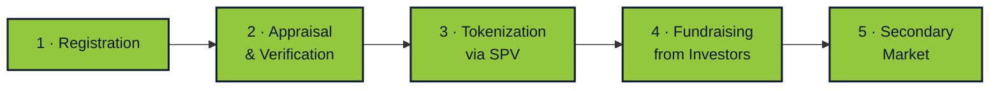

# Slice

## Real-World Asset Tokenization on Solana

  Real estate, businesses, startups, vehicle fleets — any asset turned into tradeable fractions

  <DeckQr :size="110" label="Открыть презентацию" />

  github.com/In-Da-Hack-Decentrathon/Slice

<!--
- This is a 7-minute summary of the full presentation.
- Goal: quickly convey the product's value to three types of users.
- Transition: straight to the question — who is this for.
-->

---

# Who Slice Is For

🏪

Small & Medium Businesses

Bakeries, auto repair shops, coffee shops, manufacturing.

Need capital to grow — banks decline, VCs overlook, relatives refuse.

Sell 20% of your business to a crowd of investors and keep control.

💰

Retail Investors

People with $100–$1,000 per month in disposable income.

Savings deposits lose to inflation, crypto is too volatile, funds require $10k+.

Invest in real assets starting at $100 and diversify across 10 properties.

🏠

Large Asset Owners

Real estate, vehicle fleets, equity stakes in companies.

Need cash but don't want to sell the whole asset. Loans are expensive, relocation is not an option.

Unlock liquidity by selling a share. The rest stays yours.

<!--
- These are three groups with a clear pain point and willingness to pay for a solution.
- Small business: doesn't want to give up control for capital. VCs demand 30% equity, banks demand collateral.
- Retail investor: has disposable income but nowhere to deploy it with a low entry threshold.
- Large asset owners: hold significant value, but it is "frozen" in a single asset.
- Slice connects them: the owner sells a share, the investor buys a fraction, the business gets funded.
- Transition: the scale of the market we operate in.
-->

---
layout: fact
---

# $280T

## The Largest Asset Class in the World

Real estate alone. Plus businesses, vehicle fleets, and equipment.

Larger than the equities market ($110T) and bonds market ($130T) combined.

By 2030, $4–30T of tokenized assets will be on-chain (BCG, McKinsey, Roland Berger).

<!--
- Real estate is humanity's largest wallet: $280 trillion.
- And that's just ONE asset class. Add companies, startups, vehicle fleets, equipment.
- For comparison: the entire global equities market is $110T, bonds — $130T. Real estate exceeds both.
- Three independent consultancies (BCG, McKinsey, Roland Berger) converge: $4–30T of tokenized assets by 2030.
- This is not our entire addressable market. This is the total market in which we are one of the first movers in Kazakhstan.
- Transition: the pain point driving each of the three audiences.
-->

---

# Three Pain Points We Solve

Illiquidity

A large asset cannot be sold in parts. Need $30k — either take a loan at 20% or sell the whole thing and move out.

Expensive Transactions

Notary, bank, registrar — 5–8% of the price. On $150k that's $12,000. Plus weeks of waiting.

No Entry for Small Investors

Between stocks ($1) and real estate ($100k+) there is a 10,000x gap. REITs don't let you buy a SPECIFIC apartment.

All three pain points are structural. The market is built in a way that excludes small participants.

<!--
- The three pain points coincide across all three audiences — just from different sides.
- The owner cannot sell a portion. The investor has nowhere to deploy small amounts. Transaction costs are high for everyone.
- A 20% loan over 5 years means you pay back double. Selling and relocating takes 3 months plus 5–8% in fees.
- REITs offer a partial solution, but it's an investment in a fund, not a specific property. Want THIS particular apartment? Not possible.
- Transition: how we solve this in one sentence.
-->

---
layout: center
---

# Slice — In One Line

We turn any real-world asset into N tradeable fractions on Solana with full legal structuring.

🏠 Real Estate

🏢 Companies

🚀 Startups

🚕 Vehicle Fleets

⛽ Oil Depots

🚗 Vehicles

🌾 Agriculture

💎 Anything

One requirement: the asset has value and can be legally structured through an SPV (special-purpose legal wrapper).

<!--
- The pitch: "We turn any real-world asset into N tradeable fractions with full legal structuring."
- The key word is "any." Real estate is an example, not the ceiling.
- N — the number of fractions — is set at vault creation, not hardcoded.
- SPV is a special-purpose legal wrapper (in Kazakhstan — SPC, Special Purpose Company) that holds the asset. A token equals a share in the SPV.
- Thanks to the SPV, fractions carry legal weight — they are not just numbers on a blockchain.
- Transition: what this looks like as a process.
-->

---

# How It Works — 5 Stages

From document submission to fraction trading on the market — approximately 3 months.

At every stage — independent verifiers with quorum. No one makes decisions alone.

<!--
- Five stages from registration to trading.
- Registration: the owner uploads documents, specifies characteristics, decides how much to sell.
- Appraisal & Verification: notaries verify documents, appraisers provide a fair price.
- Tokenization: an SPV (legal entity) is created, Token-2022 fractions are minted.
- Fundraising: investors purchase fractions, the owner receives funds.
- Secondary Market: fractions can be resold without the owner's permission.
- 3 months is the average timeline for the entire process.
- Transition: who participates in the system and how integrity is protected.
-->

---

# 6 Roles and Fraud Protection

👤 Asset Owner

Submits the asset, retains a share.

⚖️ Notaries

Pool with quorum — verify documents.

💰 Appraisers

11 independent, "seal-and-reveal" scheme.

⚖️ Attorneys

Set up the SPV — a legal entity for the asset.

👥 Investors

Purchase fractions starting at $100.

🔮 Oracle

Bridge to government agencies and the real world.

At every step — a quorum of independent executors. Collusion is costly; fraud is economically irrational.

<!--
- Six roles, each closing its own attack vector.
- Asset Owner — the person who needs capital. Notaries — verify that the property belongs to them.
- Appraisers provide a fair price through "seal-and-reveal": first a sealed hash, then the opening.
- If the price deviates significantly from the median, part of the stake is penalized. Cheating costs more than being honest.
- Attorneys set up the SPV — the legal wrapper. Without it, a token is just a number.
- Oracle — bridge to the real world: owner's death, asset seizure, divorce.
- Transition: this is not crypto speculation, this is a serious financial instrument.
-->

---

# This Is Not Crypto Speculation

Slice is the next step in the evolution of the securities market, not an alternative to it.

1980s

Paper stock certificates stored in bank vaults

1990s–2000s

Electronic registries, centralized depositories

2020–…

Tokenized assets: same oversight, new rails

<strong>Who is already there:</strong> BlackRock ($500M+ BUIDL fund), Franklin Templeton ($400M FOBXX), JPMorgan Onyx, Goldman Sachs DAP. All under SEC, MiCA, MAS oversight.

<!--
- Key message for skeptics: this is not crypto, this is the next form of the securities market.
- 40 years ago stocks were paper certificates in vaults. 30 years ago they went electronic.
- Now — tokenization on the blockchain. Same regulators, same rules, new liquidity.
- BlackRock launched BUIDL — a tokenized money market fund worth $500M+. Franklin Templeton — FOBXX at $400M.
- All of them are under SEC. Tokenization works WITHIN regulation, not outside it.
- Transition: what we have already built.
-->

---

# What Already Works

On-chain:

<ul class="text-xs space-y-1 opacity-80">
<li>✅ 11 smart contracts on Solana devnet</li>
<li>✅ Notary voting + rounds</li>
<li>✅ "Seal-and-reveal" appraisal mechanism</li>
<li>✅ Decentralized notary pool</li>
<li>✅ Fractionalization via Token-2022</li>
</ul>

Off-chain:

<ul class="text-xs space-y-1 opacity-80">
<li>✅ Full UI: 30 pages</li>
<li>✅ Three languages: RU, EN, KK</li>
<li>✅ 160+ assets in the test database</li>
<li>✅ 129 active vaults</li>
<li>✅ Integration with Irys (document storage)</li>
</ul>

A live demo platform with real trading on devnet. Everything can be tested hands-on.

<!--
- This is not a PowerPoint product. Everything works.
- 11 programs on Solana devnet, full cycle from registration to buyout.
- Frontend — 30 pages, three languages, tailored to the Kazakh market.
- The database contains 160+ test assets, 129 active vaults, a live secondary market.
- You can go in and try it yourself. QR at the end.
- Transition: what still needs to be done.
-->

---

# Honestly — What's Not Solved Yet

📊 Dividends

How to automatically distribute asset income (rent, business revenue) to token holders. Requires an oracle from Stripe / POS systems.

✂️ Token Splits

If a fraction's price has risen — how to lower the entry threshold for new investors. An analog of stock splits, but via mint authority migration.

🗳️ Holder Council

Who and how makes strategic decisions about the asset (renovation, sale, management change). A separate governance module.

These are not bugs. These are product questions that need to be resolved before public launch.

<!--
- An honest section for the jury and investors.
- Dividends — the main gap. Without them, the asset only generates value through buyout.
- Splits — a problem for long-lived assets. Fraction price grows, entry threshold grows.
- Holder Council — a DAO analog. Who decides the asset's fate: carry out renovation, sell, replace the manager.
- We have solution ideas for each of these. They are in the full version of the presentation.
- Transition: team and our mission.
-->

---

# Team and Mission

Our mission is to make investing in businesses as simple as buying a product online.

Булыгин Н.С.

t.me/Bulygin_Nik

Almat Kismet

t.me/almatkismet

Muslim Shady

t.me/musl1m_shady

Fekiss

t.me/fek1ss

In Da Hack · 4 people from Kazakhstan

<!--
- A team of four: contracts, backend, frontend, integrations.
- All from Kazakhstan, we understand the local market and legal context.
- Mission: open business investing to anyone with $100 a month, provide funding to those overlooked by banks.
- Telegram is the primary communication channel, feel free to reach out.
- Transition: links and QR codes.
-->

---
layout: center
---

# Links and QR Codes

GitHub

github.com/In-Da-Hack-Decentrathon/Slice

Router on the Blockchain

EncUKRwbJNy2f9...Dpx devnet

## Questions?

Slice · Real Estate on Solana · In Da Hack

<!--
- Three QRs: project code, blockchain explorer, demo app.
- The GitHub QR leads to the open repository — all contracts can be audited.
- The Solana Explorer QR — live transactions on devnet can be viewed.
- The demo QR — you can visit and try it yourself.
- Thank you, looking forward to your questions.
-->
