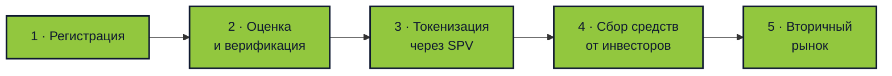

# Slice

## Токенизация реальных активов на Solana

  Недвижимость, бизнесы, стартапы, автопарки — любой актив превращается в торгуемые фракции

  <DeckQr :size="110" label="Открыть презентацию" />

  github.com/In-Da-Hack-Decentrathon/Slice

<!--
- Это 7-минутная выжимка полной презентации.
- Цель: быстро донести ценность продукта трём типам пользователей.
- Переход: сразу к вопросу — для кого это.
-->

---

# Для кого Slice

🏪

Малый и средний бизнес

Пекарни, автосервисы, кофейни, производства.

Нужны деньги на рост — банк отказывает, венчур не замечает, родственники не дают.

Продай 20% бизнеса толпе инвесторов, оставь контроль себе.

💰

Массовый инвестор

Люди с $100–$1000 в месяц свободных денег.

Депозит съедает инфляция, крипта слишком волатильна, фонды требуют $10k+.

Инвестируй в настоящие активы от $100, диверсифицируйся по 10 объектам.

🏠

Владельцы крупных активов

Недвижимость, автопарки, доли в компаниях.

Нужны деньги, но продавать целиком не хочется. Кредит дорогой, переезд не вариант.

Получи ликвидность, продав часть. Остальное — твоё.

<!--
- Это три группы, у которых есть понятная боль и готовность платить за решение.
- Малый бизнес: не хочет терять контроль ради денег. Венчур требует 30% компании, банк требует залог.
- Массовый инвестор: у него есть свободные деньги, но некуда их вложить с малым порогом.
- Владельцы крупных активов: у них есть стоимость, но она «заморожена» в одном объекте.
- Slice соединяет их: владелец продаёт часть, инвестор покупает долю, бизнес получает финансирование.
- Переход: масштаб рынка, на котором мы играем.
-->

---
layout: fact
---

# $280 трлн

## Крупнейший класс активов в мире

Только недвижимость. Плюс бизнесы, автопарки, оборудование.

Больше, чем рынок акций ($110 трлн) и облигаций ($130 трлн) вместе.

К 2030 году на блокчейне будет $4–30 трлн токенизированных активов (BCG, McKinsey, Roland Berger).

<!--
- Недвижимость — самый большой кошелёк человечества: $280 триллионов.
- И это ОДИН класс. Плюс компании, стартапы, автопарки, оборудование.
- Для сравнения: весь рынок акций в мире — $110 трлн, облигаций — $130 трлн. Недвижимость больше обоих.
- Три независимых консалтинга (BCG, McKinsey, Roland Berger) сходятся: $4-30 трлн токенизированных активов к 2030.
- Это не наш рынок целиком. Это общий рынок, в котором мы — один из первых игроков в Казахстане.
- Переход: какая боль движет каждую из трёх аудиторий.
-->

---

# Три боли, которые мы решаем

Неликвидность

Крупный актив нельзя продать частями. Нужно $30k — либо кредит под 20%, либо продавать всё и переезжать.

Дорогие сделки

Нотариус, банк, регистратор — 5-8% от цены. На $150k это $12 000. Плюс недели ожидания.

Нет входа для мелких

Между акциями ($1) и недвижимостью ($100k+) — пропасть в 10 000 раз. REIT не даёт купить КОНКРЕТНУЮ квартиру.

Все три боли — структурные. Рынок устроен так, что мелких участников не существует.

<!--
- Три боли совпадают у всех трёх аудиторий — просто с разных сторон.
- Владельцу нельзя продать часть. Инвестору некуда вложить мало. Сделки сверху дорогие для всех.
- Кредит под 20% за 5 лет — вернул вдвое. Продать и переехать — 3 месяца ожидания + 5-8% комиссий.
- REIT даёт часть решения, но это инвестиция в фонд, не в конкретный объект. Хочешь именно ЭТУ квартиру? Нельзя.
- Переход: как мы это решаем одной фразой.
-->

---
layout: center
---

# Slice — одной строкой

Превращаем любой реальный актив в N торгуемых фракций на Solana с полным юридическим оформлением.

🏠 Недвижимость

🏢 Компании

🚀 Стартапы

🚕 Автопарки

⛽ Нефтебазы

🚗 Авто

🌾 Сельхоз

💎 Что угодно

Требование одно: актив имеет стоимость и поддаётся юридическому оформлению через SPV (юрлицо-обёртку).

<!--
- Фраза: «Превращаем любой реальный актив в N торгуемых фракций с полным юридическим оформлением».
- Ключевое слово — «любой». Недвижимость — пример, не потолок.
- N — количество фракций — задаётся при создании хранилища, не захардкожено.
- SPV — это юрлицо-обёртка (в КЗ — ТОО), на которое оформлен актив. Токен = доля в SPV.
- Благодаря SPV фракции имеют юридическую силу, не просто цифры в блокчейне.
- Переход: как это выглядит в виде процесса.
-->

---

# Как это работает — 5 стадий

От подачи документов до торговли фракциями на рынке — около 3 месяцев.

На каждой стадии — независимые проверяющие с кворумом. Никто не принимает решения в одиночку.

<!--
- Пять стадий от регистрации до торговли.
- Регистрация: владелец загружает документы, указывает характеристики, решает сколько продать.
- Оценка и верификация: нотариусы проверяют документы, оценщики дают честную цену.
- Токенизация: создаётся SPV (юрлицо), выпускаются фракции Token-2022.
- Сбор средств: инвесторы покупают фракции, владелец получает деньги.
- Вторичный рынок: фракции можно перепродавать без разрешения владельца.
- 3 месяца — средний срок всего процесса.
- Переход: кто участвует в системе и как защищена честность.
-->

---

# 6 ролей и защита от мошенничества

👤 Собственник

Подаёт актив, оставляет долю себе.

⚖️ Нотариусы

Пул с кворумом — проверяют документы.

💰 Оценщики

11 независимых, «конверт и вскрытие».

⚖️ Юристы

Оформляют SPV — юрлицо на актив.

👥 Инвесторы

Покупают фракции от $100.

🔮 Оракул

Мост с госорганами и реальным миром.

На каждом шаге — кворум независимых исполнителей. Сговор дорогой, мошенничество экономически невыгодно.

<!--
- Шесть ролей, каждая закрывает свой провал.
- Собственник — тот, кому нужны деньги. Нотариусы — проверяют что квартира его.
- Оценщики дают честную цену через «конверт и вскрытие»: сначала запечатанный хеш, потом открытие.
- Если цена далеко от медианы — часть залога уходит в штраф. Жульничать дороже, чем быть честным.
- Юристы оформляют SPV — юрлицо-обёртку. Без него токен = просто цифра.
- Оракул — мост с реальным миром: смерть владельца, арест имущества, развод.
- Переход: это не крипто-спекуляция, это серьёзный финансовый инструмент.
-->

---

# Это не крипто-спекуляция

Slice — продолжение эволюции рынка ценных бумаг, а не альтернатива ему.

1980-е

Бумажные сертификаты акций в сейфах банков

1990–2000-е

Электронные реестры, централизованные депозитарии

2020–…

Токенизированные активы: тот же надзор, новые рельсы

<strong>Кто уже там:</strong> BlackRock ($500M+ фонд BUIDL), Franklin Templeton ($400M FOBXX), JPMorgan Onyx, Goldman Sachs DAP. Все под надзором SEC, MiCA, MAS.

<!--
- Ключевое сообщение для скептиков: это не крипта, это следующая форма рынка ценных бумаг.
- 40 лет назад акции были бумажными сертификатами в сейфах. 30 лет назад — электронными.
- Сейчас — токенизация на блокчейне. Те же регуляторы, те же правила, новая ликвидность.
- BlackRock запустил BUIDL — токенизированный денежный рынок на $500M+. Franklin Templeton — FOBXX на $400M.
- Все они под SEC. Токенизация работает ВНУТРИ регулирования, не вне его.
- Переход: что мы уже построили.
-->

---

# Что уже работает

В блокчейне:

<ul class="text-xs space-y-1 opacity-80">
<li>✅ 11 контрактов на Solana devnet</li>
<li>✅ Голосования нотариусов + раунды</li>
<li>✅ «Конверт и вскрытие» для оценки</li>
<li>✅ Децентрализованные нотариусы</li>
<li>✅ Фракционирование через Token-2022</li>
</ul>

Вне блокчейна:

<ul class="text-xs space-y-1 opacity-80">
<li>✅ Полный интерфейс: 30 страниц</li>
<li>✅ Три языка: RU, EN, KK</li>
<li>✅ 160+ активов в тестовой базе</li>
<li>✅ 129 активных хранилищ</li>
<li>✅ Интеграция с Irys (хранение документов)</li>
</ul>

Живая демо-платформа с реальной торговлей на devnet. Всё можно потрогать руками.

<!--
- Это не PowerPoint-продукт. Всё работает.
- 11 программ на Solana девнет, полный цикл от регистрации до выкупа.
- Фронтенд — 30 страниц, три языка, адаптирован под казахстанский рынок.
- В базе 160+ тестовых активов, 129 активных хранилищ, живой вторичный рынок.
- Можно зайти и потрогать. QR в конце.
- Переход: что ещё нужно сделать.
-->

---

# Честно — что ещё не решено

📊 Дивиденды

Как автоматически распределять доход актива (аренда, выручка бизнеса) по держателям токенов. Нужен оракул от Stripe / кассовых систем.

✂️ Сплит токенов

Если цена фракции выросла — как снизить порог входа для новых инвесторов. Аналог сплита акций, но через миграцию эмитента.

🗳️ Совет держателей

Кто и как принимает стратегические решения по активу (ремонт, продажа, смена управляющего). Отдельный модуль управления.

Это не баги. Это продуктовые вопросы, требующие проработки до публичного запуска.

<!--
- Честный блок перед жюри и инвесторами.
- Дивиденды — главная недоработка. Без них актив живёт только на выкупе.
- Сплит — проблема долгоживущих активов. Цена фракции растёт, порог входа растёт.
- Совет держателей — аналог DAO. Кто решает судьбу актива: провести ремонт, продать, сменить управляющего.
- У нас есть идеи решения каждой задачи. Они в полной версии презентации.
- Переход: команда и наша миссия.
-->

---

# Команда и миссия

Наша миссия — сделать инвестиции в бизнес такими же простыми, как покупка товара онлайн.

Булыгин Н.С.

t.me/Bulygin_Nik

Almat Kismet

t.me/almatkismet

Muslim Shady

t.me/musl1m_shady

Fekiss

t.me/fek1ss

In Da Hack · 4 человека из Казахстана

<!--
- Команда из четырёх человек: контракты, бэкенд, фронтенд, интеграции.
- Все из Казахстана, понимаем локальный рынок и юридический контекст.
- Миссия: открыть инвестиции в бизнес для человека с $100 в месяц, дать финансирование тем, кого не замечают банки.
- Telegram — основной канал связи, пишите.
- Переход: ссылки и QR-коды.
-->

---
layout: center
---

# Ссылки и QR-коды

GitHub

github.com/In-Da-Hack-Decentrathon/Slice

Solana Explorer

explorer.solana.com/?cluster=devnet

## Вопросы?

Slice · Real Estate on Solana · In Da Hack

<!--
- Три QR: код проекта, обозреватель блокчейна, демо-приложение.
- QR на GitHub ведёт в открытый репозиторий — можно проверить все контракты.
- QR на Solana Explorer — можно увидеть живые транзакции на devnet.
- QR на демо — можно зайти и попробовать самому.
- Спасибо, ждём вопросов.
-->
