# <span class="accent">Slice</span>

## Real-World Asset Tokenization on Solana

<div class="mt-6 text-lg opacity-70">
  Real estate, companies, startups, taxi fleets, oil depots, vehicles — anything of value
</div>

<div class="abs-tl m-4">
  <DeckQr :size="110" label="Open presentation" />
</div>

<div class="abs-br m-6 text-sm opacity-50">
  Decentrathon · github.com/In-Da-Hack-Decentrathon/Slice
</div>

---
layout: cover
class: section-investor
---

# Part 1

## <span class="accent">Problem → Solution → Use Cases → Market</span>

---
layout: cover
class: section-sub
---

# A · The Problem

Why large assets remain illiquid

<div class="mt-4 text-xs opacity-70">
Real estate is a prime example. The same problem applies to companies, startups, taxi fleets, oil depots, vehicle fleets, and farmland.
</div>

---
layout: fact
---

# $280 000 000 000 000

## TAM · Theoretical Ceiling

The global real estate market is just one of many possible asset classes.

<div class="mt-6 text-sm opacity-70">
+ companies, startups, private credit, bonds, commodities, equipment.<br/>
Projected tokenization of all securities by 2030: $162 trillion.
</div>

<!--
- How much is all the real estate in the world worth? $280 trillion — and that is just one asset class.
- Add companies, startups, taxi fleets, oil depots, equipment, agriculture.
- For comparison: the global equity market is ~$110T, the bond market ~$130T. Real estate exceeds both.
- Analogy: if the equity market were a lake, the real estate market would be an ocean. We are bringing the same infrastructure equities enjoy to that ocean.
- TAM — the "dream ceiling": what if every real-world asset could trade like a stock.
- Obviously not everything can be digitized. That is why we move to SAM next — a realistic forecast.
- Transition: how much of this will actually become tokenized by 2030.
-->

---
layout: fact
---

# $4–30T

## SAM · Serviceable Addressable Market

Consensus forecast for tokenized assets by 2030.

<div class="mt-6 text-sm opacity-70 space-y-1">
  <div>BCG: $16.1T (roughly 10% of global GDP)</div>
  <div>Roland Berger: $10.9T — real estate, debt, funds</div>
  <div>McKinsey: $2–4T (conservative)</div>
</div>

<div class="mt-4 text-xs opacity-60">
This is not speculation — it is the migration of equity and bond markets onto blockchain rails. BlackRock, JPMorgan, and Franklin Templeton are already issuing tokenized funds under SEC oversight.
</div>

<!--
- SAM — the realistic scenario: what will actually move on-chain by 2030.
- Key message for the audience: this is NOT crypto speculation. It is the natural evolution of equity and bond markets.
- BlackRock launched the tokenized BUIDL fund at $500M+ in 2024. Franklin Templeton — FOBXX at $400M. JPMorgan — Onyx for client settlements.
- All of them operate under SEC supervision (US regulator). In the EU — MiCA. In KZ — AIFC. In the UAE — VARA.
- Analogy: just as paper stock certificates went electronic in the 1990s, electronic securities are now going tokenized.
- Three leading consultancies independently project $4–30T by 2030.
- This is NOT our entire market — it is the total tokenization market. Our share is smaller.
- Transition: how much is already on-chain RIGHT NOW — SOM.
-->

---
layout: fact
---

# $100–500M

## SOM · Obtainable Market

Conservative estimate for Slice in the Kazakhstan market over 5 years.

<div class="mt-6 text-sm opacity-70 space-y-1">
  <div>Annual real estate turnover in KZ: ~$8–12B</div>
  <div>Goal: 0.5–1% of transactions via tokenization within 5 years</div>
  <div>+ equity stakes in ТОО, vehicle fleets, agriculture, commercial real estate</div>
  <div>AIFC sandbox — regulatory launchpad for the pilot</div>
</div>

<!--
- SOM — what WE CAN REALISTICALLY CAPTURE, not the entire global market.
- We start from the Kazakhstan market: annual real estate turnover is about $8–12B.
- Goal: capture 0.5–1% of transactions within 5 years — that is $40–120M per year, cumulatively $100–500M.
- Plus other asset classes: equity stakes in ТОО, vehicle fleets, farmland — an additional 30–50% on top.
- Why KZ first: AIFC provides a regulatory sandbox, a digital assets law from 2020, and no direct competitors.
- This is a conservative figure. In a best-case scenario — 2–3x higher.
- Transition: the numbers look great, but let us zoom in on a specific person and their pain point.
-->


---

# Pain Point #1 — Illiquidity

## Large assets cannot be sold in parts

<div class="mt-3 text-xs opacity-70">Example: an apartment. But the same applies to a company, taxi fleet, or business stake.</div>

<div class="mt-4 grid grid-cols-2 gap-8">
<div>

**What the owner wants:**
Needs $30k for renovation / business / education.
The asset is worth $150k (apartment, business stake, vehicle fleet). Selling the whole thing is not an option.

</div>
<div>

**What is available today:**
- A loan at 15–20% APR
- Sell and move out
- Rent it out and wait for years

</div>
</div>

<!--
- A simple real-life situation: need a renovation, but the apartment is worth $150k and only $30k is needed.
- Selling a quarter of the apartment is impossible. Selling the whole thing means moving. Taking a loan means paying back double.
- Analogy: it is as if the only way to buy from a bakery were to purchase the entire cake, when all you want is one slice.
- We provide the mechanism to "slice the cake": sell 20% of the apartment, keep 80%, continue living there.
- The investor puts in $30k and receives 20%. The owner gets cash WITHOUT a loan, WITHOUT monthly payments.
- Transition: illiquidity is the first pain point. But even rare transactions are expensive and slow to execute.
-->

---

# Pain Point #2 — Costly Transactions and Fraud

<div class="mt-6 grid grid-cols-3 gap-4 text-sm">
<div class="role-card">

**Fees**
Notary + registrar + lawyer + taxes = **5–8%** of the transaction price

</div>
<div class="role-card">

**Time**
Processing: **weeks or months**. Escrow — through banks.

</div>
<div class="role-card">

**Fraud**
Forged documents, double-selling, hidden encumbrances

</div>
</div>

<div class="mt-6 opacity-70 text-sm">
  Fees exceed the annual yield of many instruments. Trust is built on paper that is easy to forge.
</div>

<!--
- Imagine selling an apartment in Almaty — you need to visit 4 offices: BTI, public services center, notary, bank.
- Each takes its cut. Total: 5–8% of the deal price. On $150k, that is $7,500 — 12 monthly salaries for an average person in Kazakhstan.
- Analogy: imagine paying 5 separate commissions just to buy a loaf of bread — to the shop, carrier, bakery, municipality, and insurer.
- The process takes weeks to months. Money sits idle in a bank. You miss other opportunities.
- Fraud: paper documents are easy to forge. A 2020 transaction can still be challenged in 2026.
- Transition: okay, suppose I am not selling. But how does a small investor even enter the real estate market?
-->

---

# Pain Point #3 — No Entry for Small Investors

<div class="mt-8">

**Minimum ticket to invest in rental real estate:** $100k+

**What is available to a retail investor:**

</div>

| Instrument | Regulator | Min. Ticket | Liquidity |
|---|---|---|---|
| Bank deposit | Central bank | $100 | High |
| Equities | SEC / AIFC / Central bank | $1 | High |
| Bonds | SEC / AIFC | $1000 | Medium |
| REIT | SEC / AIFC | $10 | Medium |
| **Direct real estate** | **Ministry of Justice / ЕГРП** | **$100k+** | **Low** |
| **Tokenized RWA** | **SEC / MiCA / AIFC** | **$10** | **High** |

<div class="mt-4 opacity-70 text-sm">
Tokenization does not replace regulators — it works WITHIN their frameworks. The same supervisory structure as for equities.
</div>

<!--
- Staircase analogy: equities are the first step ($1), real estate is the ten-thousandth step ($100k+).
- Between them — a gap. For 90% of people, real estate as an investment is simply inaccessible.
- REIT is like a "vineyard share": you invest in a fund that owns 100 properties, but no specific one.
- Want THIS particular apartment in Almaty where your friend lives? Today — impossible. On Slice — possible.
- Concrete example: the average salary in KZ is $800. Buying an apartment means saving for 10 years with zero spending.
- Transition: let us combine all three pain points into one picture.
-->

---

# Who Suffers — Small Businesses

<div class="mt-4 text-sm grid grid-cols-3 gap-4">

<div class="role-card">
<div class="font-semibold accent">🏦 Bank Barriers</div>
<div class="text-xs mt-2 opacity-80">Extremely difficult to secure a loan without collateral and a 2+ year track record. Banks avoid risk.</div>
</div>

<div class="role-card">
<div class="font-semibold accent">👔 Angels Overlook Them</div>
<div class="text-xs mt-2 opacity-80">Small businesses are off-radar for VCs — they need 100x growth in 5 years, not a steady 2x.</div>
</div>

<div class="role-card">
<div class="font-semibold accent">💸 Expensive Capital</div>
<div class="text-xs mt-2 opacity-80">Either predatory rates from private lenders, or giving up company control to an investor.</div>
</div>

</div>

<div class="mt-6 text-sm opacity-70">
Between "a bank loan" and "a venture round" there is a gap. Slice bridges it: the seller raises capital from many small investors without losing control.
</div>

<!--
- A bakery, an auto repair shop, a beauty salon, a small manufacturer — they have nowhere to turn for funding.
- Banks demand collateral and a 2-year history. Young businesses are cut off at the start.
- VCs want a business that will grow 100x in 5 years. A stable bakery does not interest them.
- Private investors are either relatives or loan sharks with predatory rates.
- Our instrument: sell 20% of the business to a hundred small investors, raise growth capital, retain control.
- Analogy: it is like crowdfunding, but investors receive a share of profit instead of a "thank-you" T-shirt.
- Transition: what about ordinary people who would like to invest?
-->

---

# Who Suffers — Ordinary People

<div class="mt-4 text-sm grid grid-cols-3 gap-4">

<div class="role-card">
<div class="font-semibold accent">📉 Savings Dead End</div>
<div class="text-xs mt-2 opacity-80">Deposits barely cover inflation. The stock market demands deep knowledge and constant attention.</div>
</div>

<div class="role-card">
<div class="font-semibold accent">🎁 Crowdfunding Is Charity</div>
<div class="text-xs mt-2 opacity-80">On Kickstarter you get a "thank you" or a mug. No share of future profit.</div>
</div>

<div class="role-card">
<div class="font-semibold accent">🚪 High Entry Barrier</div>
<div class="text-xs mt-2 opacity-80">Real investment instruments start at large sums — inaccessible to the retail user.</div>
</div>

</div>

<div class="mt-6 text-sm opacity-70">
An ordinary person with $100–$500 per month has no way to participate in real businesses in their city. There are deposits, equities, the volatile crypto market. That is it.
</div>

<!--
- Imagine a friend who saves $200 a month. Where can they invest it?
- A bank deposit at 10% APR — with 15% inflation, they are losing money.
- Equities — requires expertise, reading reports, following news.
- Kickstarter — not an investment; it is charity. You get a T-shirt.
- Real investment funds — minimum $10,000–$50,000 to enter.
- They could buy 2% in a bakery down the street and receive a share of its revenue. But no such instrument exists.
- Slice builds exactly that bridge: connecting retail investors with real businesses through fractions.
- Transition: let us put all the pain points — for owners and investors — into one picture.
-->

---

# All Pain Points in One Picture

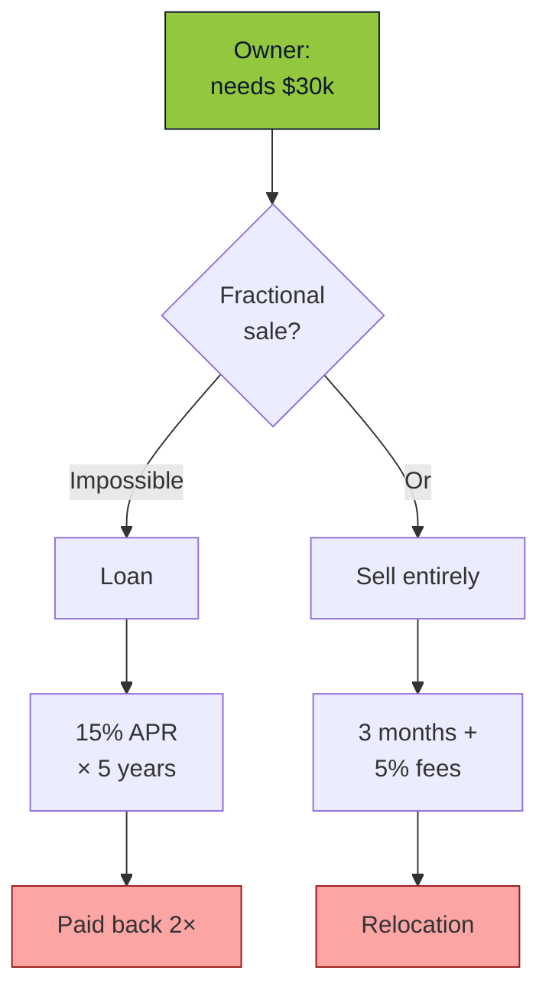

<!--
- This is a structural problem, not a temporary one — the market is fundamentally built without small participants.
- Either a loan (pay back 2x) or sell and move (3 months + fees). There is no third option.
- In both cases the owner loses: either overpays or loses their home.
- The solution must be fundamental: not an optimization of the existing system, but an entirely new mechanism.
- Transition: that mechanism is Slice. But first — why the market is ready right now.
-->

---

# Why the Market Is Ready Right Now

<div class="mt-6 text-sm grid grid-cols-3 gap-4">

<div class="role-card">
<div class="font-semibold accent">⚡ Web3 Got Cheap</div>
<div class="text-xs mt-2 opacity-80">Solana: $0.00025 per transaction, 400 ms finality. Small deals are no longer expensive.</div>
</div>

<div class="role-card">
<div class="font-semibold accent">🎨 Creator Economy Growth</div>
<div class="text-xs mt-2 opacity-80">Small businesses and independent creators need flexible financing. There are many more of them now.</div>
</div>

<div class="role-card">
<div class="font-semibold accent">🔍 Search for Alternatives</div>
<div class="text-xs mt-2 opacity-80">Investors want more than deposits and equities. They need access to real businesses at small ticket sizes.</div>
</div>

</div>

<div class="mt-8 text-center text-lg opacity-80">
👉 The market is ready for a new format of investing
</div>

<!--
- Three factors have converged right now — this was not possible before, and the window will not stay open forever.
- First: before Solana, blockchain fees were $5–50 per transaction. Fractional trading was economically unfeasible.
- Second: small businesses and independent creators need capital. Their numbers have grown several-fold in the last 5 years.
- Third: retail investors are disillusioned with deposits (inflation eats returns) and fear crypto (too volatile).
- The perfect moment: demand exists, infrastructure has matured, regulators are beginning to understand the rules.
- Analogy: similar to how marketplaces emerged in the 2000s when internet + logistics + trust in online payments all converged.
- Transition: now the solution itself — how it works.
-->

---
layout: cover
class: section-sub
---

# B · The Solution

Full cycle: from document to secondary market

---
layout: center
---

# Slice — In One Line

<div class="text-2xl mt-6 leading-relaxed">
We turn any real-world asset into <span class="accent">N tradable fractions</span> on Solana — with full legal structuring.
</div>

<div class="mt-4 text-sm opacity-70">
Apartments, houses, offices, oil depots, taxi fleets, startups, companies, equipment — anything that has value and legal documentation.
</div>

<div class="mt-8 opacity-60 text-xs">
On Solana · Token-2022 · Anchor
</div>

<!--
- One sentence that explains everything: we slice an apartment into pieces and sell them on Solana.
- Pizza analogy: we cut an apartment into N slices. Each slice is one token. Want a quarter of the pizza — buy a quarter of the tokens.
- N is a parameter. Not hard-coded to 10,000. Could be 1,000, could be 100,000. Depends on the asset price.
- The key phrase is "with full legal structuring." Without an SPV (legal wrapper entity), it is just a picture on the internet.
- SPV is like a box into which the apartment was placed with a receipt attached. Own a piece of the box — own a piece of the apartment.
- Transition: how this magic translates into a concrete 7-step process.
-->

---

# This Is Not Crypto Speculation

<div class="mt-4 text-sm max-w-3xl">

Slice is the next step in the evolution of capital markets, not an alternative to them.

</div>

<div class="mt-4 text-xs grid grid-cols-3 gap-4">
<div class="role-card">
<div class="font-semibold accent">1980s</div>
<div class="mt-1">Paper stock certificates stored in bank vaults</div>
</div>
<div class="role-card">
<div class="font-semibold accent">1990–2000s</div>
<div class="mt-1">Electronic registries, centralized depositories</div>
</div>
<div class="role-card">
<div class="font-semibold accent">2020–…</div>
<div class="mt-1">Tokenized assets: same oversight, new rails</div>
</div>
</div>

<div class="mt-6 text-xs opacity-70">
**Who is already there:** BlackRock ($500M+ BUIDL fund), Franklin Templeton ($400M FOBXX), JPMorgan (Onyx), Goldman Sachs (GS DAP). All under SEC, MiCA, MAS supervision. Slice operates in the same paradigm, but for individual assets rather than large funds.
</div>

<!--
- Core message: we are not competitors to stocks and bonds — we are their next form.
- 40 years ago, stocks were paper certificates. Physically in vaults. Trades executed through banks.
- 30 years ago — electronic depositories. The entire infrastructure went digital.
- Now — tokenization on blockchain. Same regulators, same rules, new level of liquidity.
- BlackRock launched BUIDL in March 2024 — a tokenized money market on Ethereum. Already $500M+.
- Franklin Templeton — FOBXX, a tokenized government fund.
- JPMorgan Onyx — an internal network for interbank settlements.
- All of them operate UNDER SEC oversight. Tokenization = a regulated instrument, not anarchy.
- Slice does this for individual assets (apartments, companies), not large funds.
- Transition: which assets can we tokenize.
-->

---

# Any Asset → Fractions

<div class="mt-4 grid grid-cols-4 gap-3 text-xs">
<div class="role-card text-center">
<div class="text-2xl mb-1">🏠</div>
<div class="font-semibold">Real Estate</div>
<div class="opacity-70 mt-1">Apartments, houses, offices, warehouses, land</div>
</div>
<div class="role-card text-center">
<div class="text-2xl mb-1">🏢</div>
<div class="font-semibold">Companies</div>
<div class="opacity-70 mt-1">Operating businesses, ТОО, LLC</div>
</div>
<div class="role-card text-center">
<div class="text-2xl mb-1">🚀</div>
<div class="font-semibold">Startups</div>
<div class="opacity-70 mt-1">Early-stage investment rounds</div>
</div>
<div class="role-card text-center">
<div class="text-2xl mb-1">🚕</div>
<div class="font-semibold">Taxi Fleets</div>
<div class="opacity-70 mt-1">Vehicles generating ride revenue</div>
</div>
<div class="role-card text-center">
<div class="text-2xl mb-1">⛽</div>
<div class="font-semibold">Oil Depots</div>
<div class="opacity-70 mt-1">Industrial assets</div>
</div>
<div class="role-card text-center">
<div class="text-2xl mb-1">🚗</div>
<div class="font-semibold">Vehicles</div>
<div class="opacity-70 mt-1">Premium cars, collections</div>
</div>
<div class="role-card text-center">
<div class="text-2xl mb-1">🌾</div>
<div class="font-semibold">Agriculture</div>
<div class="opacity-70 mt-1">Farmland, equipment, harvest</div>
</div>
<div class="role-card text-center">
<div class="text-2xl mb-1">💎</div>
<div class="font-semibold">Anything</div>
<div class="opacity-70 mt-1">Any legally structured asset</div>
</div>
</div>

<div class="mt-4 text-xs opacity-70 text-center">
One requirement: the asset must have real value and be eligible for legal structuring via an SPV.
</div>

<!--
- Key takeaway: real estate is the showcase example, not the ceiling.
- Any large asset with legal documentation can be tokenized using the same mechanism.
- Real-life KZ examples: equity stakes in ТОО, vehicle fleets, agricultural equipment, commercial real estate.
- Each asset class has its nuances (e.g., a taxi fleet generates cash flow, an apartment does not), but the platform core is the same.
- We chose real estate as the initial niche because we have domain expertise and the market is large.
- Transition: let us look at the end-to-end process — 7 stages from registration to trading.
-->

---

# End-to-End Process — 7 Stages


<div class="mt-6 text-xs opacity-70 leading-relaxed">
<strong>1.</strong> Owner registers the asset + documents &nbsp;·&nbsp; <strong>2.</strong> 3+ independent verifiers &nbsp;·&nbsp; <strong>3.</strong> 11 appraisers, blind commit-reveal scheme<br/>
<strong>4.</strong> SPV* + Token-2022 NFT fractions &nbsp;·&nbsp; <strong>5.</strong> Fundraising campaign, investors enter &nbsp;·&nbsp; <strong>6.</strong> Secondary market &nbsp;·&nbsp; <strong>7.</strong> Buyout via holder vote

<div class="mt-2 text-xs opacity-60">
* SPV = Special Purpose Vehicle, a legal wrapper entity (in KZ — SPC, Special Purpose Company) that holds title to the apartment. Fractions = shares in this SPV.
</div>
</div>

<!--
- Think of it as a recipe: 7 steps from raw ingredients to a finished dish.
- 1) registration — submit documents. 2) verification — confirm ownership. 3) appraisal — set the price.
- 4) tokenization — slice into fractions. 5) fundraise — investors buy in. 6) trading — fractions can be resold. 7) buyout — someone acquires the whole asset.
- The entire process runs on-chain; no one can tamper with any intermediate step.
- From start to first trade — approximately 3 months. After that, the asset lives on the market for years.
- Transition: what makes all of this possible — 6 key innovations.
-->

---

# 6 Key Innovations

<div class="mt-4 grid grid-cols-3 gap-4 text-sm">
<div class="role-card">

**End-to-End On-Chain Lifecycle**
From registration to secondary market — all state lives on-chain

</div>
<div class="role-card">

**Blind Appraisal (Commit-Reveal)**
Fair pricing: first the hash, then the reveal. No collusion.

</div>
<div class="role-card">

**Fractional Ownership**
The asset is split into N fractions. N is calculated from the price.

</div>
<div class="role-card">

**On-Chain Compliance**
KYC checks and restrictions enforced at the contract level

</div>
<div class="role-card">

**Six Roles + Quorum**
Owner, verifier, appraiser, lawyer, notary, investor

</div>
<div class="role-card">

**Legal Enforceability**
Notary quorum + SPV (legal wrapper) documents = real legal rights

</div>
</div>

<!--
- Each card is not marketing — it is a concrete Anchor program. You will see the code in Part 2.
- End-to-end lifecycle: there is no step where you must fall back to manual off-chain actions.
- Blind commit-reveal voting — the most interesting part for engineers; we will cover it separately.
- Multi-role governance — 6 roles, but the same wallets can hold multiple roles simultaneously.
- Legal binding — this is what sets us apart from toy tokenization projects.
- Transition: let us look at the interface to see how it looks for the user.
-->

---
layout: image-right
image: /shots/landing-en.png
---

# Landing Page

Platform entry point — three languages: EN / RU / KK.

Login via wallet (Solana wallet adapter) or via email with TOTP.

<div class="mt-8 text-sm opacity-70">
  Next.js 16 · React 19 · Tailwind v4 · shadcn/ui
</div>

<!--
- We are showing the live UI; all screenshots are from localhost:2098 (production-ready build).
- Three languages are built in from the start, not added later.
- Login: via wallet (Phantom, Solflare) or via email with TOTP through Ory Kratos.
- Next.js 16 App Router + React 19 server components — instant rendering of asset lists.
- Transition: after login, the user lands on the dashboard.
-->

---
layout: image-right
image: /shots/dashboard.png
---

# Dashboard

The user's main screen.

KPI cards: assets, verifications, deals.

"Requires your attention" — what is waiting specifically for you as a notary / appraiser / lawyer.

<!--
- The dashboard adapts to the user's roles: a notary sees votes, a lawyer sees legal tasks.
- "Requires your attention" — a list of actions: what specifically is expected of me right now.
- KPI cards pull from the Postgres cache; details are fetched directly from the chain.
- Reputation affects priority: higher-rated notaries receive more rounds.
- Transition: now let us walk through the 6 roles by building the ecosystem step by step.
-->

---
layout: cover
class: section-sub
---

# C · Who Is in the System

Why not simple P2P. The 6 roles, one by one.

<!--
- The first investor question: "why so many intermediaries — isn't it simpler to go client-to-client?"
- The answer: because an apartment is not just a number in a database; it is a real asset with legal context.
- Each role solves a specific real-world problem. Without them, the token is just a promise.
- Let us start with the problem that seems easiest to solve without intermediaries — and see where it breaks.
- Transition: the starting point — one person, one asset.
-->

---
layout: center
---

# Why Not Simply Client → Client

<div class="mt-4 text-sm max-w-3xl mx-auto">

**Creating a digital token on a blockchain is easy.** Binding it to a real-world asset is hard.

Without intermediaries, four failures arise:

1. **Title verification** — who confirmed the asset (apartment, company, fleet) actually belongs to the seller?
2. **Fair price** — the seller will inflate it; the buyer cannot verify.
3. **Legal wrapper** — a token without an SPV = a pretty picture with no rights.
4. **Dispute resolution** — who do you turn to if someone breaches the agreement?

</div>

<div class="mt-8 text-sm opacity-70 text-center">
Each role in Slice is the answer to one of these failures.
</div>

<!--
- The main audience question: "why all these intermediaries? Let the seller and buyer just agree on their own!"
- Analogy: why do bazaars use appraisers and guarantors? Because strangers do not trust each other.
- Imagine: you are buying an apartment from a stranger. They show you photos of documents in Telegram. Would you trust them?
- 4 failures without intermediaries: (1) is the apartment even theirs? (2) what is the real price? (3) what if they scam you? (4) where do you complain?
- The traditional world solves this through notaries, banks, registries. We port their functions to the blockchain.
- The difference: on-chain intermediaries are verifiable and incorruptible because everything is transparent.
- Transition: let us build the system from scratch — one person who wants to sell.
-->


---

# Step 1 — The Owner Alone

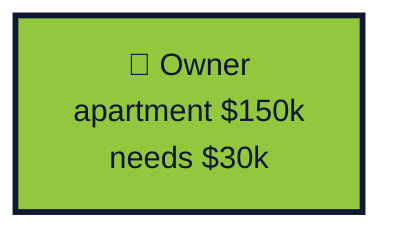

<div class="mt-4 text-sm opacity-70">
Starting point: one person, one asset, one need for liquidity. Cannot sell the apartment outright. A loan is too expensive.
</div>

<!--
- Meet Aisha — a situation any Almaty resident can relate to.
- She has a $150k apartment but no cash. She needs $30k: renovation, business, wedding, child's tuition — anything.
- Today's options: (1) a loan at 15–20%, pay back double over 5 years, (2) sell and move, (3) rent out and wait years.
- All three options are bad. Either overpaying, losing the home, or a long wait.
- Analogy: you own a large painting worth $150k, but you cannot sell a corner for $30k.
- Our task: let Aisha sell 20% of the apartment, stay living there, avoid a loan.
- Transition: for investors to trust the deal, we need to prove the apartment is really hers.
-->

---
layout: two-cols
---

# Aisha — the Owner

<div class="mt-4 text-sm">

**Situation:** apartment in Almaty, $150k, needs $30k for a business.

**What she does:**
1. Registers the asset + uploads documents
2. Specifies attributes (area, photos, address)
3. Chooses: sell entirely or retain a portion of ownership
4. Submits the asset to the shared pool for verification
5. After appraisal — publishes the asset for fundraising

**What she does NOT do:** she does not select notaries / appraisers / lawyers. Any qualified participant from the shared pool picks up the task.

**Result:** $30k in hand, 80% ownership retained, still living in the same apartment.

</div>

::right::


<!--
- The central character of Part 1. All other roles revolve around her.
- Key point: she does not lose the apartment, does not move out, does not wait for years.
- The owner does NOT select notaries/appraisers — anyone from the pool picks up the task.
- The owner only decides: sell entirely or retain a share.
- The number of fractions is determined automatically by the contract based on the final auction price.
- Documents go to Irys; the hash is written on-chain in the asset registry.
- Transition: for Aisha's investors to trust the deal, the documents must be verified by a neutral party.
-->

---

# The Problem — Does the Seller Actually Own It?

<div class="mt-6 text-sm max-w-3xl">

The investor sees a listing: apartment in Almaty, $150k, 20% on sale. **How do they know the seller is the real owner?**

| Approach | Why it fails |
|---|---|
| Request documents | Documents can be forged; a photo of a document — even more so |
| Visit the public services center | Not all investors are in KZ; slow; does not scale |
| Trust the seller | That is how 90% of scams work |
| Insurance | Expensive; does not cover tokenization |

</div>

<div class="mt-6 text-sm opacity-70">
A trusted intermediary is needed — one who performs the check once, records the result on-chain, and all investors trust that record as the source of truth.
</div>

<!--
- Ask the audience: would you send $500 to a stranger who sent document photos in a chat? No one would.
- This is the classic trust problem: scammers produce fake document photos that look better than real ones.
- The "visit the public services center" option does not scale: an investor from another city will not travel for $500.
- You need an intermediary everyone trusts. In the traditional world — a notary. On-chain — also a notary, but under observation.
- But a single notary is not enough — they can be bribed. You need a POOL of notaries, each cross-checking the others.
- Analogy: like a jury in court — 12 people, not one judge. Colluding with all of them is virtually impossible.
- Transition: meet the first intermediary — the notary who enters our system.
-->

---

# Step 2 — The Notary Joins

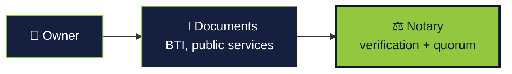

<div class="mt-4 text-sm opacity-70">
The notary confirms document authenticity. Not one notary alone — a quorum of notaries with reputation-weighted votes.
</div>

<!--
- The notary solves the trust problem: the investor does not want to personally visit the public services center.
- A quorum is needed at two stages: before appraisal (document verification by notaries) and before fractionalization (SPV verification by notaries after the lawyer).
- Vote weight: `1000 + rating_score × 10`. A top notary weighs 15,000; a low-rated one — 1,000.
- A single notary's vote means nothing. Only the aggregated weighted consensus matters.
- Transition: let us meet the person who votes — Marat.
-->

---
layout: two-cols
---

# Marat — the Notary

<div class="mt-4 text-sm">

**Situation:** a practicing notary looking for additional income in crypto.

**What he does:**
1. Registers and receives the `Notary` role
2. Votes in rounds (quorum collection)
3. Participates in notary rounds: before appraisal and after the lawyer
4. Vote weight grows with reputation

**Earnings:** commission from each completed round, proportional to `vote_weight`.

</div>

::right::


<!--
- Marat is the bridge between the traditional legal world and the crypto economy.
- He does not need to understand blockchain — the notary interface looks like a standard case management system.
- Weight formula: `max(1000, 10000 + rating_score × 10)`. Reputation genuinely affects income.
- If he systematically votes against the majority — reputation drops, stake gets slashed.
- Transition: documents are verified. Now we need a price — and the seller cannot set it themselves.
-->

---

# The Problem — What Is It Actually Worth?

<div class="mt-4 text-sm max-w-3xl">

**The best appraiser is the market itself.** But there is no market at launch. Without a price, you cannot start an auction.

"Asset flipping" attack: a fraudster creates 2 accounts, lists the apartment at $1, instantly buys from the second account, resells at market price — profit of $149,999.

<div class="mt-4 grid grid-cols-2 gap-4">
<div>

**Overvaluation risk:**
- Seller lists at $300k for a $150k apartment
- Investors overpay
- At buyout a year later — holders take losses

</div>
<div>

**Undervaluation risk:**
- Seller lists at $1, buys via a second account
- Insider collusion
- Industrial-scale fraud

</div>
</div>

</div>

<div class="mt-4 text-sm opacity-70">
Independent appraisal is needed. One appraiser = one point of collusion. Therefore — multiple appraisers, independent of each other, with protection against coordination before results are published.
</div>

<!--
- Start with an acknowledgment: the best appraiser is the market itself; no one can be more precise.
- But at LAUNCH there is no market. The first asset has never been traded; its price must be estimated.
- The most dangerous attack: a fraudster creates two accounts, lists the apartment at $1, buys from the second.
- Analogy: imagine an eBay auction where the seller and buyer are the same person. Self-bought for $1.
- Then resells the same token at market price — a 150,000x profit. Heard of wash trading? That is exactly it.
- Defense: independent appraisers. Not one, because they can be bribed. Several, because colluding with all of them is expensive.
- Transition: how a specific appraiser works — Dinara.
-->

---

# Step 3 — The Appraiser Joins

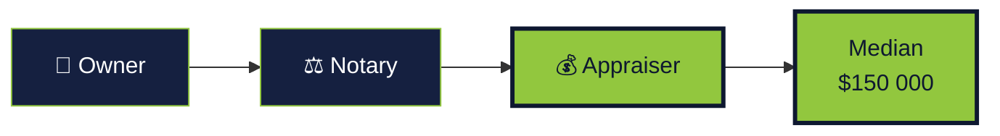

<div class="mt-4 text-sm opacity-70">
Not one appraiser, but 11 — using a blind commit-reveal scheme. The median filters out extreme valuations.
</div>

<!--
- The appraiser's task: name a fair price for the apartment without being influenced by others.
- Core technique: commit-reveal. In simple terms — sealed envelopes.
- Analogy: jury voting. Everyone writes their appraisal in an envelope, seals it, then all envelopes are opened simultaneously.
- No one sees others' valuations until the reveal — coordination or collusion is not possible.
- 11 appraisers is not a magic number. It is enough for the median to be resilient to outliers.
- If an appraiser does not reveal — they lose their stake. If their price deviates significantly — they also lose part of it.
- Transition: meet Dinara — she will appraise Aisha's apartment.
-->

---
layout: two-cols
---

# Dinara — the Appraiser

<div class="mt-4 text-sm">

**Situation:** a real estate agent with 10 years of experience in Almaty, looking to monetize her expertise.

**What she does:**
1. Receives the `Appraiser` role, locks a stake in SOL
2. **Commit phase:** `keccak256(price ‖ salt)` recorded on-chain
3. **Reveal phase** after the deadline: discloses the figure
4. Median across all reveals → minimum asset price

**Protection:** no one sees others' valuations until the reveal. Extreme values are penalized.

</div>

::right::


<!--
- The blind commit-reveal scheme is the key innovation; we will cover it in detail in Part 2.
- The SOL stake is not paper accountability — it is economic accountability.
- Maximum of 11 appraisers per round — a balance between statistical robustness and coordination costs.
- The more accurate the valuations, the higher the reputation and the more round invitations.
- Transition: we have a price, we have documents. The asset is ready to become fractional property. We need buyers.
-->

---

# The Problem — How to Split Ownership Rights

<div class="mt-6 text-sm max-w-3xl">

The apartment is verified, the appraisal is fair. The owner wants to **sell 20% for $30k**. But:

- Co-ownership in ЕГРП supports 2–10 co-owners, not 2,000.
- Legally you cannot simply "write" that 2,000 people each hold 0.01%.
- Every sale of a co-ownership share requires a notary, public services center, and registration.

**On-chain — N fungible fractions with instant transfer without a notary.** The quantity N is set when the vault is created; the price per fraction = asset_price / N. A container on-chain (vault) is needed to hold the token supply.

</div>

<div class="mt-6 text-sm opacity-70">
A vault is needed: an on-chain intermediary program that mints Token-2022 fractions and distributes them to investors after the fundraise.
</div>

<!--
- Third problem: the structural gap between the legal form of ownership and on-chain fractionalization.
- In the real world, an apartment can have 2–10 co-owners; the registry does not scale to 2,000.
- Token-2022 is Solana's built-in standard for fungible tokens with metadata and transfer hooks.
- N fractions — a parameter of `initialize_vault`, set when the vault is created. Can be 1,000, 10,000, or 100,000.
- Transition: how this looks in the UI for investors.
-->

---

# Step 4 — The Market Joins

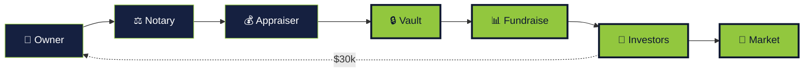

<div class="mt-4 text-xs opacity-70">
The vault turns the asset into N Token-2022 fractions. The fundraising campaign sells a share (e.g., 20%). Funds go to the owner; fractions go to investors. The secondary market provides liquidity.
</div>

<!--
- The vault is an on-chain intermediary at a PDA that holds fractions until the fundraise ends.
- Token-2022 is Solana's standard for programmable tokens (transfer hooks, metadata).
- The number of fractions N is a vault parameter. Price per fraction = asset_price / N.
- After a successful fundraise, funds are transferred to the owner; fractions are distributed proportionally to deposits.
- Transition: let us meet the investors — there are two types.
-->

---
layout: two-cols
---

# Rustam — Investor (Primary Market)

<div class="mt-4 text-sm">

**Situation:** $500/month of disposable income, wants exposure to real estate.

**What he does:**
1. Completes KYC (Sumsub / Binance / Civic)
2. Browses fundraising campaigns on `/auctions`
3. Invests $500 across 5 different assets
4. Receives 5 types of fractions in his wallet

**Result:** real estate diversification with a $100 entry point.

</div>

::right::


<!--
- Rustam is the profile of the retail investor the platform is built for.
- A $100 entry point bridges the gap between equities ($1) and direct real estate ($100k+).
- KYC is mandatory — without an attestation on the wallet, the compliance hook blocks the `invest()` call.
- 5 different assets — genuine diversification by geography, type, and size.
- Transition: but an investor may want to exit before the buyout — the secondary market.
-->

---
layout: two-cols
---

# Nazerke — Secondary Market

<div class="mt-4 text-sm">

**Situation:** bought 100 fractions 6 months ago, needs cash — selling 50.

**What she does:**
1. Opens `/market`
2. Places a sell order for 50 fractions
3. The off-chain order book matches her with a buyer
4. Settlement in batches on-chain

**Result:** exits the position in minutes, without waiting years for a buyout.

</div>

::right::


<!--
- The secondary market is the key differentiator vs. REITs: exit anytime, not after years.
- Hybrid approach: off-chain order book (speed, low-latency matching), on-chain settlement (security, finality).
- This removes the fear of "what do I do later with 100 apartment fractions." Answer: sell them on the market.
- Secondary market liquidity is the primary driver of mass adoption for investors.
- Transition: the asset is trading. But who guarantees that the tokens are actually backed by the apartment?
-->

---

# The Problem — Tokens with No Legal Force

<div class="mt-6 text-sm max-w-3xl">

The investor bought 100 fractions. They have 100 Token-2022 tokens in their wallet. **What do they legally hold?**

<div class="mt-4 grid grid-cols-2 gap-4 text-xs">
<div>

**Without SPV:**
- Token = a record on the blockchain
- Claim on the apartment = "the owner promised"
- If the owner sells the apartment off-chain — the token is worthless
- A court will say: "that is your problem"

</div>
<div>

**With SPV:**
- The SPV (in KZ — SPC) holds title to the apartment
- Token = a share in the SPV (documented)
- The owner cannot sell the apartment — it is held by the SPV
- A court recognizes the SPV as the legal owner

</div>
</div>

</div>

<div class="mt-6 text-sm opacity-70">
<strong>SPV (Special Purpose Vehicle)</strong> — a legal wrapper entity created specifically for one asset. In Kazakhstan, the equivalent is <strong>SPC (Special Purpose Company)</strong>: a simplified legal entity with a limited scope of activity, registered for a specific purpose in its charter. The lawyer registers the SPC, transfers the apartment title to it, and publishes the charter hash on-chain.
</div>

<!--
- Imagine: you bought 100 tokens. They are in your wallet. What do you LEGALLY HOLD?
- Without an SPV — nothing. Just numbers on a blockchain. You have nothing to show in court to prove apartment ownership.
- An SPV is a legal box into which the apartment is "packaged." In Kazakhstan, the equivalent is SPC (Special Purpose Company).
- SPC is a simplified legal entity with a limited scope of activity, registered specifically for one asset with a stated purpose in its charter.
- Analogy: imagine the apartment was placed in a safe. The safe belongs to the SPC. Whoever holds the keys owns the apartment.
- Keys = tokens. Whoever holds more tokens has more votes in managing the SPC.
- Each apartment gets its own SPC. Never mixed: different apartments, different liabilities, different issues.
- The lawyer registers the SPC, prepares documents, records the hash on-chain — so everyone can verify.
- Transition: meet the lawyer — Aidar.
-->

---

# Step 5 — The Lawyer Joins

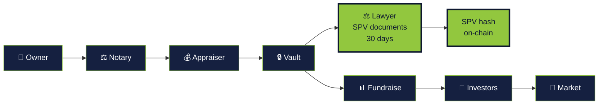

<div class="mt-4 text-sm opacity-70">
The lawyer prepares SPV documents in parallel with the fundraise. Deadline — 30 days. Miss it — stake is slashed and the task is reassigned.
</div>

<!--
- SPV (Special Purpose Vehicle) — the legal wrapper that holds title to the property.
- Without an SPV, the token is a pretty picture. With an SPV — real ownership rights via a share in the legal entity.
- The lawyer picks up the task — 30 days to complete — uploads the SPV document hash on-chain.
- Economic incentive: commission plus the slashing penalty for missing the deadline goes to the pool for the next lawyer.
- Transition: who does this — Aidar.
-->

---
layout: two-cols
---

# Aidar — the Lawyer

<div class="mt-4 text-sm">

**Situation:** a corporate lawyer specializing in SPC and SPV structures.

**What he does:**
1. Holds the `Lawyer` role on-chain
2. On `/legal`, picks up a task from the queue
3. 30 days to register the SPV and prepare documents
4. Uploads the SPV hash to `asset_registry`

**Result:** commission of `max(min_lawyer_fee, 3%)`. Misses the deadline — stake is slashed, the task goes to the next lawyer.

</div>

::right::


<!--
- Aidar is a traditional lawyer, but with transparent on-chain accountability.
- He is not signing a blank page: he sees the document hash, the appraisal, the owner, and the investors.
- 30 days is a realistic timeframe for SPC registration in Kazakhstan.
- The stake is slashed not for errors, but for missing the deadline. Errors are caught at the notary PostCheck.
- Transition: the last element — and the picture closes.
-->

---

# Step 6 — The Full Picture with SPV

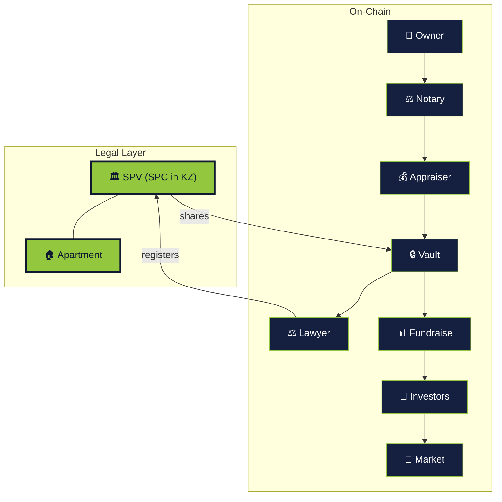

<div class="mt-4 text-xs opacity-70">
Token-2022 fractions are shares in the SPV. The SPV holds title to the real apartment. The on-chain and off-chain layers are linked.
</div>

<!--
- This is the final ecosystem map. All 6 roles, all connections, both layers.
- The key: a token is a share in the SPV, not a "promise." This provides legal enforceability.
- All arrows from previous steps are here. Only the SPV layer is added.
- Kazakhstan: SPV = SPC (Special Purpose Company). In other jurisdictions — LLC, Limited, GmbH.
- Transition: all 6 roles are introduced. Now let us show the UI that serves them.
-->

---
layout: center
---

# Glossary — Key Terms

<div class="mt-6 text-sm grid grid-cols-2 gap-x-12 gap-y-3">
<div><span class="accent font-semibold">SPV</span> — Special Purpose Vehicle, a legal wrapper entity (in KZ — SPC, Special Purpose Company) that holds title to the property.</div>
<div><span class="accent font-semibold">Vault</span> — a PDA on-chain that holds Token-2022 fractions before and after the fundraise.</div>
<div><span class="accent font-semibold">Fraction</span> — one of N tokens per asset. N is set when the vault is created. Share = fraction / N.</div>
<div><span class="accent font-semibold">Commit-Reveal</span> — two-phase voting: first the hash, then the reveal, so no one sees others' valuations.</div>
<div><span class="accent font-semibold">Quorum</span> — the notary approval threshold (typically 66.66%, by vote weight).</div>
<div><span class="accent font-semibold">KYC Attestation</span> — a PDA confirming the wallet has been verified by a provider.</div>
</div>

<!--
- A 30-second reference — so investors in the audience do not get lost when engineers start speaking their language.
- SPV is the most important term. If you remember only one thing, let it be this.
- All of these terms will resurface in Part 2, this time with code.
- Transition: why each role has multiple participants, not just one.
-->

---

# Why Multiple Participants per Role

<div class="mt-4 text-sm grid grid-cols-2 gap-6">
<div>

**A single notary:**
- Can be bribed
- Can make mistakes
- No one to cross-check

**A notary pool + quorum:**
- Collusion is expensive (must bribe the majority)
- A single error is compensated
- Everyone cross-checks each other
- Vote weight depends on reputation

</div>
<div>

**A single appraiser:**
- Incentivized to please the owner
- One subjective opinion
- No protection against "flipping"

**Multiple appraisers + median:**
- Extreme values are automatically filtered
- Collusion is exposed by commit-reveal
- The median is resilient to outliers
- Enforcement through reputation and staking

</div>
</div>

<div class="mt-4 text-sm opacity-70">
Principle: **every critical step requires a quorum of independent participants**. This applies to all stages — not just notaries, but also appraisal, legal review, and holder voting.
</div>

<!--
- Core principle: no important decision is made by a single person. Always a group.
- Analogy: like a jury — 12 people, not one judge. A single person cannot decide the outcome.
- Or a housing association: major decisions go through a general assembly, not a single chairman.
- Quorum is the minimum agreement threshold. Typically 66.66% (two-thirds).
- Why it works: bribing one person is cheap. Bribing two-thirds is orders of magnitude more expensive and visible.
- Everyone cross-checks the others. Systematic dishonesty leads to reputation loss and slashing.
- This same principle applies EVERYWHERE: notaries, appraisers, lawyers, token holders.
- Transition: but who appoints these "trusted" participants? Is it a circular dependency?
-->

---
layout: cover
class: section-sub
---

# C' · The Oracle and Edge Cases

Who oversees the trusted parties. What if the owner dies.

<!--
- 6 roles are introduced. But the main question remains: who appointed these 6 people as "trusted"?
- And: what happens when the system encounters the real world — death, divorce, arrest.
- These questions come from both investors and regulators. We need an answer.
- Transition: let us start with who oversees the trusted parties.
-->

---

# Step 7 — The Oracle Joins

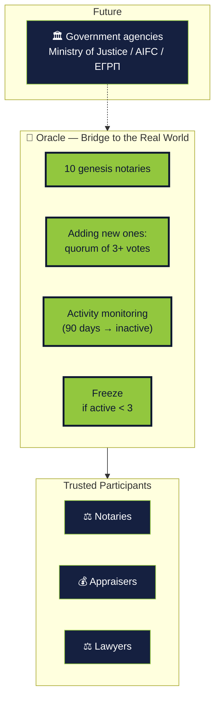

<div class="mt-3 text-xs opacity-70">
<strong>A smart contract cannot verify real-world events on its own.</strong> Laws differ by country — universal rules cannot be hard-coded. The oracle is the bridge between the blockchain and the state: it translates external events (death, arrest, divorce) into on-chain actions.
</div>

<!--
- The fundamental blockchain problem: it knows nothing about the real world. It is like a robot in a sealed room.
- Analogy: imagine a robot in a locked room. It does not know if it is raining outside until someone tells it.
- The entity that "tells" the blockchain about the real world is the oracle. A bridge between computer and life.
- Example: a court seizes an apartment. The blockchain does not know this on its own. The oracle must report it.
- Why you cannot have "one smart contract for all countries": laws differ. In KZ — SPC, in Dubai — LLC, in Russia — OOO.
- It is impossible to hard-code every country's laws. Therefore, the oracle is a configurable bridge for each jurisdiction.
- Currently the oracle = a notary quorum. Long-term — direct connection to government registries.
- Transition: specific real-world scenarios where the oracle is needed.
-->

---

# The Problem of Owner Death

<div class="mt-6 text-sm grid grid-cols-2 gap-8">
<div>

**Scenario:** Aisha has passed away. She holds 80% of fractions in her wallet. The heir does not know the seed phrase.

**What breaks:**
- Fractions are permanently locked in the wallet
- The apartment legally exists (SPV is not dissolved)
- Holders cannot initiate a buyout; there is no point of contact
- The SPV cannot be re-registered to the heir

</div>
<div>

**Resolution via the oracle:**
1. The heir presents a death certificate + notarized will
2. A lawyer files a request to the `compliance` program
3. A notary quorum (weighted vote) verifies the documents
4. Forced transfer to the heir's wallet via transfer hook
5. `Asset.original_owner` is updated

</div>
</div>

<div class="mt-6 text-xs opacity-70">
The forced transfer is implemented via Token-2022 transfer hooks + administrative privileges of the `compliance` program. Important: this is not an arbitrary seizure — only by quorum decision based on off-chain documents.
</div>

<!--
- The most common question from skeptics: "what happens to the tokens if the owner dies?"
- Imagine: Aisha has passed away, and 80% of the apartment sits in her wallet. The heir does not know the seed phrase.
- Without a mechanism — the fractions are dead forever. The apartment is "frozen." No one can initiate a buyout.
- Solution: the heir presents a death certificate and will in court → receives a court order.
- The court forwards the order to the oracle (notaries) → quorum confirms → tokens are transferred to a new wallet.
- This is NOT an arbitrary seizure. An admin cannot just press a button. Only through quorum + document.
- Analogy: just as a bank transfers an account to an heir — it also requires documentation.
- Transition: another real-world case — property seizure.
-->

---

# The Problem of Property Seizure

<div class="mt-6 text-sm grid grid-cols-2 gap-8">
<div>

**Scenario:** A court has ordered the apartment seized (tax debt, criminal case).

**Requirements:**
- Freeze fraction trading
- Prohibit buyout
- Preserve the ability to distribute proceeds from forced sale
- Notify all holders

</div>
<div>

**Procedure (via the oracle):**
1. Government authority submits an official document
2. A lawyer or notary records a `FreezeOrder` on-chain
3. Transfer hook blocks all fraction transfers
4. Vault transitions to `Frozen` status
5. After asset liquidation — distribution proportional to holdings

</div>
</div>

<div class="mt-6 text-xs opacity-70">
This is an unpleasant but necessary feature: without it, the platform is incompatible with the legal framework of any jurisdiction.
</div>

<!--
- Scenario: the tax authority or court seizes the apartment (debts, criminal case).
- Crypto purists will say: "blockchain should not freeze anything!" But then we cannot operate in any country.
- Bank account analogy: if a court issues a freeze — the bank freezes it; you cannot withdraw funds. Standard practice.
- Without this mechanism, we are pirates, not a platform for institutional capital.
- The freeze is executed only by court order; the document is verified by lawyers/notaries, then a quorum.
- After asset liquidation (forced sale) — proceeds are distributed to all token holders.
- Transition: more edge cases — divorce, bankruptcy, disputes.
-->

---

# Other Edge Cases

<div class="mt-4 text-sm grid grid-cols-2 gap-4">
<div class="role-card">

**Divorce of SPV Co-Owners**
If the owner is a married couple. The court splits the 80% owner fractions evenly. Forced transfer by court order.

</div>
<div class="role-card">

**Investor Bankruptcy**
The investor's fractions become part of the bankruptcy estate. A trustee can request a forced transfer to a custodial wallet.

</div>
<div class="role-card">

**SPV Document Dispute**
After `NotaryPostCheck` an error is found in the charter. The asset returns to `LegalProcessing`; the lawyer's stake is slashed.

</div>
<div class="role-card">

**Holder Blocks Buyout**
One holder acquires 34%+ to block any buyout (quorum is 66%). Resolved via a DAO dilution proposal.

</div>
</div>

<div class="mt-6 text-xs opacity-70">
All edge cases require quorum + off-chain document + on-chain action. There is no branch where a single person can make a unilateral decision.
</div>

<!--
- This is not an exhaustive list, but it covers 80% of real-world scenarios.
- Key principle: no change of ownership without a quorum and a supporting document.
- The DAO proposal is a separate governance program, on the roadmap.
- The goal is to show: the system is not naive. We have thought about death, divorce, bankruptcy, and attacks.
- Transition: back to economics and market.
-->

---
layout: cover
class: section-sub
---

# D · Market and Economics

Where we play and where the revenue comes from

---

# Transaction Economics

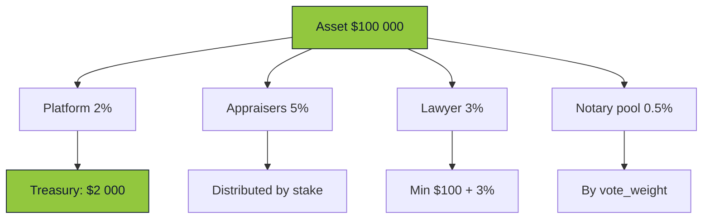

<div class="mt-4 text-sm opacity-70">
  The platform takes 2% of every tokenization. At $100M turnover — $2M annual revenue. Plus the secondary market (0.3% per trade).
</div>

<!--
- The platform takes 2% of every tokenization + 0.3% of every secondary trade.
- A single asset generates 100–300 transactions over 3 years: fundraise, secondary trades, buyout.
- At $100M tokenized turnover, the platform generates $2M annual revenue from the primary market alone, plus secondary.
- Appraisers receive 5%, the lawyer 3%, notaries share the pool (typically 0.5–1%).
- Slashing penalties for outlier valuations go to the treasury — a self-funding defense mechanism.
- Transition: what has already been built and is working.
-->

---
layout: center
---

# What Has Been Built

<div class="mt-6 text-sm">

- ✅ **11 Anchor programs** on Solana devnet
- ✅ **Full UI** on Next.js (EN/RU/KK)
- ✅ **KYC pipeline** (mock + ready for Sumsub/Binance/Civic)
- ✅ **129 vaults**, **160+ assets**, **active market**
- ✅ **Notary voting** + **notary rounds**
- ✅ **Off-chain coordinator** on Bun + Elysia + Drizzle
- ✅ **Irys/Arweave** for documents

</div>

<div class="mt-8 text-xs opacity-60">
  Running on Solana devnet.
</div>

<!--
- This is not a PowerPoint product: 160 assets in the DB, 129 active vaults, real trading.
- 11 Anchor programs passed pre-audit preparation and are deployed on devnet.
- The UI is fully in three languages; the KYC pipeline is ready (mock plus readiness for 3 providers).
- Notary voting and notary rounds are implemented.
- Off-chain coordinator plus Irys integration are working.
- Transition: Part 1 is complete. Part 2 — how it works under the hood.
-->

---
layout: cover
class: section-tech
---

# Under the Hood

## <span class="accent">How It Works at the Blockchain Level</span>

<div class="opacity-60 mt-6">Architecture → Contracts → Lifecycle → Design Decisions → Off-Chain</div>

<!--
- Fair warning: technical details ahead.
- If you are only here for the investment part — a break is a good idea.
- For engineers: this covers Anchor code, PDA models, Token-2022, commit-reveal.
- Keep in mind from Part 1: 6 roles, SPV, N fractions, 7-stage process.
- Transition: let us start with the architecture.
-->

---

# Terminology Reference

<div class="mt-4 text-xs grid grid-cols-2 gap-x-6 gap-y-2">
<div><span class="accent font-semibold">On-chain</span> — state stored in Solana contracts.</div>
<div><span class="accent font-semibold">Off-chain</span> — backend, databases, documents.</div>
<div><span class="accent font-semibold">PDA</span> — Program Derived Address. A deterministic address from seeds. The client computes it locally.</div>
<div><span class="accent font-semibold">Router-facet pattern</span> — architecture with a single entry point and multiple modules.</div>
<div><span class="accent font-semibold">Facet</span> — a program connected to the router. We have 11 facets.</div>
<div><span class="accent font-semibold">Round</span> — a notary/appraiser voting round with a deadline and quorum.</div>
<div><span class="accent font-semibold">PreCheck / PostCheck</span> — our terms: document verification BEFORE appraisal and AFTER the lawyer.</div>
<div><span class="accent font-semibold">Commit-Reveal</span> — two-phase voting: first the hash, then the reveal.</div>
<div><span class="accent font-semibold">Stake</span> — a SOL deposit locked for the duration of voting.</div>
<div><span class="accent font-semibold">Slashing</span> — penalty: part of the stake goes to the treasury for a violation.</div>
<div><span class="accent font-semibold">Quorum</span> — minimum vote threshold for a decision (typically 66.66%).</div>
<div><span class="accent font-semibold">Transfer hook</span> — a Token-2022 extension: a check before every fraction transfer.</div>
</div>

<!--
- This is a reference card. Engineers can skip; newcomers — read carefully.
- "On-chain" is like a public bulletin board: everyone sees it, no one can erase it.
- "Off-chain" is our private notebook: fast, but you have to take our word for it.
- PDA is a deterministic address. Analogy: an apartment number in a building. Knowing the building + entrance + floor — you can compute the apartment number without searching a list.
- Router-facet pattern — a main entrance and many shops. In a mall, you enter through one door and then pick a shop inside.
- Facet — one shop in that mall. We have 11 shops: identity, assets, validation, etc.
- Round — a voting round with a deadline and a minimum agreement threshold.
- Commit-reveal — first a sealed envelope, then the opening, so no one can adjust their answer.
- Transfer hook — a guard at the checkpoint who inspects every fraction transfer.
- Transition: architecture — where things live, what layers Slice is made of.
-->

---
layout: cover
class: section-sub
---

# F · Architecture

Three layers and how they are glued together

---

# Full Architecture — Step 1 · Client

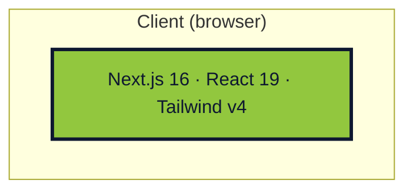

<div class="mt-4 text-sm opacity-70">
Frontend — Next.js 16 on App Router. Wallet adapter on the client for transaction signing.
</div>

<!--
- Everything starts in the browser: the user personally signs everything related to their wallet.
- React 19 + server components for fast rendering of asset lists.
- The frontend NEVER holds private keys — only signatures via the browser extension (Phantom, Solflare).
- Transition: but the client needs a backend that aggregates data and validates.
-->

---

# Full Architecture — Step 2 · + Backend

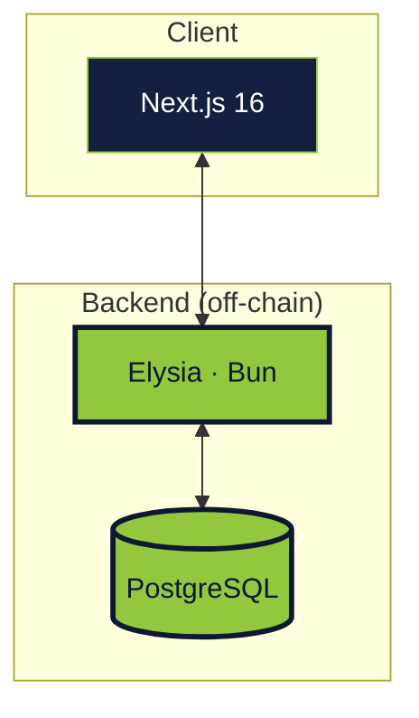

<div class="mt-4 text-sm opacity-70">
The backend is a coordinator, not the source of truth. Postgres caches on-chain data for search, filtering, and the off-chain order book.
</div>

<!--
- Bun + Elysia provides ~3x throughput improvement over Node + Express.
- Drizzle ORM — type-safe queries, no runtime magic.
- Postgres holds what is expensive to read from the chain: indexes, lists, histories.
- Important: if Postgres goes down, the system does not break — data can always be rebuilt from the chain.
- Transition: but the real state does not live here.
-->

---

# Full Architecture — Step 3 · + Solana

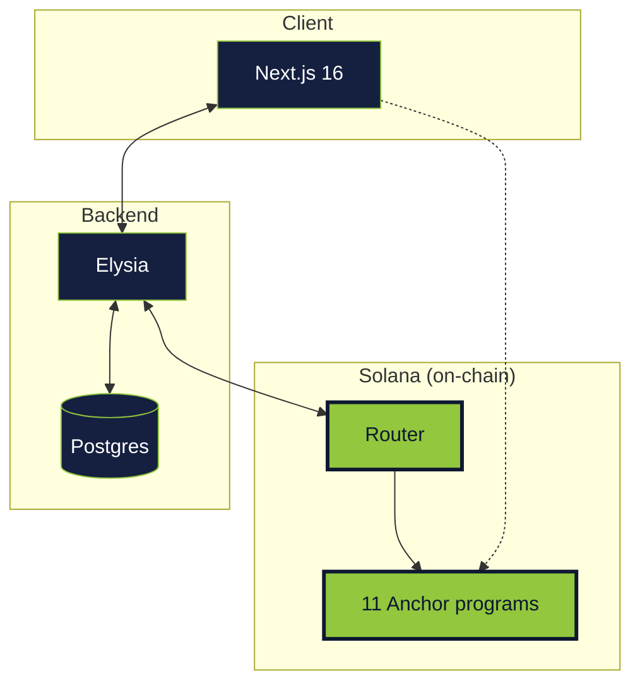

<div class="mt-4 text-sm opacity-70">
Client signs → backend or client sends the transaction → router validates → facet program executes.
</div>

<!--
- The router is the single entry point. KYC filter, routing by facet addresses.
- Two transaction paths: via the backend (simpler UX) and directly from the client (full self-custody).
- The backend reads the chain via RPC but can never initiate a transaction on the user's behalf.
- We will break down the 11 programs in 2 slides.
- Transition: one more thing — external integrations.
-->

---

# Full Architecture — Step 4 · + Ory Kratos

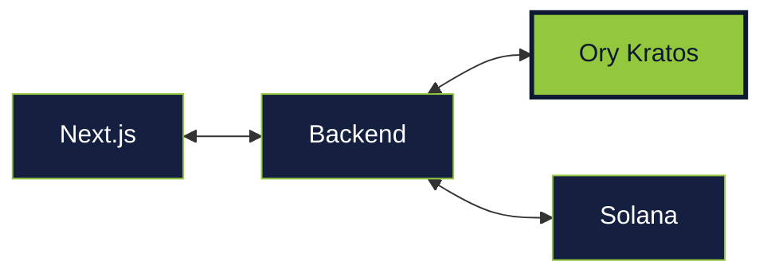

<div class="mt-4 text-sm opacity-70">
<strong>Ory Kratos</strong> — a production-grade identity management system (email, TOTP, OAuth, wallet linking). The backend delegates all authentication to it.
</div>

<!--
- Kratos is a turnkey "registration engine." The Ory company built it; we just plug it in.
- It handles: email login, passwords, TOTP codes, social logins, wallet linking.
- Analogy: we do not build our own auth system — we use a ready-made engine, like an engine for a car.
- Wallet linking via EIP-191: the user signs a message with their Phantom/Solflare, we verify the signature.
- Transition: the second external service — permanent document storage.
-->

---

# Full Architecture — Step 5 · + Irys and KYC

```mermaid {scale: 0.65}
flowchart LR
  API[Backend] <--> Ir[Irys / Arweave]
  API <--> KYC[KYC providers<br/>(not implemented)]
  API <--> Chain[Solana]
  classDef old fill:#152040,stroke:#92c73e,color:#ffffff
  classDef new fill:#92c73e,stroke:#0e1830,color:#0e1830,stroke-width:3px
  class API,Chain old
  class Ir,KYC new
```

<div class="mt-4 text-sm opacity-70">
<strong>Irys</strong> — permanent document storage on top of Arweave. Hash on-chain, file on Irys. <strong>KYC</strong> — currently a mock; Sumsub / Binance / Civic planned.
</div>

<!--
- Irys is a digital time capsule. Upload a document once — it lives forever on Arweave.
- We do not store files on Solana (too expensive), only their hashes. Files go to Irys.
- If a document is tampered with — the hash will not match, and the forgery will be visible to everyone.
- KYC — the architecture is ready; real providers were not connected during the hackathon.
- KYC attestations arrive as webhooks → recorded as PDAs in the `identity` program.
- Transition: why we chose Solana for the on-chain layer.
-->


---

# Why Solana

<div class="mt-4 text-sm">

| Criterion | Ethereum | Polygon | **Solana** |
|---|---|---|---|
| Finality | 12–60 sec | 2–3 sec | **400 ms** |
| Fee | $0.50–20 | $0.01–0.10 | **$0.00025** |
| TPS | 15–30 | 65 | **65 000** |
| Built-in fractions | ❌ | ❌ | **Token-2022** |
| Dev tools | Hardhat | Hardhat | **Anchor** |

</div>

<div class="mt-6 opacity-70 text-sm">
  Real estate transactions are frequent and small. $0.50 fee × 100 investors = $50 just in blockchain fees. On Solana — $0.025.
</div>

<!--
- 400 ms finality is critical: we cannot keep an investor in a pending state.
- $0.00025 per transaction: a single investor can perform 100 actions and barely notice the fees.
- Token-2022 extensions — built-in transfer hooks, confidential transfers, metadata.
- Transfer hooks are needed for compliance: KYC check before every secondary trade.
- Anchor gives us type-safe account layouts and automatic discriminators.
- Transition: let us look at the full tech stack.
-->

---
layout: center
---

# Tech Stack

<div class="mt-6 grid grid-cols-3 gap-6 text-sm">

<div class="role-card">
<h3 class="accent">On-Chain</h3>

- Rust
- Anchor framework
- 11 programs
- Token-2022
- Ed25519 signatures

</div>

<div class="role-card">
<h3 class="accent">Backend</h3>

- Bun runtime
- Elysia web framework
- TypeScript
- Drizzle ORM
- PostgreSQL 16

</div>

<div class="role-card">
<h3 class="accent">Frontend</h3>

- Next.js 16 (App Router)
- React 19
- Tailwind CSS v4
- shadcn/ui
- @solana/wallet-adapter

</div>

</div>

---
layout: cover
class: section-sub
---

# G · On-Chain Architecture

11 Anchor programs and their choreography

---

# How to Read the Program Architecture

<div class="mt-4 text-sm grid grid-cols-2 gap-6">
<div>

**Router-Facet Pattern (EIP-2535 on Solana):**
- Single entry point — the router
- Facet programs register with the router
- Upgrade — swap the address in the router, no data migration
- PDA accounts stay in place

</div>
<div>

**PDA Model:**
- Every state is a Program Derived Address
- Deterministic seeds: `[program, entity, id]`
- The client computes the address locally, no index reads needed
- No global on-chain lists

</div>
</div>

<!--
- A 30-second framing so engineers do not get lost in the next 6 slides.
- The router-facet pattern gives us an upgrade path without forks or migrations.
- PDA is fundamental to Solana programming. If unfamiliar — it is like a deterministic hash of input data.
- We do not use global registries: the client always knows where to look.
- Transition: let us start with the bare router and build up all 11 programs one group at a time.
-->

---

# 11 Programs — Step 1 · Router Only


<div class="mt-4 text-sm opacity-70">
The only program clients know about. All CPI cross-program invocations pass through it.
</div>

<!--
- The router is not a facade-level smart contract; it is a full pre-validator.
- It holds a mapping: `target_pubkey → facet_address`.
- On every call it checks: is KYC valid? Is the facet registered? Is the instruction whitelisted?
- Upgrading any of the 11 programs is a single transaction in the router.
- Transition: let us add the core — identity, assets, validation.
-->

---

# 11 Programs — Step 2 · + Core

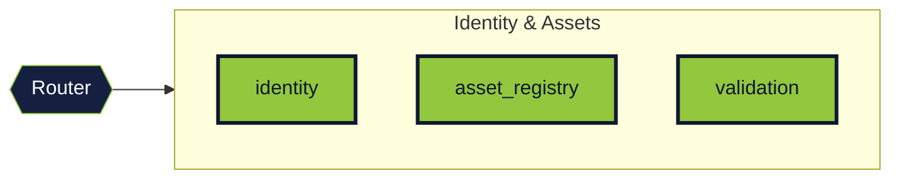

<div class="mt-4 text-sm opacity-70">
<strong>identity</strong> — roles, reputation, KYC · <strong>asset_registry</strong> — asset lifecycle · <strong>validation</strong> — Ed25519 verifications
</div>

<!--
- This is the minimal skeleton: users, assets, and proof that the asset is real.
- identity: 6 roles, per-role reputation, `PublicKeyRecord` for off-chain signatures.
- asset_registry: 12 asset statuses, `set_asset_status` is authorized only by the designated program.
- validation: verifiers sign Ed25519 off-chain; verification via the Instructions sysvar.
- Transition: assets exist; now let us add deals.
-->

---

# 11 Programs — Step 3 · + Deals

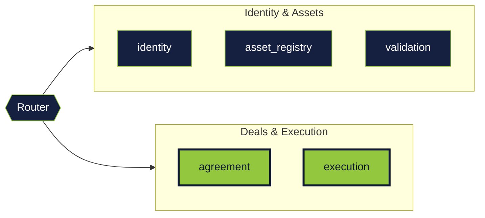

<div class="mt-4 text-sm opacity-70">
<strong>agreement</strong> — deal structure, parties, terms · <strong>execution</strong> — atomic settlement with escrow
</div>

<!--
- agreement and execution are for direct wallet-to-wallet deals (outside the fractional model).
- agreement captures terms: price, parties, deadline, conditions.
- execution performs the atomic swap: asset <-> SOL via escrow.
- This is a fallback for non-fractional trading or buyout of individual assets.
- Transition: now appraisal and tokenization.
-->

---

# 11 Programs — Step 4 · + Tokenization

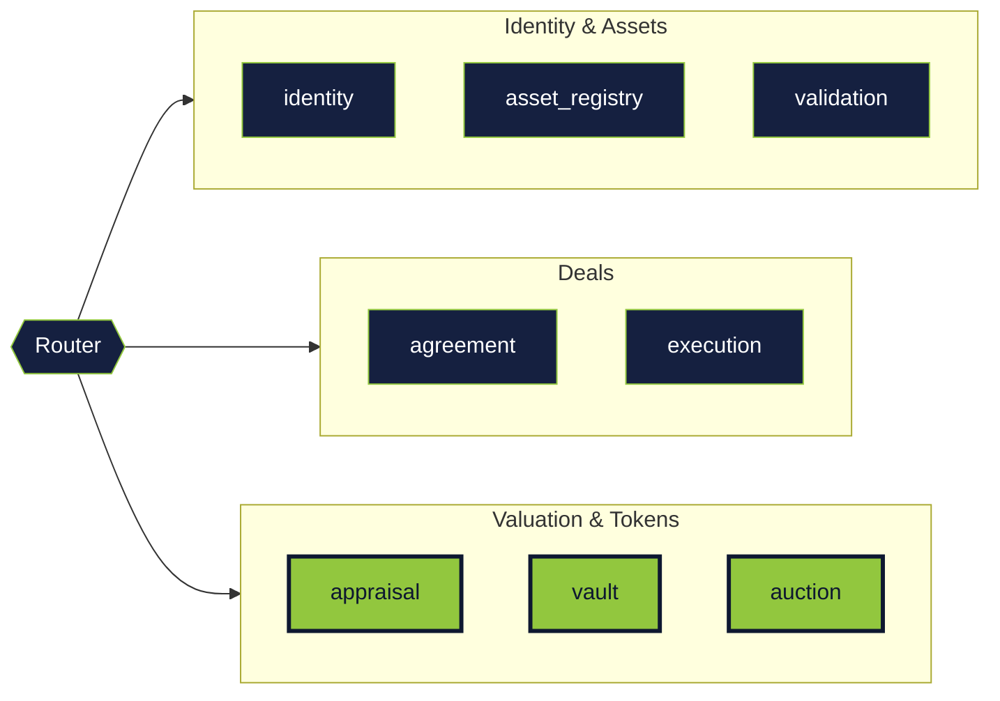

<div class="mt-4 text-sm opacity-70">
<strong>appraisal</strong> — commit-reveal valuations · <strong>vault</strong> — Token-2022 fractions · <strong>auction</strong> — fundraising and buyouts
</div>

<!--
- This is the heart of the fractional model. Three programs that turn an apartment into 10,000 tokens.
- appraisal: commit → reveal → median → penalize outliers. Detailed walkthrough in 3 slides.
- vault: creates a Token-2022 mint, holds the token supply, distributes after the fundraise.
- auction: fundraising campaigns (entry) and buyout auctions (exit with holder voting).
- Transition: the last group — governance and trading.
-->

---

# 11 Programs — At a Glance

<div class="mt-4 text-xs">

| Group | Programs | Purpose |
|---|---|---|
| **Identity & Assets** | identity, asset_registry, validation | Who you are, what you own, who verified it |
| **Deals** | agreement, execution | P2P deals between wallets |
| **Tokens** | appraisal, vault, auction | Valuation, fractions, fundraise, buyout |
| **Governance** | compliance, market | Notaries, lawyers, secondary market |

</div>

<div class="mt-6 text-sm opacity-70">
11 programs + router = 12 deployments on Solana. Each program is responsible for a single task.
</div>

<!--
- A compact summary of all 11 programs by group.
- Identity & Assets — the core: users and their assets.
- Deals — direct wallet-to-wallet trades, no fractionalization.
- Tokens — the fractional model: appraisal, vault, fundraise and buyout auctions.
- Governance — the most complex group: notaries, legal tasks, fees, secondary market.
- Single-responsibility principle: one program — one task.
- Transition: let us look at the router in detail.
-->


---

# Router — The Diamond Proxy Pattern

```rust {all|1|3-5|7-10}
// Router pre-validates every call
pub fn pre_validate(ctx: Context<PreValidate>) -> Result<()> {
    require!(
        is_kyc_valid(&ctx.accounts.user_kyc),
        Error::KycExpired
    );
    let facet = ctx.accounts.router.facets
        .get(ctx.accounts.target)
        .ok_or(Error::UnknownFacet)?;
    Ok(())
}
```

<div class="mt-4 text-sm opacity-70">
All calls go through the router → KYC filter → target program (facet). Upgrading a program means swapping its address in the router — no data migration.
</div>

<!--
- Imagine a multi-story shopping mall. To enter — one main entrance with security.
- The main entrance is the router. Security checks: got your documents? KYC passed? Then come in.
- Inside — different shops: groceries (identity), clothing (assets), bank (vault), lawyers (compliance).
- Each shop is a separate program. They do not know about each other; they only know security.
- If a shop closes and a new one opens — just update the address in the security registry. Nothing else to touch.
- Benefits: upgrade programs without migrations, a single KYC checkpoint, clean separation.
- Transition: let us explore the shops one by one. First — identity (who you are).
-->

---

# identity — Root of the System

<div class="mt-2 text-xs grid grid-cols-2 gap-4">
<div>

**PDA accounts:**
- `User [wallet]` — profile
- `UserReputation [wallet, role]` — reputation
- `KycAttestation [wallet, provider]` — KYC
- `PublicKeyRecord [owner, key]` — keys

</div>
<div>

**6 roles:**

```rust
enum UserRole {
  Regular, Verifier,
  Appraiser, Lawyer,
  Notary, Admin,
}
```

</div>
</div>

<!--
- User — the base PDA, one per wallet. All other identity accounts reference it.
- `UserReputation` per role — a good notary can be a bad appraiser.
- `KycAttestation` per provider: you can have several (Sumsub + Civic); expiry is checked.
- `PublicKeyRecord` — for off-chain Ed25519 signatures, so you don't spend SOL on every signature.
- 6 roles; a wallet can hold any subset. Admin is for platform configuration.
- Transition: now the asset itself.
-->

---

# asset_registry — Asset Lifecycle

<div class="mt-4 text-sm">

**Asset PDA** contains:
- `asset_id`, `description`, `current_owner`, `original_owner`
- `status` — enum of 12 states
- `verification_count` / `verification_threshold`
- `minimum_price` — median appraisal (lamports)
- `vault`, `fraction_mint`, `total_supply`
- `lawyer`, `legal_deadline`, `spv_document_hash`

**AssetAttribute [asset_id, key_hash]** — arbitrary key/value pairs for attributes (city, area, year, etc.)

</div>

<!--
- Asset PDA — the sole writer for `asset.status`, via `set_asset_status()`.
- 12 statuses; each transition is authorized by exactly one designated program.
- `minimum_price` — the appraisal result, used as the lower bound for the fundraising campaign.
- `legal_deadline` is set when the lawyer picks up the task; missing it triggers slashing.
- `AssetAttribute` — arbitrary key/value (area, floor, year); key is hashed for indexing.
- Transition: how verifiers sign facts about the asset.
-->

---

# validation — Ed25519 Signatures

<div class="mt-2 text-xs">

The verifier signs off-chain; the program verifies the signature via sysvar:

```rust
pub fn verify_asset(ctx: Context<VerifyAsset>,
    asset_id: [u8;32],
    pubkey: [u8;32],      // verifier's key
    signature: [u8;64],   // Ed25519
    verifier_name_hash: [u8;32],
) -> Result<()> {
    // 1. msg.sender has role=Verifier
    // 2. pubkey is registered in PublicKeyRecord
    // 3. Ed25519 via Instructions sysvar
    // 4. counter++, if >= threshold → status=NotaryPreCheck
}
```

</div>

<!--
- Instructions sysvar is Solana's mechanism for inspecting other instructions in the same transaction.
- The Ed25519 program verification is added as a separate instruction; we read it.
- The verifier pays SOL only once — for registering the `PublicKeyRecord`.
- After that, they can sign unlimited off-chain verifications without paying fees.
- `verifier_name_hash` binds the signature to a specific person for audit purposes.
- Transition: the `appraisal` program — the commit-reveal mechanism.
-->

---

# appraisal — Blind Commit-Reveal Voting

<div class="mt-4 text-sm">

**Problem:** if appraisers can see each other's prices — they will coordinate.

**Solution:** commit-reveal scheme with staking.

**Three phases:**
1. **Commit:** `keccak256(price || min_holders || salt)` + SOL stake
2. **Reveal:** appraiser shows `price + salt`, program verifies the hash
3. **Finalize:** median of all prices → `minimum_price` of the asset

**Protection:**
- Failure to reveal → stake is forfeited
- Outlier values (far from median) → penalized

**Maximum appraisers:** 11 per round.

</div>

<!--
- Three phases — commit (7 days), reveal (7 days), finalize (atomic).
- `keccak256` was chosen for EVM tooling compatibility (MetaMask-type wallets can see the hash).
- `min_holders` — an appraiser parameter: minimum number of holders for the fundraise.
- The median protects against extreme values (unlike the mean).
- Outlier penalty: a platform parameter, typically 20% deviation from median triggers a penalty.
- Transition: we have the price; time to tokenize.
-->

---

# vault — Token-2022 Fractions

<div class="mt-4 text-sm">

After appraisal, the asset can be fractionalized:

```rust
pub fn initialize_vault(ctx: Context<InitVault>,
    asset_id: [u8;32],
    total_supply: u64,  // parameter, e.g. 10 000
) -> Result<()> {
    // 1. asset.status == Evaluated
    // 2. Create Token-2022 Mint[asset_id]
    // 3. Mint total_supply into vault_token_account
    // 4. token_price = minimum_price / total_supply
    // 5. asset.status → Funding
}
```

**Token-2022 extensions** enable: transfer hooks (compliance checks), on-chain metadata, confidential amounts.

</div>

<!--
- `initialize_vault` requires `asset.status == Evaluated` — you cannot tokenize without a price.
- Token-2022 mint with `mint_authority = vault`. The vault is the sole entity that can mint and burn.
- `total_supply` is a parameter at vault creation. Price formula: `token_price = minimum_price / total_supply` (see vault/src/domain/validation.rs:11-15).
- `token_price = minimum_price / total_supply` — the reference price for the fundraise.
- After a successful fundraise, the vault distributes fractions to investors proportionally to their deposits.
- Transition: let us walk through how an NFT becomes a divisible asset.
-->

---

# NFT vs. Fractional Tokens

<div class="mt-4 text-sm grid grid-cols-2 gap-6">
<div class="role-card">

**Classic NFT (SPL NFT / Metaplex)**
- `supply = 1`, `decimals = 0`
- Unique, indivisible
- Metadata: off-chain JSON or Arweave
- Used for art, identification

Example: a property ownership certificate.

</div>
<div class="role-card">

**Fraction (Token-2022, fungible)**
- `supply = N` (parameter), `decimals = 0`
- Fungible
- On-chain metadata via Metadata extension
- Used for fractional ownership

Example: 1 fraction = 0.01% of an apartment.

</div>
</div>

<div class="mt-6 text-sm opacity-70">
In Slice we use both: first registration via NFT (`asset_registry`), then fractionalization via a Token-2022 mint.
</div>

<!--
- NFT is a unique token. Analogy: a birth certificate. Only one exists; cannot be forged.
- Used for collectible images, certificates, object identification.
- A fraction is the opposite — like a banknote. All identical, fungible.
- Imagine 100-dollar bills: it does not matter which one is in your wallet; they are equivalent.
- For our task we need BOTH: an NFT to say "this apartment," fractions to "slice" it into shares.
- Analogy: the NFT is the ownership certificate for a large cake. Fractions are the sliced pieces for sale.
- Transition: let us show how these cake slices exist and transfer.
-->

---

# Fractional Ownership — On-Chain

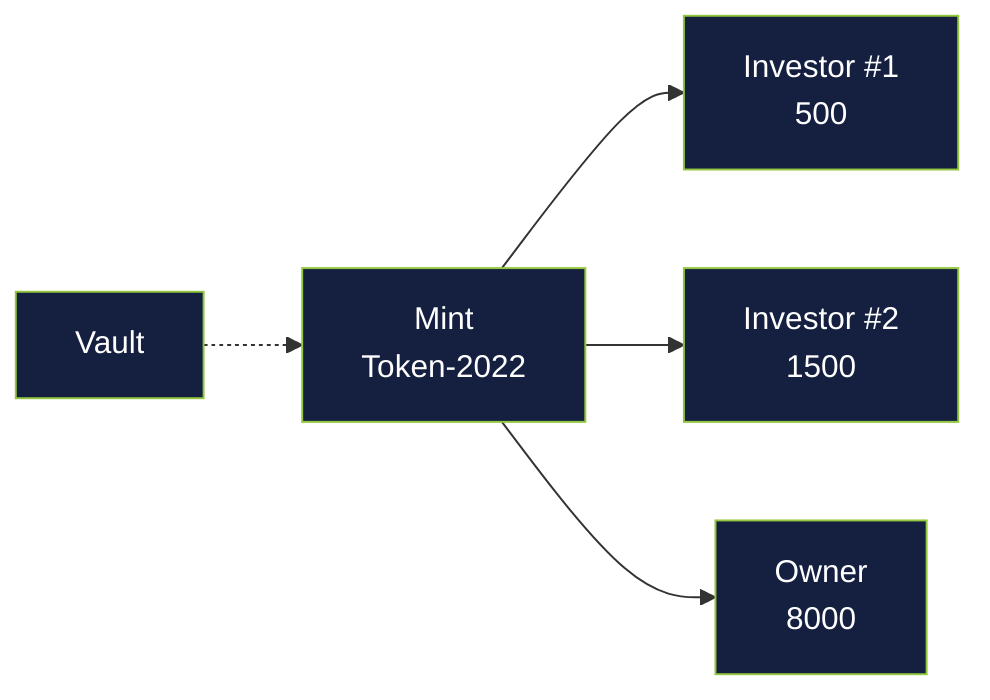

<div class="mt-4 text-xs opacity-70">
The mint is the "printing press" that issues fractions for one apartment. The vault holds the supply until the fundraise ends, then distributes to token accounts.
</div>

<!--
- Left to right: mint → vault → investor token accounts.
- The mint issues N fractions — N is set at vault creation.
- The vault is a safe. It holds the entire supply until the fundraise concludes.
- After a successful fundraise — distribution to token accounts proportional to deposits.
- A token account is like a bank account, but for fractions. Each investor has their own.
- Transition: where is the real apartment in all of this?
-->

---

# Linking the Blockchain to the Real World

```mermaid {scale: 0.55}
flowchart LR
  Asset[Asset PDA<br/>on-chain]
  SPV[SPV · SPC]
  Flat[🏠 Apartment]
  Asset -.-> SPV
  SPV --- Flat
  classDef new fill:#92c73e,stroke:#0e1830,color:#0e1830
  classDef dim fill:#152040,stroke:#92c73e,color:#ffffff
  class Asset dim
  class SPV,Flat new
```

<div class="mt-4 text-xs opacity-70">
The SPV (in KZ — SPC) legally holds title to the apartment. The Asset PDA on-chain stores the hash of the SPV documents. If the documents are altered — the hash will not match, and it will be visible to everyone.
</div>

<!--
- This is the most important slide for understanding: the token is connected to the real world through the SPV.
- Asset PDA — an on-chain record stating "somewhere there is an apartment with these documents."
- The SPV (in KZ — SPC, Special Purpose Company) legally holds title to the apartment on paper.
- The link: the SPV document hash is recorded in the Asset. If documents are tampered with — the hash will not match.
- Own fractions → own a share of the SPV → have rights to a share of the real apartment.
- Transition: how fraction transfers are protected — who checks every trade.
-->

---

# Transfer Hooks — Token-Level Compliance

```rust {all|1-3|5-8|10-13}
// Every fraction transfer passes through the hook
pub fn transfer_hook(ctx: Context<TransferHook>,
    amount: u64) -> Result<()> {

    // 1. KYC check on both sides
    require!(is_kyc_valid(&ctx.accounts.from_kyc), KycExpired);
    require!(is_kyc_valid(&ctx.accounts.to_kyc), KycExpired);

    // 2. Asset is not frozen (arrest/dispute)
    require!(!ctx.accounts.asset.frozen, AssetFrozen);

    // 3. Anti-whale holder limit
    require!(new_balance <= max_per_holder_bps * total_supply / 10000,
             HolderLimitExceeded);
    Ok(())
}
```

<div class="mt-4 text-sm opacity-70">
Every transfer (primary, secondary, buyout) passes through this check. No KYC — transaction rejected. Asset frozen — rejected. A whale trying to accumulate &gt;34% — rejected.
</div>

<!--
- The transfer hook is a guard at the checkpoint. Before every fraction transfer, it inspects both parties.
- Analogy: a VIP club does not let you in without a face check. That face check IS the transfer hook.
- What it checks: (1) has the sender passed KYC, (2) has the receiver, (3) is the asset frozen, (4) is one person accumulating more than the allowed limit.
- If any check fails — the transaction is rejected; no transfer occurs.
- Key advantage: the guard is built into the fraction itself; it cannot be bypassed by any wallet.
- Transition: the auction program — fundraise and buyout.
-->


---

# auction — Fundraise and Buyouts

<div class="mt-4 grid grid-cols-2 gap-6 text-sm">
<div>

**Fundraising Campaign**
- `invest()` — investor → campaign PDA
- `Deposit[asset_id, investor]` tracks contributions
- After `end_time` → `close_funding()`
- Success: distribute fractions, `asset.status = InLegalPool`
- Failure: refund everyone

</div>
<div>

**Buyout Auction**
- Buyer locks `offer_per_token × total_supply`
- Fraction holders vote (weight = `token_balance`)
- `quorum_bps` (e.g. 6666 = 66.66%)
- If approved — distribute funds, close the vault

</div>
</div>

<!--
- Fundraise is the primary market. Buyout is the exit mechanism. In between — the secondary market.
- `Deposit` PDA = `[asset_id, investor]`, cumulative: one investor can invest multiple times.
- `close_funding` can be called by anyone after `end_time` — finalization is permissionless.
- Success → `InLegalPool`; failure → everyone is refunded, status reverts to `Evaluated`.
- Buyout: `quorum_bps`, e.g. 6666 — 66.66% weighted by token balance.
- Transition: the last program — `compliance`, the most complex one.
-->

---

# compliance — Notaries, Lawyers, Fees

<div class="mt-4 text-sm">

**Notary Rounds (PreCheck + PostCheck):**
- Pre: document verification before appraisal
- Post: SPV verification before fractionalization
- `vote_weight = max(1000, 10000 + rating_score × 10)`

**Legal Tasks:**
- Lawyer picks up the task → 30 days
- Uploads SPV hash → `LegallyBound`
- Missed the deadline → stake slashed, task reassigned

**FeeConfig** (singleton):
- `min_appraiser_fee`, `min_lawyer_fee`
- `appraiser_pct_bps`, `lawyer_pct_bps`, `platform_pct_bps`
- `platform_treasury` — where the 2% goes

</div>

<!--
- `compliance` holds 3 major subsystems: notary rounds, legal tasks, fee configuration.
- `vote_weight` formula: `max(1000, 10000 + rating_score × 10)` — even a low-rated notary has a floor.
- The legal task queue is open to all: any qualified lawyer can pick up a free task.
- `FeeConfig` is a singleton, changed only by admin, affects all future deals.
- `platform_treasury` receives the 2% and all slashed stakes.
- Transition: the asset lifecycle — all 12 states.
-->

---
layout: cover
class: section-sub
---

# H · Asset Lifecycle

12 states. 180 days. One flow.

---

# State Machine — Phase 1 · Verification

```mermaid {scale: 0.55}
stateDiagram-v2
  [*] --> PendingVerification
  PendingVerification --> NotaryPreCheck: threshold reached
  NotaryPreCheck --> Verified: notaries approved
  Verified --> [*]: ... (continued)
```

<div class="mt-4 text-sm opacity-70">
Asset registered → N verifiers signed → notaries approved → <code>Verified</code>.
</div>

<!--
- The longest phase: 3–5 days on average, depends on verifier speed.
- The bottleneck is human: a verifier must physically or via an agent confirm the documents.
- The threshold is set by the owner at registration (typically 3 of 5).
- `NotaryPreCheck` — the first weighted quorum. If it fails — `asset.status = Rejected`.
- Transition: documents accepted, the asset exists. Now it needs a price.
-->

---

# State Machine — Phase 2 · Appraisal

```mermaid {scale: 0.55}
stateDiagram-v2
  Verified --> PendingEvaluation
  PendingEvaluation --> Evaluated: appraisal completed
  Evaluated --> [*]: ... (continued)
```

<div class="mt-4 text-sm opacity-70">
Commit → reveal → median → <code>minimum_price</code> recorded in <code>asset_registry</code>.
</div>

<!--
- Duration: 2 weeks (7 days commit + 7 days reveal).
- Finalized by any participant: the program itself computes the median and penalizes outliers.
- `minimum_price` is not the selling price — it is the lower bound for the fundraise.
- If fewer than 3 appraisers commit by the deadline — the round restarts.
- Transition: we have a price; time to tokenize.
-->

---

# State Machine — Phase 3 · Fundraise

```mermaid {scale: 0.55}
stateDiagram-v2
  Evaluated --> Funding: vault created
  Funding --> InLegalPool: funded
  Funding --> [*]: fundraise failed (refund)
```

<div class="mt-4 text-sm opacity-70">
Vault created → investors enter → upon reaching the goal → <code>InLegalPool</code>. On failure — full refund.
</div>

<!--
- Fundraise typically lasts 30 days; the owner sets `end_time`.
- If under-subscribed — automatic refund to all investors; asset reverts to `Evaluated`.
- Success → `InLegalPool`; the asset awaits a lawyer.
- The transition moment is critical: after a successful fundraise, the owner has already received funds — no turning back.
- Transition: next — legal structuring.
-->

---

# State Machine — Phase 4 · Legal Structuring

```mermaid {scale: 0.55}
stateDiagram-v2
  InLegalPool --> LegalProcessing: lawyer picks up task
  LegalProcessing --> LegallyBound: SPV documents uploaded
  LegallyBound --> NotaryPostCheck
  NotaryPostCheck --> Fractionalized: notaries approved
  LegalProcessing --> InLegalPool: deadline missed (returned to queue)
```

<div class="mt-4 text-sm opacity-70">
Lawyer picks up the task → 30 days for SPV → hash uploaded → notary PostCheck → <code>Fractionalized</code>.
</div>

<!--
- The lawyer picks up the task from `InLegalPool`, a shared queue for all available lawyers.
- Missed the deadline — stake is slashed, task returns to the shared pool.
- `NotaryPostCheck` — the second weighted quorum, verifying the SPV documents.
- If the check fails — the asset returns to `LegalProcessing` with notary comments.
- Transition: the asset is fractionalized, tokens are with investors. Now — life on the market.
-->

---

# State Machine — Phase 5 · Market and Exit

```mermaid {scale: 0.55}
stateDiagram-v2
  Fractionalized --> Dissolved: buyout approved
  Dissolved --> [*]
```

<div class="mt-4 text-sm opacity-70">
Secondary trading of fractions → buyer submits a buyout offer → holder vote → upon reaching quorum → <code>Dissolved</code>.
</div>

<!--
- `Fractionalized` — the asset's "active" life; can last for years.
- Buyout auction: offer × supply is locked; holders vote (weight = balance).
- `quorum_bps` e.g. 6666 — 66.66% "approve" → buyout proceeds.
- `Dissolved` — vault closed, SPV re-registered to the buyer, fractions burned.
- Transition: the final picture — all transitions together.
-->

---

# State Machine — Full Diagram

```mermaid {scale: 0.55}
stateDiagram-v2
  [*] --> PendingVerification
  PendingVerification --> NotaryPreCheck: threshold reached
  NotaryPreCheck --> Verified: notaries approved
  Verified --> PendingEvaluation
  PendingEvaluation --> Evaluated: appraisal completed
  Evaluated --> Funding: vault created
  Funding --> InLegalPool: funded
  InLegalPool --> LegalProcessing: lawyer picks up task
  LegalProcessing --> LegallyBound: SPV documents uploaded
  LegallyBound --> NotaryPostCheck
  NotaryPostCheck --> Fractionalized: notaries approved
  Fractionalized --> Dissolved: buyout approved
  Dissolved --> [*]
```

<div class="text-xs opacity-60 mt-2">
12 states. Any state (before the fundraise) can transition to `Cancelled`. On average — 180 days from registration to first trade.
</div>

<!--
- Now all phases are stitched together. This is the diagram engineers will study in depth.
- Cancellation is possible only before the fundraise — after a successful fundraise, the contract is binding.
- Each transition is authorized by exactly one program — the sole writer for `asset.status`.
- Transition: the timeline in days — how long this takes in practice.
-->

---

# Typical Timeline — 180 Days

```mermaid {scale: 0.55}
gantt
  title Asset Lifecycle
  dateFormat YYYY-MM-DD
  section Verification
  Registration + verification  :done, 2025-01-01, 5d
  Notary PreCheck              :done, 2025-01-06, 3d
  section Appraisal
  Commit phase                 :active, 2025-01-09, 7d
  Reveal phase                 :2025-01-16, 7d
  section Tokenization
  Vault + mint                 :2025-01-24, 1d
  Fundraising campaign         :2025-01-25, 30d
  section Legal Structuring
  Lawyer work + SPV            :2025-02-24, 30d
  Notary PostCheck             :2025-03-26, 5d
  section Market
  Secondary trading            :2025-03-31, 90d
```

<!--
- This Gantt chart is an estimated timeline for a real asset from registration to the secondary market.
- ~85 days for all pre-market stages: verification, appraisal, fundraise, legal structuring.
- After `Fractionalized` — active life of 90+ days on the secondary market.
- Bottlenecks: appraisal (human-paced) and legal structuring (30-day deadline).
- Transition: deeper into the key design decisions.
-->

---
layout: cover
class: section-sub
---

# I · Key Design Decisions

Deep dive into 4 mechanisms

---

# Blind Commit-Reveal — Phase 1 · Commit

```mermaid {scale: 0.6}
sequenceDiagram
  participant A as Appraiser
  participant P as Program
  A->>A: Generate price and salt
  A->>P: commit(keccak256(price‖salt)) + stake
  P->>P: Store commitment hash
  Note over A,P: Price is hidden behind the hash
```

<div class="text-sm opacity-70 mt-2">
7 days: each appraiser submits a hash and locks a stake. No one sees anyone else's figures.
</div>

<!--
- Each appraiser writes their price on a slip of paper, adds a random number (salt), and puts it in an envelope.
- They seal the envelope and send the FINGERPRINT (hash) to the contract — not the price itself.
- Plus they deposit a stake in SOL — a "promise" backed by money.
- Why salt: without it, a fraudster could brute-force prices (1, 2, 3... $1M) and guess from the hash. Salt makes this impossible.
- 7 days for all envelopes to be collected. No prices are visible yet.
- Analogy: sealed jury voting. Everyone has spoken — no one knows anyone else's opinion.
- Transition: the deadline has passed. Time to open the envelopes.
-->

---

# Blind Commit-Reveal — Phase 2 · Reveal

```mermaid {scale: 0.6}
sequenceDiagram
  participant A as Appraiser
  participant P as Program
  participant M as Other appraisers
  Note over A,M: Commit deadline passed
  A->>P: reveal(price, salt)
  P->>P: Verify keccak256(price‖salt) == commitment
  M->>P: reveal(...)
  Note over A,M: All prices are now public
```

<div class="text-sm opacity-70 mt-2">
7 days: each appraiser reveals their figure; the program verifies it against the commitment. Failure to reveal → stake forfeited.
</div>

<!--
- Opening the envelopes. Each appraiser shows their price + salt.
- The contract checks: does the hash of this price+salt actually match what was submitted earlier?
- If it does not match — they tried to change the price after seeing others' reveals. Penalty: entire stake forfeited.
- If they do not reveal at all — also penalized. The system does not tolerate no-shows.
- Now prices are visible to everyone. But it is too late to coordinate — the envelopes were already sealed.
- Psychology: the fear of losing a $500 stake is stronger than the desire to lie. So everyone tells the truth.
- Transition: we have all the prices. Time to compute the final one.
-->

---

# Blind Commit-Reveal — Phase 3 · Finalization

```mermaid {scale: 0.6}
sequenceDiagram
  participant P as Program
  participant A as Appraiser
  P->>P: Compute median
  P->>P: Penalize outliers (> N% from median)
  P->>P: Record minimum_price in Asset
  P-->>A: Return stake + commission share
```

<div class="text-sm opacity-70 mt-2">
Median → <code>minimum_price</code>. Outlier values lose part of their stake. Honest appraisers receive their stake back + a share of the commission.
</div>

<!--
- Take all prices, sort them, find the middle — that is the median.
- Analogy: if 5 people named 100, 140, 150, 160, 200 — the median is 150.
- Why not the mean: if someone named $1M by mistake or malice — the mean breaks; the median does not.
- Valuations far from the median (>20%) lose part of their stake. Incentive to be closer to the truth.
- An honest appraiser receives: their stake back + a commission share proportional to their stake amount.
- The result: the contract now has a "minimum asset price" — the auction is built from here.
- Transition: that is the economic defense. Now let us see how notary voting works.
-->

---

# PDA Data Model — Step 1 · Identity

```mermaid {scale: 0.6}
erDiagram
  User ||--o{ KycAttestation : has
  User ||--o{ UserReputation : has
  User ||--o{ PublicKeyRecord : has
```

<div class="text-sm opacity-70 mt-2">
Root: `User` PDA per wallet. `KycAttestation` per provider, `UserReputation` per role, `PublicKeyRecord` — keys for off-chain signatures.
</div>

<!--
- PDA is like an "apartment address": knowing the building, entrance, and floor — you can pinpoint the apartment.
- For us: knowing the wallet → gives us User. Knowing wallet + provider → gives us the KYC record. Knowing wallet + role → gives us the reputation.
- One wallet can hold all 6 roles: be a notary, appraiser, and investor simultaneously.
- A bad notary can be a good investor — reputations are computed separately per role.
- Analogy: school grades across different subjects do not sum. Bad at physics does not make you bad at literature.
- `PublicKeyRecord` — a key store for fast off-chain signatures, saves on fees.
- Transition: around User, assets appear — the next cluster.
-->

---

# PDA Data Model — Step 2 · + Asset Lifecycle

```mermaid {scale: 0.65}
erDiagram
  User ||--o{ KycAttestation : has
  User ||--o{ UserReputation : has
  User ||--o{ Asset : owns
  Asset ||--o{ AssetVerification : receives
  Asset ||--|| AppraisalRound : "appraised-by"
  AppraisalRound ||--o{ AppraisalCommit : contains
  Asset ||--o{ NotaryRound : "validated-by"
  NotaryRound ||--o{ NotaryVote : contains
```

<div class="text-sm opacity-70 mt-2">
Asset is the central entity. Verifications, appraisal rounds, and notary votes revolve around it.
</div>

<!--
- `Asset = [asset_id]`, `AssetVerification = [asset_id, verifier]`.
- One asset can go through multiple appraisal rounds (if the first one fails).
- `NotaryRound` is created twice per asset: `PreCheck` and `PostCheck`.
- `NotaryVote = [round, notary]` — one vote per notary per round.
- Transition: a verified and appraised asset gets tokenized.
-->

---

# PDA Data Model — Step 3 · + Tokenization

```mermaid {scale: 0.55}
erDiagram
  User ||--o{ Asset : owns
  Asset ||--o{ AssetVerification : receives
  Asset ||--|| AppraisalRound : "appraised-by"
  AppraisalRound ||--o{ AppraisalCommit : contains
  Asset ||--|| Vault : "locked-in"
  Vault ||--|| FractionMint : mints
  Vault ||--o{ Deposit : "funded-by"
  Asset ||--o{ NotaryRound : "validated-by"
  NotaryRound ||--o{ NotaryVote : contains
  Asset ||--o{ BuyoutAuction : "can-be-bought"
  BuyoutAuction ||--o{ BuyoutVote : contains
```

<div class="text-sm opacity-70 mt-2">
Full model: vault owns `FractionMint` (Token-2022), `Deposit` links investors to fractions, `BuyoutAuction → BuyoutVote`.
</div>

<!--
- Everything is deterministically derived from seeds. The client recomputes any PDA locally.
- `Vault = [asset_id]`, `FractionMint = [asset_id, "mint"]`, `Deposit = [asset_id, investor]`.
- `BuyoutAuction` and `BuyoutVote` are only created when an active buyout offer exists.
- No global lists: the client queries a specific PDA, not "give me all deposits."
- Transition: now let us see how notaries vote with reputation weights.
-->

---

# Reputation-Weighted Notary Voting

```mermaid {scale: 0.65}
flowchart LR
  N[Notary votes] --> C{rating_score}
  C -->|positive| W1["weight = 10000 + score×10"]
  C -->|negative| W2["weight = max 1000"]
  W1 --> S[Sum of weighted votes]
  W2 --> S
  S --> Q{approval > quorum_bps?}
  Q -->|yes| F[Asset.status = next]
  Q -->|no| R[Reject]
  classDef ok fill:#92c73e,stroke:#0e1830,color:#0e1830
  classDef bad fill:#fca5a5,stroke:#991b1b
  class F ok
  class R bad
```

<div class="text-sm opacity-70 mt-2">
Good notary: rating=+500 → weight 15,000. Bad notary: rating=-200 → weight 1,000 (minimum). Reputation genuinely matters.
</div>

<!--
- Weighted voting — Sybil defense: creating new notaries is unprofitable since they have minimum weight.
- The 1,000 floor guarantees even a low-rated notary has a voice (not permanently blacklisted).
- Positive rating grows linearly: +50 to rating → +500 to weight.
- Transition: voting works differently at different stages — let us show each one.
-->

---
layout: cover
class: section-sub
---

# I' · Voting Mechanics

7 decision points, from notaries to holders

<!--
- In Slice there are 7 different moments where voting is needed.
- Each has its own mechanics: threshold, weighted, commit-reveal, balance-weighted.
- I will show them as separate diagrams because the mechanics differ.
- Transition: first — notary voting at `PreCheck`.
-->

---

# 1 · Notary PreCheck — Threshold Vote

```mermaid {scale: 0.5}
flowchart TB
  Submit[Owner submits documents] --> Round[NotaryRound created]
  Round --> Vote1[Notary #1 vote]
  Round --> Vote2[Notary #2 vote]
  Round --> Vote3[Notary #3 vote]
  Round --> VoteN[...Notary #N]
  Vote1 --> Sum[sum of weighted approvals / total weight]
  Vote2 --> Sum
  Vote3 --> Sum
  VoteN --> Sum
  Sum --> Check{≥ quorum_bps?}
  Check -->|yes| Verified[asset.status = Verified]
  Check -->|no, timeout| Rejected[asset.status = Rejected]
  Check -->|voting in progress| Round
  classDef ok fill:#92c73e,stroke:#0e1830,color:#0e1830
  classDef bad fill:#fca5a5,stroke:#991b1b
  class Verified ok
  class Rejected bad
```

<div class="mt-2 text-xs opacity-70">
All members of the shared pool can vote. Quorum is calculated not by vote count but by <strong>sum of weights</strong>. Deadline: typically 72 hours.
</div>

<!--
- This is a standard weighted threshold vote.
- We do not wait for everyone — as soon as the cumulative weight of approvals crosses `quorum_bps` (typically 6666 — 66.66%), the round finalizes.
- If the weight of rejections prevails — rejection.
- If timeout and neither side reached the threshold — the asset returns to `PendingVerification`.
- Transition: the same voting at `PostCheck`, but this time verifying the SPV, not the owner's documents.
-->

---

# 2 · Notary PostCheck — Same, but for SPV

```mermaid {scale: 0.65}
flowchart LR
  Lawyer[Lawyer uploads SPV hash] --> Post[NotaryRound #2]
  Post --> Votes[Weighted votes<br/>on SPV documents]
  Votes --> Check{≥ quorum_bps?}
  Check -->|yes| Frac[asset.status = Fractionalized]
  Check -->|no| Requeue[status = InLegalPool,<br/>lawyer slashed]
  classDef ok fill:#92c73e,stroke:#0e1830,color:#0e1830
  classDef bad fill:#fca5a5,stroke:#991b1b
  class Frac ok
  class Requeue bad
```

<div class="mt-2 text-xs opacity-70">
Notaries verify: SPC is registered, charter matches, apartment is titled to the SPC, hash matches. If not — the lawyer is slashed and the task returns to the shared pool.
</div>

<!--
- The difference from `PreCheck`: what is verified is not the original document package but the lawyer's final deliverable.
- This is a double safeguard: first the owner's documents, then the legal wrapper.
- If notaries find an error — the lawyer loses their stake; the asset goes to another lawyer.
- Transition: appraisers use a different mechanic — commit-reveal.
-->

---

# 3 · Appraisal — Median via Commit-Reveal

```mermaid {scale: 0.6}
flowchart LR
  C[Commit<br/>7 days] --> R[Reveal<br/>7 days]
  R --> M[Price median]
  M --> OK{Price close<br/>to median?}
  OK -->|yes| W[Return stake<br/>+ commission]
  OK -->|no| S[20% stake<br/>slashed]
  classDef ok fill:#92c73e,stroke:#0e1830,color:#0e1830
  classDef bad fill:#fca5a5,stroke:#991b1b
  class W ok
  class S bad
```

<div class="mt-4 text-sm opacity-70">
Appraisers are equal (weight = 1). But slashing makes fraudulent valuations expensive. The median protects against outliers.
</div>

<!--
- Here there is NO weighting — all appraisers are equal. The value of the defense lies in slashing plus commit-reveal.
- Median, not mean: resilient to one extreme outlier in either direction.
- 20% penalty — a platform parameter; can be changed by admin.
- Reward: returned stake + `(appraiser_fee_pool × my_stake / total_good_stake)`.
- Transition: the lawyer's work — but this is not a vote; it is a race for the task.
-->

---

# 4 · Legal Task — First Come, First Served

```mermaid {scale: 0.55}
flowchart TB
  Pool[InLegalPool queue] --> L1[Lawyer #1 claims]
  Pool --> L2[Lawyer #2 claims]
  Pool --> L3[Lawyer #3 claims]
  L1 --> Work{30 days of work}
  L2 --> Skipped1[too late]
  L3 --> Skipped2[too late]
  Work -->|on time| Upload[Upload SPV hash]
  Work -->|missed deadline| Slash[slashed + returned to queue]
  Upload --> Post[→ NotaryPostCheck]
  classDef ok fill:#92c73e,stroke:#0e1830,color:#0e1830
  classDef bad fill:#fca5a5,stroke:#991b1b
  classDef dim fill:#1c2a4a,stroke:#5a6378,color:#8b95ab
  class Upload,Post ok
  class Slash bad
  class Skipped1,Skipped2 dim
```

<div class="mt-2 text-xs opacity-70">
First to claim gets the task. No voting — just competition for speed and reputation.
</div>

<!--
- This is not voting; it is a race-safe task claim.
- Atomic claim via PDA: either you are first or you are not. No one can take it away after the claim.
- 30 days is a fixed parameter, starting from the moment of claim.
- Penalty for missing: the task returns to the shared pool; another lawyer can claim it.
- Lawyer reputation grows for on-time delivery, drops on slashing.
- Transition: validation of the lawyer's work brings us back to the notary `PostCheck` (#2).
-->

---

# 5 · Fundraise — Passive "Wallet" Vote

```mermaid {scale: 0.6}
flowchart LR
  Open[Fundraise open<br/>2000 fractions, goal $30k] --> I1[Investor #1<br/>invests $500]
  Open --> I2[Investor #2<br/>invests $1000]
  Open --> IN[...]
  I1 --> Sum[sum of deposits]
  I2 --> Sum
  IN --> Sum
  Sum --> Check{≥ goal by end_time?}
  Check -->|yes| Funded[distribute fractions<br/>owner receives $30k]
  Check -->|no| Refund[refund all investors]
  classDef ok fill:#92c73e,stroke:#0e1830,color:#0e1830
  classDef bad fill:#fca5a5,stroke:#991b1b
  class Funded ok
  class Refund bad
```

<div class="mt-2 text-xs opacity-70">
No formal voting. Money IS the vote: actively investing means "yes to this project." Under-subscription means the market said "no."
</div>

<!--
- Market signals, not an explicit vote.
- `close_funding` can be called by any wallet after `end_time` — finalization is permissionless.
- Fraction distribution is proportional to deposits.
- If under-subscribed: all investors are refunded; the asset → `Evaluated` (can try again).
- Transition: buying on the secondary market is not a vote, but it is an important flow.
-->

---

# 6 · Secondary Market — Off-Chain Matching, On-Chain Settlement

```mermaid {scale: 0.55}
flowchart LR
  Seller[Seller: sell 50 fractions @ $20] -->|POST /market/orders| OB[Off-chain order book]
  Buyer[Buyer: buy 50 fractions ≤ $22] -->|POST /market/orders| OB
  OB -->|matching| Deal[Matched trade]
  Deal --> Batch[Settlement batch]
  Batch -->|Token-2022 transfer + SOL transfer| Chain[Atomic swap on-chain]
  Chain --> Done[Done: fractions transferred]
  classDef ok fill:#92c73e,stroke:#0e1830,color:#0e1830
  class Done,Chain ok
```

<div class="mt-2 text-xs opacity-70">
Hybrid: low-latency matching off-chain, atomic settlement on-chain. 0.3% platform commission.
</div>

<!--
- This is not voting — it is a standard exchange, but with on-chain settlement.
- The backend maintains the order book, matches orders, and forms batches.
- Each trade is an atomic transaction: Token-2022 transfer from seller + SOL transfer from buyer.
- The transfer hook checks KYC on both sides.
- 0.3% commission goes to the platform treasury.
- Transition: buyout — the final vote.
-->

---

# 7 · Buyout — Balance-Weighted Holder Vote

```mermaid {scale: 0.55}
flowchart TB
  Offer[Buyer: $1.2 × 10000 fractions<br/>locks $12000] --> Auction[BuyoutAuction opened]
  Auction --> V1[Holder #1 vote<br/>weight = balance]
  Auction --> V2[Holder #2 vote]
  Auction --> VN[...]
  V1 --> Sum[sum of approvals / total supply]
  V2 --> Sum
  VN --> Sum
  Sum --> Check{≥ quorum_bps?}
  Check -->|yes| Accepted[distribute $12k proportionally<br/>burn fractions<br/>close vault]
  Check -->|no| Rejected[refund buyer]
  classDef ok fill:#92c73e,stroke:#0e1830,color:#0e1830
  classDef bad fill:#fca5a5,stroke:#991b1b
  class Accepted ok
  class Rejected bad
```

<div class="mt-2 text-xs opacity-70">
Vote weight = <code>balance</code>: 1 fraction = 1 vote. Quorum typically 66.66%. The buyer locks the full amount until completion.
</div>

<!--
- This is classic token-holder voting: weight proportional to ownership.
- The buyer must lock `offer_per_token × total_supply` in escrow — real skin in the game.
- If approved: all holders receive their proportional share of $12k, fractions are burned, vault is closed.
- If rejected: the buyer receives a refund; fractions remain with holders.
- Risk for holders: one whale with 34%+ can block (>33%).
- Transition: we have 7 decision points with 4 different mechanics.
-->

---

# Comparing the 7 Voting Mechanics

<div class="mt-2 text-xs">

| # | Moment | Participants | Weight | Outcome |
|---|---|---|---|---|
| 1 | Notary PreCheck | shared notary pool | by reputation | verify / reject |
| 2 | Notary PostCheck | shared notary pool | by reputation | fractionalize / requeue |
| 3 | Appraisal | 11 appraisers | equal (outlier penalized) | median price |
| 4 | Legal task | shared lawyer pool | first come, first served | task assigned |
| 5 | Fundraise | all KYC-verified investors | by deposit amount | funded / refund |
| 6 | Secondary trade | buyer + seller | bilateral match | atomic swap |
| 7 | Buyout | holders | by fraction balance | dissolve / refund |

</div>

<div class="mt-4 text-xs opacity-70">
Four mechanics: weighted threshold (notaries), commit-reveal median (appraisal), task race (lawyers), balance-weighted holder vote (buyout).
</div>

<!--
- This table is a cheat sheet for technical questions from the audience.
- Key takeaway: different stages require different mechanics; there is no one-size-fits-all.
- Notaries — trust via reputation. Appraisal — honesty via slashing. Holder vote — ownership via balance.
- All 7 mechanics are built into the `compliance` and `auction` programs, using shared PDAs.
- Transition: the economic model that funds all of this.
-->

---

# Economic Model

<div class="mt-4 text-sm">

**Example: asset of 1,000,000 lamports (1 SOL)**

| Recipient | Formula | Amount |
|---|---|---|
| Appraisers | 5% (proportional to stake) | 50,000 |
| Lawyer | max(min_lawyer_fee, 3%) | 30,000 + min |
| Platform | 2% | 20,000 |
| Notaries | shared pool, weighted | 900,000 − above |
| **Outlier penalty** | stake × 10% | → platform |

**Incentives:**
- Stake is returned if revealed and not an outlier
- Penalties fund the platform treasury
- Reputation + role → more commissions

</div>

<!--
- Example on a round number: 1 SOL = 1,000,000 lamports.
- Appraisers' 5% is distributed proportional to stake, not equally.
- The lawyer receives the greater of `min_lawyer_fee` and 3% — protection against tokenizing overly cheap assets.
- Notaries receive the largest share, but through a weighted pool — active ones earn more.
- Outlier penalties go to the treasury, not lost to the void.
- Transition: the off-chain layer — the backend coordinator.
-->

---
layout: cover
class: section-sub
---

# J · Off-Chain Layer

Backend as coordinator

---

# Flow via the Backend Coordinator

```mermaid {scale: 0.55}
sequenceDiagram
  participant U as User (browser)
  participant FE as Next.js
  participant BE as Elysia Backend
  participant PG as Postgres
  participant SOL as Solana
  U->>FE: Clicks "Create Asset"
  FE->>BE: POST /api/v1/assets/create
  BE->>PG: Validate, insert record
  BE->>SOL: CPI asset_registry.create_asset
  SOL-->>BE: transaction signature
  BE->>PG: Update with tx_sig
  BE-->>FE: {asset, tx}
  FE-->>U: Success + explorer link
```

<div class="text-sm opacity-70 mt-2">
The backend is not the source of truth. The chain is. The backend caches, orchestrates, and applies filters.
</div>

<!--
- The backend cannot advance state on its own — it needs the user's signature.
- Write path: user signs → backend adds metadata → submits transaction → updates cache.
- If the backend refuses — the user can send the transaction directly from their wallet adapter.
- Censorship resistance: the backend does not have a monopoly.
- Transition: how does the backend even know what happened on-chain?
-->

---

# Caching Flow — How the Backend Knows the State

```mermaid {scale: 0.55}
flowchart LR
  SOL[Solana RPC] -->|log subscription| Idx[Indexer]
  Idx -->|parsed events| DB[(Postgres)]
  DB --> API[Elysia API]
  API --> FE[Next.js UI]
  SOL -.-> API
  classDef ok fill:#92c73e,stroke:#0e1830,color:#0e1830
  class SOL,Idx,DB,API,FE ok
```

<div class="text-sm opacity-70 mt-2">
The indexer listens to program logs → parses events → writes to Postgres. The API reads from cache; on cache miss — reads directly from the chain.
</div>

<!--
- The source of truth is always the chain. Postgres is a materialized view.
- At startup, the indexer catches up from `last_processed_slot`.
- Each program emits Anchor events (the `msg!` macro) with typed structures.
- If the indexer is down for an hour — on restart, it replays the missed slots.
- Transition: what else is connected to the backend?
-->

---

# Integrations

<div class="mt-4 grid grid-cols-2 gap-6 text-xs">
<div>

**Ory Kratos** — open-source identity management
- Login: email + TOTP, OAuth, wallet linking
- Browser sessions (no client-side JWT)
- Turnkey solution; we do not build our own auth

**Irys / Arweave** — permanent storage
- Arweave — a blockchain for permanent file storage
- Irys — an upload layer on top of Arweave
- < 100 KiB free on devnet
- File hash on-chain, file itself on Irys

</div>
<div>

**KYC providers** (not implemented in the hackathon)
- Planned: Sumsub, Binance, Civic
- Currently: mock implementation
- Webhook → PDA `KycAttestation`
- Checks at the router level

**PostgreSQL** — local cache
- On-chain data cache for search
- Off-chain order book
- Sessions, vote drafts

</div>
</div>

<!--
- Kratos is a turnkey "registration engine." The Ory company built it; we just plug it in.
- Analogy: we do not build our own car — we buy a ready-made engine and attach it to the frame.
- Kratos handles: email login, passwords, TOTP codes, social logins, wallet linking.
- Irys is permanent file storage. Upload a document once — it lives on the Arweave network forever.
- Analogy: a digital time capsule. Upload a document — no one can ever delete it.
- We do not store files on Solana (expensive — every byte costs money). Only the hash; the file goes to Irys.
- KYC — the "not implemented in the hackathon" note: architecture is ready, real providers were not connected.
- PostgreSQL — our fast cache. Reading from the blockchain is slow; from a database — instant.
- Transition: a separate program for managing the notaries themselves.
-->

---

# Decentralized Notaries

<div class="mt-4 text-sm">

A dedicated on-chain program for managing notaries:

- **GlobalState:** 10 genesis notaries at system launch
- **Adding new ones:** 3 votes from active notaries → a new one is created
- **Activity monitoring:**
  - 90 days without a heartbeat → status `inactive`
  - 180 days → recovery possible
- **Emergency mode:** if active < 3 → system freeze
- Methods: `propose_notary` / `confirm_notary` / `ping_heartbeat`

</div>

<div class="mt-6 text-sm opacity-70">
Protection against centralization. Notaries are not appointed by the platform — only by a quorum of existing notaries.
</div>

<!--
- This is a separate governance layer above the notary pool.
- Notaries cannot be appointed by the platform — only a quorum of existing notaries adds new ones.
- Activity: 90 days without a heartbeat → inactive; 180 → recovery.
- Emergency mode: if fewer than 3 are active → DAO freeze and manual recovery.
- Protects against centralization: the platform cannot become the sole holder of authority.
- Transition: the frontend — 30 pages, 3 languages.
-->

---
layout: cover
class: section-sub
---

# K · Frontend

30 pages · 3 languages

---
layout: image-right
image: /shots/admin-users.png
---

# User Management

Filter by 6 roles.

Role assignment — admin can grant roles by wallet address.

Per-role reputation scores.

<!--
- This page is admin-only; regular users see a simplified version at `/participants`.
- Role assignment by wallet address — roles can be granted and revoked.
- Filter by all 6 roles, search by wallet/email.
- Per-role reputation scores are immediately visible in the table.
- Transition: localization — how it all looks in three languages.
-->

---
layout: two-cols
---

# Localization — 3 Languages

<div class="mt-4 text-sm">

The frontend is fully localized:
- 🇬🇧 English (default)
- 🇷🇺 Russian
- 🇰🇿 Kazakh

next-intl + JSON message files.

Routing: `/{locale}/...`

**All terminology** (commit, reveal, quorum, SPV, fraction) is translated for each market.

</div>

::right::

<div class="grid grid-cols-1 gap-2 mt-4">


</div>

---
layout: cover
class: section-sub
---

# L · Conclusion

Hackathon assumptions, roadmap, contacts

---

# This Is a Hackathon — Honest About the Assumptions

<div class="mt-4 text-xs grid grid-cols-2 gap-6">
<div>

**What is implemented:**
- ✅ 11 Anchor contracts on Solana devnet
- ✅ Full UI (30 pages, 3 languages)
- ✅ Indexer + PostgreSQL cache
- ✅ Backend coordinator (Bun + Elysia)
- ✅ Off-chain order book (in-memory)

</div>
<div>

**What is not implemented / simplified:**
- ⚠️ **KYC integration**: mock only, no real providers
- ⚠️ Auth: TOTP + email via Ory Kratos (not production SSO)
- ⚠️ No multisig on SPV documents
- ⚠️ Forced transfers — admin-only, no federated oracle
- ⚠️ Custodial wallet — not a simplification but an architectural decision (exchange model)

</div>
</div>

<div class="mt-4 text-xs opacity-70">
Hackathon goal: demonstrate the full end-to-end process from registration to buyout. Mainnet would require an audit, real KYC providers, and a regulatory pilot (e.g., via AIFC).
</div>

<!--
- It is important to be honest with the jury: this is not production.
- The MVP covers the full lifecycle — from registration to buyout; that is what matters.
- KYC integration is specifically called out: the architecture is ready, but connecting real providers was not done.
- Custodial wallet is NOT a simplification but a deliberate architecture for mass adoption.
- Abstractions allow swapping the mock for a real provider without rewriting anything.
- Transition: more on custodial wallets — this is an architectural decision.
-->

---

# Exchange Architecture — The Regular User Path

<div class="mt-4 text-sm">

The backend abstracts the blockchain — the user interacts with an ordinary web service.

</div>

<div class="mt-6 text-sm space-y-3 max-w-2xl">

**The "regular website" path:**

1. Sign up with email + TOTP
2. Backend issues a custodial wallet
3. All actions feel like a regular website
4. Keys are stored on the backend (encrypted)
5. The user may not even know it is blockchain

</div>

<div class="mt-6 text-xs opacity-70">
Analogues: Binance, Coinbase, Revolut Crypto. The mass-market user interacts with the exchange UI, not the blockchain directly.
</div>

<!--
- The mass-market user should not have to know about seed phrases, gas, or addresses.
- They sign up with email + password + TOTP. Just like everywhere else.
- The backend creates a wallet for them; keys are stored encrypted.
- All investor actions (buying, selling fractions) look like ordinary buttons.
- Blockchain transactions are signed by the backend on the user's behalf.
- Analogy: when you buy stocks in a banking app, you do not see how they are recorded in the registry.
- Transition: but power users can take full control.
-->

---

# Exchange Architecture — The Power User Path

<div class="mt-4 text-sm">

Power users connect their own wallet and get full control.

</div>

<div class="mt-6 text-sm space-y-3 max-w-2xl">

**The "self-custody" path:**

1. Connect Phantom / Solflare
2. Signatures — in the client wallet
3. Full control over keys
4. Direct interaction with the contracts

</div>

<div class="mt-6 text-sm space-y-2 max-w-2xl">

**Switching between paths:**

- From web2: you can export the key and switch to self-custody
- From web3: you can link an email for account recovery

</div>

<!--
- The power user knows what a wallet is and wants control.
- They connect Phantom or Solflare and personally sign every transaction.
- Their keys never touch the backend.
- One service, two user types — and you can switch between them in either direction.
- This is NOT a hackathon shortcut; it is a product architecture for mass adoption.
- Transition: but there are also genuinely unsolved problems.
-->

<!--
- This is not a simplification — it is a deliberate exchange architecture for mass adoption.
- The user should not need to know about seed phrases, gas, or wallets to buy an apartment fraction.
- For 90% of users, a web2 experience is sufficient: email + password + TOTP.
- For power users — full self-custody via wallet adapter.
- This is NOT a trust assumption that should go away — it is the foundational service architecture.
- Analogues: Binance, Coinbase, Revolut Crypto — all use a custodial model for the masses.
- Transition: but there are genuinely unsolved problems.
-->

---
layout: cover
class: section-sub
---

# Risks and How We Mitigate Them

Four primary threats to the platform

<!--
- The next two slides are for the skeptics in the audience.
- Investors and jury members always ask: what if the business shuts down? What if the regulator comes?
- We have an answer for every threat; we do not brush them off.
- Transition: the first risk — business default.
-->

---

# Risks — Business and Regulatory

<div class="mt-4 text-sm grid grid-cols-2 gap-6">

<div class="role-card">
<div class="font-semibold accent">📉 Business Default Risk</div>

<div class="text-xs mt-2 opacity-80">
**Problem:** a small business may shut down or report zero revenue.

**Mitigation — diversification:** the platform enables building a portfolio of 10+ businesses. One loss is offset by the returns of the rest.
</div>
</div>

<div class="role-card">
<div class="font-semibold accent">⚖️ Regulatory Risk (Securities)</div>

<div class="text-xs mt-2 opacity-80">
**Problem:** revenue-sharing tokens may be classified as securities by financial regulators.

**Mitigation — compliance from day one:**
- US jurisdiction excluded
- KYC / AML at entry
- Revenue Purchase Agreement model (selling a share of future revenue, not equity)
</div>
</div>

</div>

<!--
- Business default is the investor's primary fear. We do not promise every business will survive.
- Solution — portfolio math: if you spread $1,000 across 10 businesses, one bankruptcy is -$100, not -$1,000.
- Analogy: a mutual fund buys 100 different stocks. If one company goes bankrupt — 1% loss, not 100%.
- Regulatory risk: a revenue-sharing token is effectively a security. The US aggressively prosecutes unregistered securities.
- We exclude the US from the start. We operate through KZ (AIFC), UAE (VARA), EU (MiCA).
- Revenue Purchase Agreement — a legal form of "I buy a share of your future revenue," not "I buy equity." This distinction matters to regulators.
- Transition: technical risks — contract security and data integrity.
-->

---

# Risks — Technical and Transparency

<div class="mt-4 text-sm grid grid-cols-2 gap-6">

<div class="role-card">
<div class="font-semibold accent">💻 Technical Risk (Vulnerabilities)</div>

<div class="text-xs mt-2 opacity-80">
**Problem:** smart contract vulnerabilities can lead to loss of user funds.

**Mitigation — open source and audits:**
- Battle-tested Solana libraries (Anchor)
- External security audits before public launch
- Open source — anyone can verify
</div>
</div>

<div class="role-card">
<div class="font-semibold accent">📊 Revenue Transparency</div>

<div class="text-xs mt-2 opacity-80">
**Problem:** a business may underreport revenue to pay less to token holders.

**Mitigation — data oracles:**
- Integration with payment gateways (Stripe, POS systems)
- Automatic transaction attestation on-chain
- Data flows directly from the source, bypassing the owner
</div>
</div>

</div>

<!--
- Technical risk is real: DeFi saw $5+ billion in contract exploits between 2021–2024.
- Anchor is Solana's framework that eliminates most common errors at compile time.
- External audit before public launch is a mandatory requirement, not optional. We plan to engage Trail of Bits or OtterSec.
- Open source = anyone can verify. This is not a weakness but a strength: bugs are found faster.
- Revenue transparency is a more insidious problem. If a business takes cash, it can easily underpay investors.
- Solution: connect their POS system or Stripe directly. Money comes in → oracle records it on-chain → distribution happens automatically.
- Analogy: it is as if the tax authority could see every transaction in real time. Cheating becomes impossible.
- Transition: now about what we have not yet finished.
-->

---
layout: cover
class: section-sub
---

# Open Questions

What has not been solved yet

<!--
- An honest section: what is NOT solved even at the architecture level.
- These are not bugs but open product questions that require deliberate decisions.
- Transition: the first challenge — managing fraction supply.
-->

---

# Challenge 1 — New Token Issuance (Split)

<div class="mt-4 text-sm max-w-3xl">

**Problem:** the price per fraction grows over time. Entry for new investors becomes more expensive. We need an equivalent of a stock split.

**What exists in equity markets:** a company does a 10:1 split — one share becomes 10. The price drops 10x, liquidity increases.

**What we have not solved:**
- Who initiates the split? The owner? A holder quorum?
- How to preserve ownership proportions?
- How to update all existing orders on the secondary market?
- Token-2022 does not support a built-in split — a migration to a new mint is required

</div>

<div class="mt-4 text-sm opacity-70">
Possible approach: create a new mint, re-issue with a coefficient, simultaneously close the old one via a balance snapshot.
</div>

<!--
- This is a fundamental problem for long-lived assets.
- Without a split, the fraction price eventually becomes inaccessible to new investors.
- On Ethereum, this is done through contract migrations, but we are tied to a specific mint.
- Possible solution: new mint + a "burn and re-issue" bridge via balance snapshot.
- Transition: an even more important challenge — dividends.
-->

---

# Challenge 2 — Asset Income Accounting and Distribution

<div class="mt-4 text-sm max-w-3xl">

**Problem:** the apartment is rented out. Rent goes to the SPV owner. **How does that money reach fraction holders?**

**What we have not solved:**
- How to record income receipt on-chain (rent oracle?)
- How to distribute proportionally to all holders by balance
- How to handle the owner's share (they also receive a portion)
- Tax implications for investors in different jurisdictions
- Payout frequency: monthly? quarterly? on demand?

</div>

<div class="mt-4 text-sm opacity-70">
Possible approach: a dividend program with holder balance snapshots and a claim mechanism. Integration with bank payments via an oracle.
</div>

<!--
- This is the MVP's main shortcoming — without dividends, the asset lives only on buyout.
- Distribution problem: we need to snapshot balances at a certain date.
- Source problem: money arrives in the real world (SPV bank account); it needs to be reflected on-chain.
- Taxes: in KZ dividends are taxed at 5%, in Russia 13–15%, in UAE 0% — different rules.
- Possible solution: an oracle confirms the money arrived → the program distributes stablecoin to holders.
- Transition: who makes strategic decisions about the asset.
-->

---

# Challenge 3 — Asset Holder Council

<div class="mt-4 text-sm max-w-3xl">

**Problem:** the asset has many holders. A body for strategic decisions is needed — an equivalent of a board of directors.

**Decisions to vote on:**
- Long-term rental vs. short-term
- Major renovation vs. sale
- Distribute income vs. reinvest in improvements
- Accept a buyout offer or wait

**What we have not solved:**
- Voting thresholds for different types of decisions
- How to initiate a vote (any holder? only >5%?)
- What if the majority ignores the vote
- Enforceability of decisions on the SPV owner

</div>

<div class="mt-4 text-sm opacity-70">
Possible approach: a dedicated governance program with proposal types, different quorums, and execution timelocks.
</div>

<!--
- This is not just a feature; it is a prerequisite for institutional RWA.
- Without governance, a fractional asset degenerates into a simple buy-sell instrument.
- A holder council is the equivalent of a DAO, but tied to a specific asset.
- Different decision types require different thresholds: renovation 51%, sale 75%, manager change 66%.
- Possible solution: a governance module with configurable rules per asset.
- Transition: the final roadmap — how we plan to address all of this.
-->

---

# Irys — Immutable Document Storage

<div class="mt-4 text-sm grid grid-cols-2 gap-6">
<div>

**Problem:** where to store contracts, photos, SPV documents? On a regular server they can be tampered with.

**Solution:** Irys — decentralized storage on top of Arweave. Like S3, but immutable.

</div>
<div>

**How it works:**
1. Upload a document → receive a unique identifier
2. The identifier is recorded on-chain
3. Tampering is impossible — the identifier won't match

</div>
</div>

<!--
- Irys is like a digital time capsule. Once a document is stored, it stays forever.
- Arweave is a blockchain designed specifically for permanent data storage.
- We do not store files on Solana — it's expensive. Only the hash (fingerprint).
- If someone tampers with the document, the hash won't match what's on-chain. Immediately visible.
- Analogy: like a notarized copy. The original is in the archive; you hold a stamped receipt.
- Transition: SPV — the bridge between blockchain and the real world.
-->

---

# SPV — Bridge Between Blockchain and the Real World

<div class="mt-4 text-sm">

SPV (Special Purpose Vehicle) is a legal entity that holds title to the asset. Token = share in the SPV = real ownership right.

</div>

<div class="mt-4 text-sm grid grid-cols-2 gap-4">
<div class="role-card">
<div class="accent font-semibold">Kazakhstan</div>
<div class="text-xs mt-1">SPC (Special Purpose Company) via AIFC</div>
</div>
<div class="role-card">
<div class="accent font-semibold">UAE</div>
<div class="text-xs mt-1">LLC via VARA / DIFC</div>
</div>
<div class="role-card">
<div class="accent font-semibold">United Kingdom</div>
<div class="text-xs mt-1">Limited Company</div>
</div>
<div class="role-card">
<div class="accent font-semibold">Germany</div>
<div class="text-xs mt-1">GmbH</div>
</div>
</div>

<div class="mt-4 text-xs opacity-70">
Every country has its own legal entity format. Slice works with any jurisdiction — the document hash is recorded on-chain the same way everywhere.
</div>

<!--
- SPV is the key bridge. Without it, a token is just a picture. With it, it is a document with legal force.
- Every country has its own format. Kazakhstan — SPC via AIFC, Dubai — LLC, Germany — GmbH.
- Slice is not tied to one jurisdiction. The mechanism is universal: create a legal entity, transfer the asset, record the hash on-chain.
- This is the core differentiator from "just tokens": every token is backed by a real legal document.
- Transition: what we plan to build next.
-->

---

# What's Next — Key Modules in Development

<div class="mt-4 text-sm grid grid-cols-3 gap-4">

<div class="role-card">
<div class="accent font-semibold">📊 Reporting & Dividends</div>
<div class="text-xs mt-2">An asset generates income (rent, revenue). The system automatically distributes profits among fraction holders.</div>
</div>

<div class="role-card">
<div class="accent font-semibold">🗳️ Board of Directors</div>
<div class="text-xs mt-2">Holders vote on key decisions: profit distribution, repairs, changing the manager, selling — directly on-chain.</div>
</div>

<div class="role-card">
<div class="accent font-semibold">🌐 Government Registry Integration</div>
<div class="text-xs mt-2">Automated verification via government databases, fractional rental, expansion to international markets.</div>
</div>

</div>

<!--
- Three key modules needed for a full-fledged product.
- Dividends: the asset generates rent; the system calculates and distributes automatically. Where to direct funds — payouts or repairs?
- Board of directors: holders vote without meetings or minutes. Everything on-chain: transparent, irreversible, quorum-based.
- Government registries: initially manual verification (notaries). Eventually — automated via Ministry of Justice, property registry APIs.
- Transition: an honest look at risks.
-->

---

# Risks — We See Them and Don't Hide

<div class="mt-4 text-xs grid grid-cols-2 gap-4">

<div class="role-card">
<div class="accent font-semibold">⚖️ Regulation</div>
<div class="mt-1">IPOs and asset markets are complex for a reason. Government regulation is necessary. Every jurisdiction has its own rules: what can be tokenized, how to protect buyers, who is liable in disputes.</div>
</div>

<div class="role-card">
<div class="accent font-semibold">📜 Legal Precedent</div>
<div class="mt-1">SPVs work, but case law for tokenized property is still minimal. Legislation is being formed right now — the rules will change.</div>
</div>

<div class="role-card">
<div class="accent font-semibold">📉 Liquidity</div>
<div class="mt-1">At launch, the secondary market will be thin. Until a critical mass of participants is reached, selling a fraction quickly will be difficult.</div>
</div>

<div class="role-card">
<div class="accent font-semibold">🔒 Technology Risk</div>
<div class="mt-1">An external contract audit is required before public launch. We understand this and are building the system so that each risk is addressed as we grow.</div>
</div>

</div>

<!--
- An honest slide for judges and investors. We do not hide problems.
- Regulation: when we give retail investors access to large assets, we take on IPO-level responsibility.
- Legal precedent: SPVs have worked for decades in traditional finance, but in the context of tokenization there are few cases so far.
- Liquidity: the classic chicken-and-egg problem. Solved by market makers and partnerships.
- Technology risk: external audit is mandatory. Planning Trail of Bits or OtterSec.
- Transition: links and contacts.
-->

---

# Links and QR Codes

<div class="mt-8 grid grid-cols-2 gap-12 text-sm max-w-3xl mx-auto">
<div class="text-center">

<div class="mt-3 font-semibold">GitHub</div>
<div class="opacity-70 text-xs">github.com/In-Da-Hack-Decentrathon/Slice</div>
</div>

<div class="text-center">

<div class="mt-3 font-semibold">On-Chain Router</div>
<div class="opacity-70 text-xs font-mono">EncUKRwbJNy2f9...Dpx<br/>explorer.solana.com · devnet</div>
</div>
</div>

<div class="mt-6 text-xs opacity-70 text-center">
The GitHub QR code leads to the repository with source code for all 11 contracts, backend, and frontend. Solana Explorer lets you view live transactions on devnet.
</div>

<!--
- Two main links: code and blockchain explorer.
- GitHub: all code is open; auditors can review the contracts.
- Solana Explorer devnet: live transactions created during the demo.
- Transition: thank you, questions?
-->

---

# Team — In Da Hack

<div class="mt-4 px-6 py-3 border-l-4 border-primary bg-muted text-sm italic text-center" style="border-color: #92c73e;">
Our mission is to <span class="accent font-semibold">make investing in businesses as simple as buying a product online</span>.
</div>

<div class="mt-4 grid grid-cols-2 gap-3 text-sm">

<div class="role-card">
<div class="font-semibold accent">Bulygin N.S.</div>
<div class="text-xs opacity-70 mt-1">@Bulygin_Nik</div>
<div class="text-xs mt-1 opacity-60">t.me/Bulygin_Nik</div>
</div>

<div class="role-card">
<div class="font-semibold accent">Almat Kismet</div>
<div class="text-xs opacity-70 mt-1">@almatkismet</div>
<div class="text-xs mt-1 opacity-60">t.me/almatkismet</div>
</div>

<div class="role-card">
<div class="font-semibold accent">Muslim Shady</div>
<div class="text-xs opacity-70 mt-1">@musl1m_shady</div>
<div class="text-xs mt-1 opacity-60">t.me/musl1m_shady</div>
</div>

<div class="role-card">
<div class="font-semibold accent">Fekiss</div>
<div class="text-xs opacity-70 mt-1">@fek1ss</div>
<div class="text-xs mt-1 opacity-60">t.me/fek1ss</div>
</div>

</div>

<div class="mt-3 text-center text-xs opacity-60">
Built during the Decentrathon hackathon
</div>

<!--
- Close the slide by reading the mission aloud: "Make investing in businesses as simple as buying a product online."
- This is our 5-year goal: open investing to those with $100 a month, and provide funding to those banks overlook.
- Four people, each with their own focus: Solana contracts, backend coordinator, frontend, integrations.
- We are all from Kazakhstan; we know the local market and legal context.
- Telegram is our primary communication channel — reach out with any question.
- The project is open source: pull requests and issues on GitHub are welcome.
- Transition: final slide, questions.
-->

---
layout: cover
class: text-center
---


# Questions?

<div class="mt-4 opacity-70">
  <span class="accent">Slice</span> · Real Estate on Solana
</div>

<div class="mt-12 opacity-50 text-xs">
  github.com/In-Da-Hack-Decentrathon/Slice · Decentrathon
</div>
