# <span class="accent">Slice</span>

## Токенизация реальных активов на Solana

<div class="mt-6 text-lg opacity-70">
  Недвижимость, компании, стартапы, таксопарки, нефтебазы, авто — всё что имеет стоимость
</div>

<div class="abs-tr m-4">
  <DeckQr :size="110" label="Открыть презентацию" />
</div>

<div class="abs-br m-6 text-sm opacity-50">
  Decentrathon · github.com/In-Da-Hack-Decentrathon/Slice
</div>

---
layout: cover
class: section-investor
---

# Часть 1

## <span class="accent">Проблема → Решение → Кейсы → Рынок</span>

---
layout: cover
class: section-sub
---

# A · Проблема

Почему крупные активы неликвидны

<div class="mt-4 text-xs opacity-70">
Недвижимость — показательный пример. Та же проблема у компаний, стартапов, таксопарков, нефтебаз, автопарков, сельхоз-угодий.
</div>

---
layout: fact
---

# $280 000 000 000 000

## TAM · Теоретический предел

Глобальный рынок недвижимости — только один из возможных классов активов.

<div class="mt-6 text-sm opacity-70">
+ компании, стартапы, частный кредит, облигации, товары, оборудование.<br/>
Прогноз токенизации всех ценных бумаг к 2030: $162 трлн.
</div>

<!--
- Сколько стоит вся недвижимость в мире? 280 триллионов долларов — только она.
- И это ОДИН класс активов. Плюс компании, стартапы, таксопарки, нефтебазы, оборудование, сельхоз.
- Для сравнения: мировой рынок акций ~$110 трлн, облигаций ~$130 трлн. Недвижимость больше обоих.
- Аналогия: если бы рынок акций был озером, рынок недвижимости — океаном. Мы несём к нему ту же инфраструктуру, что есть у акций.
- TAM — "потолок мечты": что было бы, если бы все реальные активы можно было торговать как акции.
- Реально перевести всё в цифру не получится. Поэтому дальше — SAM, реалистичный прогноз.
- Переход: сколько из этого действительно станет токенами к 2030.
-->

---
layout: fact
---

# $4–30 трлн

## SAM · Доступный объём рынка

Консенсус-прогноз токенизированных активов к 2030 году.

<div class="mt-6 text-sm opacity-70 space-y-1">
  <div>BCG: $16,1 трлн (≈10% мирового ВВП)</div>
  <div>Roland Berger: $10,9 трлн — недвижимость, долги, фонды</div>
  <div>McKinsey: $2–4 трлн (консервативно)</div>
</div>

<div class="mt-4 text-xs opacity-60">
Это не спекуляция — это перевод рынка акций и облигаций на рельсы блокчейна. BlackRock, JPMorgan, Franklin Templeton уже выпускают токенизированные фонды под надзором SEC.
</div>

<!--
- SAM — реалистичный сценарий: что реально переедет в цифру к 2030.
- Ключевая мысль для зала: это НЕ крипто-спекуляция. Это продолжение эволюции рынка акций и облигаций.
- BlackRock запустил токенизированный фонд BUIDL на $500M+ в 2024. Franklin Templeton — FOBXX на $400M. JPMorgan — Onyx для клиентских расчётов.
- Все они действуют под надзором SEC (американский регулятор). В ЕС — MiCA. В КЗ — AIFC. В ОАЭ — VARA.
- Аналогия: как от бумажных акций перешли к электронным в 90-х. Сейчас — от электронных к токенизированным.
- Три главных консалтинга независимо дают $4-30 трлн к 2030.
- Это НЕ наш рынок целиком — это общий рынок токенизации. Наша доля — ниже.
- Переход: сколько уже на блокчейне СЕЙЧАС — SOM.
-->

---
layout: fact
---

# $100–500 млн

## SOM · Наш достижимый рынок

Консервативная оценка для Slice на рынке Казахстана за 5 лет.

<div class="mt-6 text-sm opacity-70 space-y-1">
  <div>Годовой оборот недвижимости в КЗ: ~$8–12 млрд</div>
  <div>Цель: 0.5–1% транзакций через токенизацию за 5 лет</div>
  <div>+ доли в ТОО, автопарки, сельхоз, коммерческая недвижимость</div>
  <div>AIFC sandbox — регуляторная площадка для пилота</div>
</div>

<!--
- SOM — это ЧТО МЫ МОЖЕМ РЕАЛЬНО ЗАХВАТИТЬ, не весь мировой рынок.
- Считаем от рынка Казахстана: годовой оборот недвижимости около $8-12 млрд.
- Цель: взять 0.5-1% транзакций за 5 лет — это $40-120 млн в год, накопительно $100-500 млн.
- Плюс другие классы активов: доли в ТОО, автопарки, сельхоз-угодья — ещё 30-50% к объёму.
- Почему КЗ первым: AIFC даёт регуляторную песочницу, закон о цифровых активах 2020 года, нет прямых конкурентов.
- Это консервативная цифра. В лучшем сценарии — в 2-3 раза больше.
- Переход: цифры красивые, но давайте спустимся к конкретному человеку — что у него болит.
-->


---

# Боль №1 — Неликвидность

## Крупный актив нельзя продать частями

<div class="mt-3 text-xs opacity-70">Пример: квартира. Но так же с компанией, таксопарком, долей в бизнесе.</div>

<div class="mt-4 grid grid-cols-2 gap-8">
<div>

**Что хочет собственник:**
Нужно $30k на ремонт / бизнес / образование.
Актив стоит $150k (квартира, доля в бизнесе, автопарк). Продавать целиком — не вариант.

</div>
<div>

**Что есть сегодня:**
- Кредит под 15-20% годовых
- Продать и съехать
- Сдавать и ждать годами

</div>
</div>

<!--
- Простая жизненная ситуация: нужен ремонт, но квартира стоит $150k, а нужно всего $30k.
- Продать четверть квартиры — невозможно. Продать целиком — переезжать. Взять кредит — отдавать вдвое.
- Аналогия: это как если бы в пекарне можно было купить только целый торт, а ты хочешь один кусок.
- Мы делаем механизм "разрезать торт": продать 20% квартиры, оставить 80% себе, жить там дальше.
- Инвестор даёт $30k и получает 20%. Собственник получает деньги БЕЗ кредита, БЕЗ ежемесячных платежей.
- Переход: ладно, неликвидность — первая боль. Но даже редкие сделки оформляются дорого и долго.
-->

---

# Боль №2 — Дорогие сделки и мошенничество

<div class="mt-6 grid grid-cols-3 gap-4 text-sm">
<div class="role-card">

**Комиссии**
Нотариус + регистратор + юрист + налоги = **5–8%** от цены сделки

</div>
<div class="role-card">

**Время**
Оформление: **недели или месяцы**. Эскроу — через банки.

</div>
<div class="role-card">

**Мошенничество**
Поддельные документы, двойная продажа, скрытые обременения

</div>
</div>

<div class="mt-6 opacity-70 text-sm">
  Комиссии выше годовой доходности многих инструментов. Доверие строится на бумаге, которую легко подделать.
</div>

<!--
- Представьте: чтобы продать квартиру в Алматы, нужно обойти 4 офиса — BTI, ЦОН, нотариус, банк.
- Каждый берёт свою долю. Итого 5-8% от цены сделки. На $150k это $7 500 — 12 зарплат для среднего казахстанца.
- Аналогия: представьте, что за покупку хлеба вы платили бы 5 комиссий — магазину, перевозчику, пекарне, муниципалитету, страховщику.
- Времени уходит недели-месяцы. Деньги лежат в банке, не работают. Упускаете другие возможности.
- Мошенничество: документы бумажные, легко подделать. Сделку 2020 года могут оспорить в 2026.
- Переход: хорошо, допустим я сам не продаю. Но как войти в рынок недвижимости с маленькой суммой?
-->

---

# Боль №3 — Нет входа для мелких инвесторов

<div class="mt-8">

**Порог входа в аренду недвижимости:** $100k+

**Что доступно массовому инвестору:**

</div>

| Инструмент | Регулятор | Мин. порог | Ликвидность |
|---|---|---|---|
| Депозит | ЦБ / Нацбанк | $100 | Высокая |
| Акции | SEC / AIFC / ЦБ | $1 | Высокая |
| Облигации | SEC / AIFC | $1000 | Средняя |
| REIT | SEC / AIFC | $10 | Средняя |
| **Недвижимость напрямую** | **Минюст / ЕГРП** | **$100k+** | **Низкая** |
| **Токенизированный RWA** | **SEC / MiCA / AIFC** | **$10** | **Высокая** |

<div class="mt-4 opacity-70 text-sm">
Токенизация не заменяет регуляторов — она работает ВНУТРИ их. Та же надзорная рамка, что и для акций.
</div>

<!--
- Аналогия лестницы: акции — первая ступенька ($1), недвижимость — десятитысячная ступенька ($100k+).
- Между ними — пропасть. Для 90% людей недвижимость как инвестиция просто недоступна.
- REIT — это как "пай в винограднике": ты инвестируешь в фонд, который купил 100 объектов. Но конкретного — нет.
- Хочешь именно ЭТУ квартиру в Алматы, в которой живёт твой друг? Сегодня — нельзя. На Slice — можно.
- Конкретный пример: средняя зарплата в КЗ $800. Чтобы купить квартиру — нужно копить 10 лет без трат.
- Переход: сложим все три боли в одну схему.
-->

---

# Кто страдает — малый бизнес

<div class="mt-4 text-sm grid grid-cols-3 gap-4">

<div class="role-card">
<div class="font-semibold accent">🏦 Стена в банках</div>
<div class="text-xs mt-2 opacity-80">Тяжело получить кредит без залога и идеальной истории за 2+ года. Банки не любят рискованных.</div>
</div>

<div class="role-card">
<div class="font-semibold accent">👔 Ангелы не замечают</div>
<div class="text-xs mt-2 opacity-80">Небольшие бизнесы неинтересны венчурным фондам — им нужен рост в 100 раз за 5 лет, а не стабильные x2.</div>
</div>

<div class="role-card">
<div class="font-semibold accent">💸 Дорогой капитал</div>
<div class="text-xs mt-2 opacity-80">Либо грабительские проценты у частников, либо отдавать контроль над компанией инвестору.</div>
</div>

</div>

<div class="mt-6 text-sm opacity-70">
Между «кредитом в банке» и «венчурным раундом» — пропасть. Slice закрывает её: продавец получает деньги от толпы мелких инвесторов, не теряя контроль.
</div>

<!--
- Пекарня, автомастерская, салон красоты, небольшое производство — им некуда пойти за деньгами.
- Банк хочет залог и историю за 2 года. Молодой бизнес отсекается на старте.
- Венчурный фонд хочет бизнес, который вырастет в 100 раз за 5 лет. Стабильная пекарня ему не интересна.
- Частные инвесторы — это либо родственники, либо ростовщики с грабительскими процентами.
- Наш инструмент: продать 20% бизнеса сотне мелких инвесторов, получить деньги на рост, не отдавая контроль.
- Аналогия: это как краудфандинг, но инвесторы получают долю в прибыли, а не футболку со «спасибо».
- Переход: а что с обычными людьми — теми, кто хотел бы инвестировать?
-->

---

# Кто страдает — обычные люди

<div class="mt-4 text-sm grid grid-cols-3 gap-4">

<div class="role-card">
<div class="font-semibold accent">📉 Тупик накоплений</div>
<div class="text-xs mt-2 opacity-80">Депозиты едва покрывают инфляцию. Фондовый рынок требует глубоких знаний и постоянного внимания.</div>
</div>

<div class="role-card">
<div class="font-semibold accent">🎁 Краудфандинг — это благотворительность</div>
<div class="text-xs mt-2 opacity-80">На Kickstarter ты получаешь «спасибо» или кружку. Долю от будущей прибыли — нет.</div>
</div>

<div class="role-card">
<div class="font-semibold accent">🚪 Высокий порог входа</div>
<div class="text-xs mt-2 opacity-80">Реальные инвестиционные инструменты начинаются от больших сумм — массовому пользователю недоступны.</div>
</div>

</div>

<div class="mt-6 text-sm opacity-70">
У обычного человека с $100–$500 в месяц нет способа участвовать в настоящих бизнесах своего города. Есть депозит, есть акции, есть волатильный крипторынок. И всё.
</div>

<!--
- Представьте друга, который откладывает $200 в месяц. Куда ему их вложить?
- Депозит под 10% годовых — при инфляции 15% он теряет деньги.
- Акции — нужно разбираться, читать отчётности, следить за новостями.
- Kickstarter — не инвестиция, это благотворительность. Получаешь футболку.
- Настоящие инвестиционные фонды — минимум $10 000–$50 000 на вход.
- А мог бы купить 2% в пекарне на соседней улице и получать долю от её выручки. Но такого инструмента не существует.
- Slice строит именно этот мост: соединяет массового инвестора с настоящим бизнесом через фракции.
- Переход: складываем все боли собственников и инвесторов в одну картину.
-->

---

# Боль в одну картинку

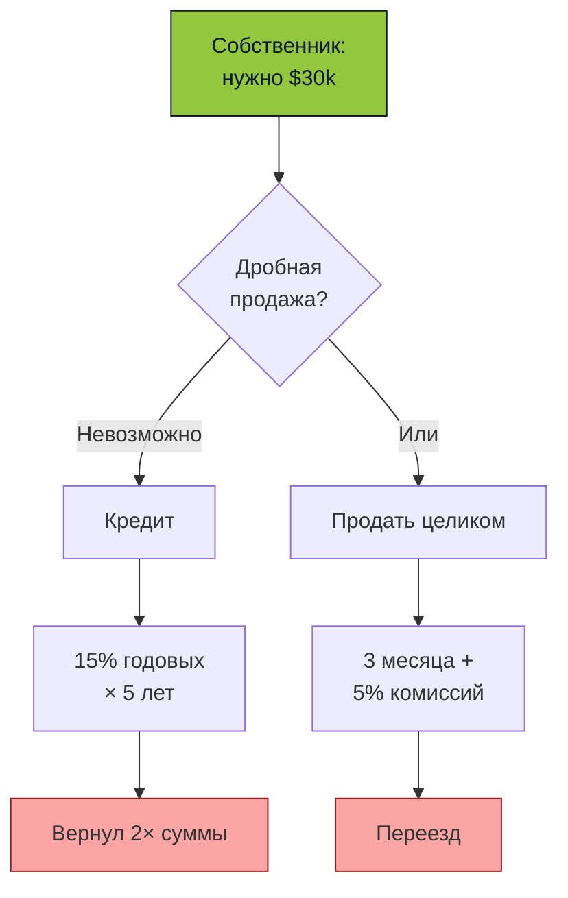

<!--
- Это структурная проблема, а не временная — рынок в принципе устроен без мелких участников.
- Либо кредит (вернул 2×), либо продать и переехать (3 месяца + комиссии). Третьего варианта нет.
- В обоих случаях собственник проигрывает: либо переплачивает, либо теряет дом.
- Решение должно быть фундаментальным: не оптимизация существующего, а новый механизм.
- Переход: этот механизм — Slice. Но сначала — почему рынок готов именно сейчас.
-->

---

# Почему рынок готов именно сейчас

<div class="mt-6 text-sm grid grid-cols-3 gap-4">

<div class="role-card">
<div class="font-semibold accent">⚡ Web3 подешевел</div>
<div class="text-xs mt-2 opacity-80">Solana: $0.00025 за транзакцию, финальность 400 мс. Мелкие сделки перестали быть дорогими.</div>
</div>

<div class="role-card">
<div class="font-semibold accent">🎨 Рост экономики создателей</div>
<div class="text-xs mt-2 opacity-80">Малый бизнес и независимые создатели нуждаются в гибком финансировании. Их стало много.</div>
</div>

<div class="role-card">
<div class="font-semibold accent">🔍 Поиск альтернатив</div>
<div class="text-xs mt-2 opacity-80">Инвесторы не хотят только депозиты и акции. Нужен доступ к реальным бизнесам с малыми суммами.</div>
</div>

</div>

<div class="mt-8 text-center text-lg opacity-80">
👉 Рынок готов к новому формату инвестиций
</div>

<!--
- Три фактора совпали именно сейчас, не было раньше, не будет завтра в таком виде.
- Первый: до Solana комиссии в блокчейне были $5-50 за транзакцию. Фракционная торговля была невозможна экономически.
- Второй: малый бизнес и независимые создатели ищут деньги. Их стало в разы больше за последние 5 лет.
- Третий: массовый инвестор разочаровался в депозитах (инфляция съедает) и боится крипты (слишком волатильно).
- Идеальный момент: запрос есть, инфраструктура созрела, регуляторы начинают понимать правила.
- Аналогия: как появились маркетплейсы в 2000-х, когда совпали интернет + логистика + доверие к онлайн-платежам.
- Переход: теперь само решение — как это работает у нас.
-->

---
layout: cover
class: section-sub
---

# B · Решение

Полный цикл: от документа до вторичного рынка

---
layout: center
---

# Slice — одной строкой

<div class="text-2xl mt-6 leading-relaxed">
Превращаем любой реальный актив в <span class="accent">N торгуемых фракций</span> на Solana — с полным юридическим оформлением.
</div>

<div class="mt-4 text-sm opacity-70">
Квартира, дом, офис, нефтебаза, таксопарк, стартап, компания, оборудование — что угодно, что имеет стоимость и юридическое оформление.
</div>

<div class="mt-8 opacity-60 text-xs">
На Solana · Token-2022 · Anchor
</div>

<!--
- Одно предложение, которое объясняет всё: делим квартиру на кусочки, продаём их на Solana.
- Аналогия пиццы: режем квартиру на N кусков. Каждый кусок — один токен. Хочешь четверть пиццы — покупаешь четверть токенов.
- N — это параметр. Не зашито 10 000. Может быть 1 000, может 100 000. Зависит от цены актива.
- Главное слово — "с полным юридическим оформлением". Без SPV (юрлицо-обёртка) это просто картинка в интернете.
- SPV — как коробка, в которую упаковали квартиру и приклеили квитанцию. Владеешь кусочком коробки — владеешь кусочком квартиры.
- Переход: как эта магия превращается в конкретный процесс из 7 шагов.
-->

---

# Это не крипто-спекуляция

<div class="mt-4 text-sm max-w-3xl">

Slice — продолжение эволюции рынка ценных бумаг, а не альтернатива ему.

</div>

<div class="mt-4 text-xs grid grid-cols-3 gap-4">
<div class="role-card">
<div class="font-semibold accent">1980-е</div>
<div class="mt-1">Бумажные сертификаты акций в хранилищах банков</div>
</div>
<div class="role-card">
<div class="font-semibold accent">1990–2000-е</div>
<div class="mt-1">Электронные реестры, централизованные депозитарии</div>
</div>
<div class="role-card">
<div class="font-semibold accent">2020–…</div>
<div class="mt-1">Токенизированные активы: тот же надзор, новые рельсы</div>
</div>
</div>

<div class="mt-6 text-xs opacity-70">
**Кто уже там:** BlackRock ($500M+ фонд BUIDL), Franklin Templeton ($400M FOBXX), JPMorgan (Onyx), Goldman Sachs (GS DAP). Все под надзором SEC, MiCA, MAS. Slice работает в той же парадигме, но для отдельных активов, а не крупных фондов.
</div>

<!--
- Ключевое сообщение: мы не конкуренты акциям и облигациям, мы их следующая форма.
- 40 лет назад акции были бумажными сертификатами. Физически в сейфах. Сделки — через банки.
- 30 лет назад — электронные депозитарии. Вся инфраструктура цифровизировалась.
- Сейчас — токенизация на блокчейне. Те же регуляторы, те же правила, новый уровень ликвидности.
- BlackRock запустил BUIDL в марте 2024 — токенизированный денежный рынок на Ethereum. Уже $500M.
- Franklin Templeton — FOBXX, токенизированный государственный фонд.
- JPMorgan Onyx — внутренняя сеть для расчётов между банками.
- Все они работают ПОД надзором SEC. Токенизация = регулируемый инструмент, не анархия.
- Slice делает это для отдельных активов (квартир, компаний), а не крупных фондов.
- Переход: какие активы мы можем токенизировать.
-->

---

# Любой актив → фракции

<div class="mt-4 grid grid-cols-4 gap-3 text-xs">
<div class="role-card text-center">
<div class="text-2xl mb-1">🏠</div>
<div class="font-semibold">Недвижимость</div>
<div class="opacity-70 mt-1">Квартиры, дома, офисы, склады, земля</div>
</div>
<div class="role-card text-center">
<div class="text-2xl mb-1">🏢</div>
<div class="font-semibold">Компании</div>
<div class="opacity-70 mt-1">Действующий бизнес, ТОО, LLC</div>
</div>
<div class="role-card text-center">
<div class="text-2xl mb-1">🚀</div>
<div class="font-semibold">Стартапы</div>
<div class="opacity-70 mt-1">Ранние раунды инвестиций</div>
</div>
<div class="role-card text-center">
<div class="text-2xl mb-1">🚕</div>
<div class="font-semibold">Таксопарки</div>
<div class="opacity-70 mt-1">Автомобили с доходностью от поездок</div>
</div>
<div class="role-card text-center">
<div class="text-2xl mb-1">⛽</div>
<div class="font-semibold">Нефтебазы</div>
<div class="opacity-70 mt-1">Промышленные активы</div>
</div>
<div class="role-card text-center">
<div class="text-2xl mb-1">🚗</div>
<div class="font-semibold">Авто</div>
<div class="opacity-70 mt-1">Премиум-автомобили, коллекции</div>
</div>
<div class="role-card text-center">
<div class="text-2xl mb-1">🌾</div>
<div class="font-semibold">Сельхоз</div>
<div class="opacity-70 mt-1">Угодья, техника, урожай</div>
</div>
<div class="role-card text-center">
<div class="text-2xl mb-1">💎</div>
<div class="font-semibold">Что угодно</div>
<div class="opacity-70 mt-1">Любой актив с юр. оформлением</div>
</div>
</div>

<div class="mt-4 text-xs opacity-70 text-center">
Требование одно: актив должен иметь реальную стоимость и поддаваться юридическому оформлению через SPV.
</div>

<!--
- Ключевая мысль: недвижимость — показательный пример, не потолок.
- Любой крупный актив с юр. оформлением можно токенизировать одним и тем же механизмом.
- Примеры из жизни КЗ: доли в ТОО, автопарки, сельхоз-техника, коммерческая недвижимость.
- Каждый класс имеет свои нюансы (например таксопарк генерирует денежный поток, квартира — нет), но ядро платформы одно.
- Мы выбрали недвижимость стартовой нишей, потому что у нас есть продуктовое понимание и рынок крупный.
- Переход: посмотрим на общий процесс — 7 стадий от регистрации до торговли.
-->

---

# Полный процесс — 7 стадий

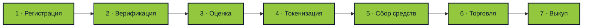

<div class="mt-6 text-xs opacity-70 leading-relaxed">
<strong>1.</strong> Владелец регистрирует объект + документы &nbsp;·&nbsp; <strong>2.</strong> 3+ независимых верификатора &nbsp;·&nbsp; <strong>3.</strong> 11 оценщиков, слепая схема «конверт и вскрытие»<br/>
<strong>4.</strong> SPV* + Token-2022 NFT фракции &nbsp;·&nbsp; <strong>5.</strong> Кампания сбора средств, инвесторы заходят &nbsp;·&nbsp; <strong>6.</strong> Вторичный рынок &nbsp;·&nbsp; <strong>7.</strong> Выкуп через голосование

<div class="mt-2 text-xs opacity-60">
* SPV = Special Purpose Vehicle, юрлицо-обёртка (в КЗ — ТОО), на которое оформляется квартира. Фракции = доли в этом SPV.
</div>
</div>

<!--
- Это как рецепт пирога: 7 шагов от яйца до готового блюда.
- 1) регистрация — принёс документы. 2) верификация — проверили что квартира твоя. 3) оценка — назначили цену.
- 4) токенизация — нарезали на кусочки. 5) продажа — инвесторы покупают. 6) торговля — кусочки можно перепродавать. 7) выкуп — кто-то скупает всё.
- Весь процесс идёт на блокчейне, никто не может подделать промежуточный шаг.
- От начала до первой торговли — примерно 3 месяца. Потом актив живёт на рынке годами.
- Переход: что делает всё это возможным — 6 технологических решений.
-->

---

# 6 ключевых решений

<div class="mt-4 grid grid-cols-3 gap-4 text-sm">
<div class="role-card">

**Сквозной цикл в блокчейне**
От регистрации до вторичного рынка — всё состояние в блокчейне

</div>
<div class="role-card">

**Слепая оценка («конверт и вскрытие»)**
Честная цена: сначала хеш, потом открытие. Без сговора.

</div>
<div class="role-card">

**Дробное владение**
Актив разбивается на N фракций. N рассчитывается от цены.

</div>
<div class="role-card">

**Соблюдение требований в блокчейне**
Проверки KYC и ограничения прямо на уровне контракта

</div>
<div class="role-card">

**Шесть ролей + кворум**
Собственник, верификатор, оценщик, юрист, нотариус, инвестор

</div>
<div class="role-card">

**Юридическая сила**
Кворум нотариусов + документы SPV (юрлицо-обёртка) = реальное право

</div>
</div>

<!--
- Каждая карточка — не маркетинг, а конкретная Anchor-программа. Увидите код в Part 2.
- Сквозной цикл: нет участка, где пришлось бы выпасть в ручные действия вне блокчейна.
- Слепое двухфазное голосование — самая интересная для технарей часть, разберём отдельно.
- Управление из нескольких ролей — 6 ролей, но одни и те же кошельки могут совмещать.
- Юридическая привязка — это то, что отличает нас от игрушечных проектов по токенизации.
- Переход: посмотрим на интерфейс, чтобы понять как это выглядит для пользователя.
-->

---
layout: image-right
image: /shots/landing-en.png
---

# Лендинг

Вход в платформу — три языка: EN / RU / KK.

Вход через кошелёк (Solana wallet adapter) и через email с TOTP.

<div class="mt-8 text-sm opacity-70">
  Next.js 16 · React 19 · Tailwind v4 · shadcn/ui
</div>

<!--
- Показываем живой интерфейс, все скриншоты с localhost:2098 (готовая к продакшену сборка).
- Три языка встроены изначально, не добавлены потом.
- Вход: через кошелёк (Phantom, Solflare) или через email с TOTP через Ory Kratos.
- Next.js 16 App Router + React 19 server components — мгновенная отрисовка списков.
- Переход: после входа пользователь попадает на главный экран.
-->

---
layout: image-right
image: /shots/dashboard.png
---

# Главный экран

Главный экран пользователя.

KPI-карточки: активы, верификации, сделки.

«Требует твоего внимания» — что ждёт от тебя лично как нотариуса / оценщика / юриста.

<!--
- Главный экран адаптируется под роли пользователя: нотариус видит голосования, юрист — юридические задачи.
- «Требует твоего внимания» — список действий: что конкретно от меня ждут сейчас.
- KPI-карточки считают по кешу Postgres, детали — прямым чтением из цепочки.
- Репутация влияет на приоритет: высокорейтинговым нотариусам приходит больше раундов.
- Переход: теперь разберём 6 ролей через построение экосистемы шаг за шагом.
-->

---
layout: cover
class: section-sub
---

# C · Кто в системе

Почему не напрямую P2P. 6 ролей по одной.

<!--
- Первый вопрос инвестора: "зачем столько посредников, не проще ли напрямую клиент-клиент?"
- Ответ: потому что квартира — это не цифра в базе, а реальный актив с юридическим контекстом.
- Каждая роль решает конкретную проблему реального мира. Без них токен = обещание.
- Начинаем с проблемы, которую решить проще всего без посредников — и увидим где она ломается.
- Переход: стартовая точка — один человек, один актив.
-->

---
layout: center
---

# Почему не просто клиент→клиент

<div class="mt-4 text-sm max-w-3xl mx-auto">

**Цифровой токен на блокчейне — это легко.** Связать его с реальным активом — сложно.

Без посредников возникают 4 провала:

1. **Верификация права** — кто сказал, что актив (квартира, компания, автопарк) вообще принадлежит продавцу?
2. **Честная цена** — продавец завысит, покупатель не сможет проверить.
3. **Юридическая обёртка** — токен без SPV = красивая картинка без прав.
4. **Разрешение споров** — кому идти, если кто-то нарушил договор?

</div>

<div class="mt-8 text-sm opacity-70 text-center">
Каждая роль в Slice — ответ на один из этих провалов.
</div>

<!--
- Главный вопрос зала: "зачем вообще столько посредников? Пусть продавец с покупателем сами договорятся!"
- Ответ аналогией: почему на базаре торгуют через оценщиков и гарантов? Потому что незнакомые люди друг другу не доверяют.
- Представьте: вы покупаете квартиру у незнакомца. Он показывает вам фото документов в телеграме. Вы ему поверите?
- 4 провала без посредников: (1) квартира вообще его?, (2) реальная цена?, (3) а если кинет?, (4) куда идти жаловаться?
- Традиционный мир решает это через нотариусов, банки, реестры. Мы переносим их функции в блокчейн.
- Разница: в блокчейне посредники проверяемы и неподкупны, потому что всё видно.
- Переход: начинаем строить систему с нуля — один человек, который хочет продать.
-->


---

# Шаг 1 — только собственник

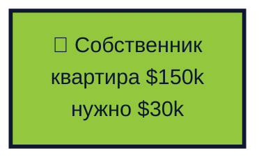

<div class="mt-4 text-sm opacity-70">
Точка отсчёта: один человек, один актив, одна потребность в ликвидности. Продать квартиру целиком — нельзя. Кредит — дорого.
</div>

<!--
- Знакомьтесь: Айша, реальная ситуация любого жителя Алматы.
- У неё квартира $150k, но наличных — нет. Нужно $30k: ремонт, бизнес, свадьба, учёба ребёнка — любое.
- Варианты сегодня: (1) кредит 15-20%, отдавать 5 лет вдвое, (2) продать и переехать, (3) сдавать и ждать годами.
- Все три варианта — плохие. Либо переплата, либо потеря дома, либо долгое ожидание.
- Аналогия: у вас есть большая картина стоимостью $150k, но вы не можете продать уголок за $30k.
- Наша задача: дать Айше продать 20% квартиры, остаться жить, не брать кредит.
- Переход: чтобы инвесторы поверили, нужно доказать что квартира действительно её.
-->

---
layout: two-cols
---

# Айша — собственник

<div class="mt-4 text-sm">

**Ситуация:** квартира в Алматы, $150k, нужно $30k на бизнес.

**Что делает:**
1. Регистрирует актив + загружает документы
2. Указывает характеристики (площадь, фото, адрес)
3. Выбирает: продать полностью или оставить часть владения себе
4. Отправляет актив в общий пул на верификацию
5. После оценки — публикует актив для сбора средств

**Что НЕ делает:** не выбирает нотариусов/оценщиков/юристов. Любой участник из общего пула берёт задачу сам.

**Результат:** $30k на руках, 80% владения сохраняется, живёт в той же квартире.

</div>

::right::


<!--
- Центральный персонаж Part 1. К ней привязаны все остальные роли.
- Акцент: она не теряет квартиру, не съезжает, не ждёт годами.
- Собственник НЕ выбирает нотариусов/оценщиков — любой из них берёт задачу из общего пула.
- Собственник решает только: продаёт полностью или оставляет себе долю.
- Количество фракций определяется контрактом автоматически на основе итоговой цены с аукциона.
- Документы уходят в Irys, хеш пишется в блокчейн в реестре активов.
- Переход: чтобы Айше поверили инвесторы, документы должен проверить нейтральный игрок.
-->

---

# Проблема — а квартира вообще его?

<div class="mt-6 text-sm max-w-3xl">

Инвестор видит объявление: квартира в Алматы, $150k, продаётся 20%. **Как он узнает, что продавец — настоящий владелец?**

| Подход | Почему не работает |
|---|---|
| Спросить документы | Документ можно подделать, фото документа — тем более |
| Сходить в ЦОН | Не все инвесторы находятся в КЗ; долго; не масштабируется |
| Верить продавцу | Именно так работают 90% мошенничеств |
| Страховка | Дорого, не покрывает токенизацию |

</div>

<div class="mt-6 text-sm opacity-70">
Нужен посредник, который делает проверку один раз, пишет результат в блокчейн — и все инвесторы доверяют ему как источнику.
</div>

<!--
- Задайте залу вопрос: вы бы отправили $500 незнакомцу, который в чате прислал фото документов на квартиру? Никто не отправит.
- Это классическая проблема доверия: мошенники делают фото фальшивых документов лучше, чем настоящие.
- Решение "сходить в ЦОН" не масштабируется: инвестор из Караганды не поедет в Алматы ради $500.
- Нужен посредник, которому доверяют все. В обычном мире — нотариус. В блокчейне — тоже нотариус, но под наблюдением.
- Но один нотариус — плохо. Его могут подкупить. Нужен ПУЛ нотариусов, каждый проверяет других.
- Аналогия: как жюри в суде — 12 человек, а не один судья. Сговорить всех невозможно.
- Переход: знакомимся с первым посредником — нотариусом, который входит в нашу систему.
-->

---

# Шаг 2 — добавляется нотариус

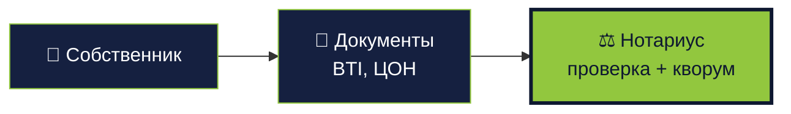

<div class="mt-4 text-sm opacity-70">
Нотариус подтверждает подлинность документов. Но не один — кворум нотариусов с весом голоса по репутации.
</div>

<!--
- Нотариус решает задачу доверия: инвестор не хочет лично ехать в ЦОН.
- Кворум нужен на двух этапах: до оценки (проверка документов нотариусами до оценки) и перед фракционированием (проверка SPV нотариусами после юриста).
- Вес голоса: `1000 + rating_score × 10`. Хороший нотариус весит 15000, плохой — 1000.
- Решение одного нотариуса ничего не значит. Только агрегированный взвешенный консенсус.
- Переход: познакомимся с тем, кто голосует — Марат.
-->

---
layout: two-cols
---

# Марат — нотариус

<div class="mt-4 text-sm">

**Ситуация:** практикующий нотариус, ищет дополнительный доход в крипто.

**Что делает:**
1. Регистрируется, получает роль `Notary`
2. Голосует в раундах (сбор кворума)
3. Участвует в раундах нотариусов: до оценки и после юриста
4. Вес голоса растёт с репутацией

**Доход:** комиссия с каждого завершённого раунда, пропорционально `vote_weight`.

</div>

::right::


<!--
- Марат — мост между традиционным юридическим миром и крипто-экономикой.
- Ему не нужно разбираться в блокчейне — интерфейс нотариуса выглядит как обычная система учёта дел.
- Формула веса: `max(1000, 10000 + rating_score × 10)`. Репутация реально влияет на доход.
- Если он голосует против большинства системно — репутация падает, происходит штрафное удержание залога.
- Переход: документы проверены. Теперь нужна цена — а её нельзя ставить самому.
-->

---

# Проблема — сколько на самом деле стоит?

<div class="mt-4 text-sm max-w-3xl">

**Лучший оценщик — сам рынок.** Но рынка на старте нет. А без цены не запустить аукцион.

Атака "перекидывание активов": мошенник заводит 2 аккаунта, выпускает квартиру за $1, со второго аккаунта мгновенно скупает, перепродаёт по рыночной цене — профит $149 999.

<div class="mt-4 grid grid-cols-2 gap-4">
<div>

**Риск завышения:**
- Продавец ставит $300k за квартиру $150k
- Инвесторы переплачивают
- При выкупе через год — потери держателей

</div>
<div>

**Риск занижения:**
- Продавец ставит $1, скупает сам через второй аккаунт
- Сговор инсайдеров
- Мошенничество в промышленных масштабах

</div>
</div>

</div>

<div class="mt-4 text-sm opacity-70">
Нужна независимая оценка. Один оценщик = один сговор. Значит — много оценщиков, независимых друг от друга, с защитой от координации до публикации результатов.
</div>

<!--
- Начните с признания: лучший оценщик — сам рынок, никто точнее не скажет.
- Но на СТАРТЕ рынка нет. Первый актив ещё никто не покупал, его цену нужно угадать.
- Самая опасная атака: мошенник делает два аккаунта. Выставляет квартиру за $1, со второго покупает.
- Аналогия: представьте аукцион eBay, где продавец и покупатель — один и тот же человек. Купил сам у себя за $1.
- Потом перепродаёт этот же токен по рыночной цене и делает профит в 150 000 раз. Слышали про фиктивную торговлю сам с собой? Это оно.
- Защита: независимые оценщики. Не один, потому что его подкупят. Несколько, потому что сговорить всех — дорого.
- Переход: как работает конкретный оценщик — Динара.
-->

---

# Шаг 3 — добавляется оценщик

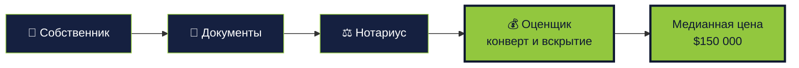

<div class="mt-4 text-sm opacity-70">
Не один оценщик, а 11 — со слепой схемой «конверт и вскрытие». Медиана отсеивает крайние оценки.
</div>

<!--
- Задача оценщика: назвать честную цену квартиры, не подстраиваясь под других.
- Главная техника: «конверт и вскрытие». Простыми словами — запечатанные конверты.
- Аналогия: голосование в жюри. Все пишут оценки в конверты, конверты запечатывают, потом вскрывают одновременно.
- Никто не видит чужую оценку до момента вскрытия — не получится подстроиться или сговориться.
- 11 оценщиков — не магическое число. Достаточно, чтобы медиана была устойчива к выбросам.
- Если оценщик не открыл конверт — теряет залог. Если его цена сильно отличается от остальных — тоже теряет часть.
- Переход: встречайте Динару — она будет оценивать квартиру Айши.
-->

---
layout: two-cols
---

# Динара — оценщик

<div class="mt-4 text-sm">

**Ситуация:** риелтор с 10 годами на рынке Алматы, хочет монетизировать экспертизу.

**Что делает:**
1. Получает роль `Appraiser`, блокирует залог в SOL
2. **Запечатывание:** `keccak256(price ‖ salt)` в блокчейне
3. **Вскрытие** после дедлайна: открывает цифру
4. Медиана по всем раскрытиям → минимальная цена актива

**Защита:** никто не видит чужие оценки до вскрытия. Крайние значения штрафуются.

</div>

::right::


<!--
- Слепая схема «конверт и вскрытие» — ключевая инновация, подробно разберём в Part 2.
- Залог в SOL — не бумажная ответственность, а экономическая.
- Максимум 11 оценщиков на раунд — компромисс между статистикой и затратами на координацию.
- Чем точнее оценки, тем выше репутация и больше приглашений в раунды.
- Переход: цена есть, документы есть. Актив готов стать фракционной собственностью. Нужны покупатели.
-->

---

# Проблема — как разделить право собственности

<div class="mt-6 text-sm max-w-3xl">

Квартира верифицирована, оценка честная. Владелец хочет **продать 20% за $30k**. Но:

- Долевая собственность в ЕГРП — это 2-10 дольщиков, не 2000.
- Юридически нельзя просто "написать" что у 2000 людей по 0.01%.
- Каждая продажа доли в обычной долевой собственности = нотариус, ЦОН, регистрация.

**На блокчейне — N взаимозаменяемых фракций с мгновенной передачей без нотариуса.** Количество N задаётся при создании хранилища, цена одной фракции = цена_актива / N. Нужен контейнер в блокчейне (хранилище), который держит запас токенов.

</div>

<div class="mt-6 text-sm opacity-70">
Нужно хранилище: программа-посредник, которая выпускает Token-2022 фракции и распределяет их инвесторам после сбора средств.
</div>

<!--
- Третья проблема: физический разрыв между юридической формой владения и дроблением в блокчейне.
- В реальном мире у квартиры может быть 2-10 собственников, реестр не масштабируется на 2000.
- Token-2022 — встроенный стандарт Solana для взаимозаменяемых токенов с метаданными и перехватчиками при передаче.
- N фракций — параметр `initialize_vault`, задаётся при создании хранилища. Может быть 1000, 10000, 100000.
- Переход: как это выглядит в UI для инвесторов.
-->

---

# Шаг 4 — добавляется рынок

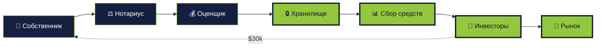

<div class="mt-4 text-xs opacity-70">
Хранилище превращает актив в N Token-2022 фракций. Кампания сбора средств продаёт долю (например 20%). Деньги идут собственнику, фракции — инвесторам. Вторичный рынок даёт ликвидность.
</div>

<!--
- Хранилище — это посредник внутри блокчейна на программно-производном адресе, который держит фракции до окончания сбора средств.
- Token-2022 — стандарт Solana для программируемых токенов (перехватчики при передаче, метаданные).
- Количество фракций N — параметр хранилища. Цена фракции = цена_актива / N.
- После завершения сбора деньги переходят собственнику, фракции распределяются пропорционально депозитам.
- Переход: познакомимся с инвесторами — их два типа.
-->

---
layout: two-cols
---

# Рустам — инвестор (первичный рынок)

<div class="mt-4 text-sm">

**Ситуация:** $500/мес свободных денег, хочет долю в недвижимости.

**Что делает:**
1. Проходит KYC (Sumsub / Binance / Civic)
2. Смотрит кампании сбора средств на `/auctions`
3. Инвестирует $500 в 5 разных объектов
4. Получает 5 видов фракций в кошельке

**Результат:** диверсификация по недвижимости с порогом $100.

</div>

::right::


<!--
- Рустам — портрет массового инвестора, ради которого строится платформа.
- Порог $100 закрывает разрыв между акциями ($1) и недвижимостью ($100k+).
- KYC обязателен — без подтверждения на кошельке фильтр соблюдения требований блокирует вызов `invest()`.
- 5 разных объектов — реальная диверсификация по географии, типу, размеру.
- Переход: но инвестор может захотеть выйти раньше выкупа — вторичный рынок.
-->

---
layout: two-cols
---

# Назерке — вторичный рынок

<div class="mt-4 text-sm">

**Ситуация:** купила 100 долей 6 месяцев назад, нужны деньги — продаёт 50.

**Что делает:**
1. Открывает `/market`
2. Выставляет ордер на 50 долей
3. Стакан ордеров вне блокчейна сводит её с покупателем
4. Расчёт пакетами в блокчейне

**Результат:** выход из позиции за минуты, не ждёт выкупа через годы.

</div>

::right::


<!--
- Вторичный рынок — ключевое отличие от REIT: выход в любой момент, не через годы.
- Гибрид: стакан ордеров вне блокчейна (скорость, сведение с низкой задержкой), расчёт в блокчейне (безопасность, финальность).
- Это снимает страх «куда потом девать 100 долей квартиры». Ответ: продать на рынке.
- Ликвидность вторичного рынка — главный драйвер массового внедрения для инвесторов.
- Переход: актив торгуется. Но кто гарантирует, что за токенами действительно стоит квартира?
-->

---

# Проблема — токен без юридической силы

<div class="mt-6 text-sm max-w-3xl">

Инвестор купил 100 фракций. У него в кошельке 100 токенов Token-2022. **Что он юридически держит?**

<div class="mt-4 grid grid-cols-2 gap-4 text-xs">
<div>

**Без SPV:**
- Токен = запись в блокчейне
- Претензия на квартиру = "владелец обещал"
- Если владелец продаст квартиру вне блокчейна — токен ничего не стоит
- Суд скажет: "это ваши проблемы"

</div>
<div>

**Со SPV:**
- SPV (ТОО) владеет квартирой по документам
- Токен = доля в SPV (документально)
- Владелец не может продать квартиру — она на SPV
- Суд признаёт SPV как собственника

</div>
</div>

</div>

<div class="mt-6 text-sm opacity-70">
<strong>SPV (Special Purpose Vehicle)</strong> — юрлицо-прослойка, создаваемое специально под один актив. В КЗ это ТОО. Юрист регистрирует SPV, оформляет квартиру на него, публикует хеш устава в блокчейне.
</div>

<!--
- Представьте: вы купили 100 токенов. Они в кошельке. Что у вас В РУКАХ ЮРИДИЧЕСКИ?
- Без SPV — ничего. Просто цифры в блокчейне. В суд идти — нечем доказывать владение квартирой.
- SPV — это юридическая коробка, в которую "упаковали" квартиру. В Казахстане эта коробка — ТОО (товарищество).
- Аналогия: представьте, что квартиру поместили в сейф. Сейф принадлежит ТОО. Кто держит ключи от ТОО — у того квартира.
- Ключи = токены. У кого больше токенов — у того больше голосов в управлении ТОО.
- На каждую квартиру — своё ТОО. Никогда не смешиваем: разные квартиры, разные долги, разные проблемы.
- Юрист создаёт это ТОО, оформляет документы, кладёт хеш в блокчейн — чтобы все могли проверить.
- Переход: знакомимся с юристом — это Айдар.
-->

---

# Шаг 5 — добавляется юрист

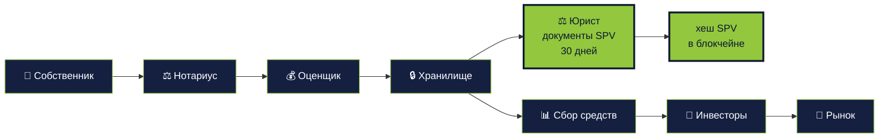

<div class="mt-4 text-sm opacity-70">
Юрист готовит SPV-документы параллельно со сбором средств. Дедлайн — 30 дней. Не успел — штрафное удержание залога и передача задачи другому.
</div>

<!--
- SPV (Special Purpose Vehicle) — юридическая прослойка, на которую оформлено имущество.
- Без SPV токен — красивая картинка. С SPV — реальное право собственности через долю в юрлице.
- Юрист берёт задачу в работу — 30 дней на оформление — загрузка хеша SPV-документов в блокчейн.
- Экономический стимул: комиссия плюс штраф за пропуск дедлайна идёт в общий пул следующего юриста.
- Переход: кто это делает — Айдар.
-->

---
layout: two-cols
---

# Айдар — юрист

<div class="mt-4 text-sm">

**Ситуация:** юрист по корпоративному праву, специализация — ТОО и SPV.

**Что делает:**
1. Роль `Lawyer` в блокчейне
2. На `/legal` берёт задачу из очереди
3. 30 дней на регистрацию SPV плюс подготовку документов
4. Загрузка хеша SPV в `asset_registry`

**Результат:** комиссия `max(min_lawyer_fee, 3%)`. Пропустил дедлайн — залог удержан, задача уходит следующему.

</div>

::right::


<!--
- Айдар — традиционный юрист, но с прозрачной ответственностью в блокчейне.
- Он не подписывает пустое место: он видит хеш документов, оценку, собственника, инвесторов.
- 30 дней — реалистичный срок регистрации ТОО в КЗ.
- Залог удерживается не за ошибки, а за срыв дедлайна. Ошибку разбирает проверка SPV нотариусами после юриста.
- Переход: последний элемент — и картина замыкается.
-->

---

# Шаг 6 — полная картина с SPV

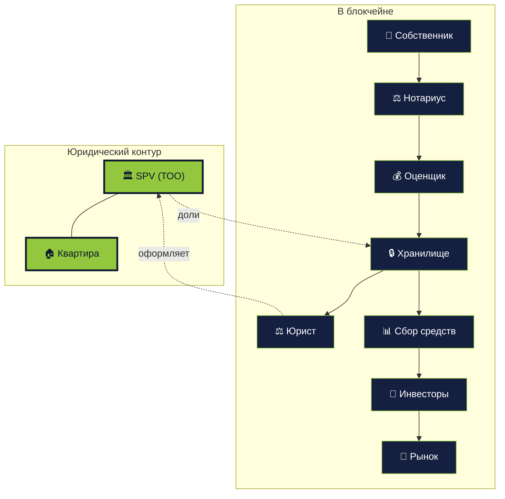

<div class="mt-4 text-xs opacity-70">
Фракции Token-2022 — это доли в SPV. SPV владеет реальной квартирой. Замыкание слоёв в блокчейне и вне блокчейна.
</div>

<!--
- Это финальная карта экосистемы. Все 6 ролей, все связки, оба слоя.
- Ключевое: токен — это доля в SPV, а не «обещание». Это даёт юридическую силу.
- Все стрелки из предыдущих шагов здесь. Добавлен только SPV-контур.
- Казахстан: SPV = ТОО. В других юрисдикциях — LLC, Limited, GmbH.
- Переход: 6 ролей представлены. Теперь покажем UI, который их обслуживает.
-->

---
layout: center
---

# Глоссарий — к чему привыкнуть

<div class="mt-6 text-sm grid grid-cols-2 gap-x-12 gap-y-3">
<div><span class="accent font-semibold">SPV</span> — Special Purpose Vehicle, юрлицо-прослойка (в КЗ — ТОО), на которое оформлена недвижимость.</div>
<div><span class="accent font-semibold">Хранилище</span> — программно-производный адрес в блокчейне, который держит Token-2022 фракции до и после сбора средств.</div>
<div><span class="accent font-semibold">Фракция</span> — один из N токенов на актив. N задаётся при создании хранилища. Доля = fraction / N.</div>
<div><span class="accent font-semibold">Конверт и вскрытие</span> — двухфазное голосование: сначала хеш, потом открытие, чтобы не видеть чужие оценки.</div>
<div><span class="accent font-semibold">Кворум</span> — порог нотариусов для одобрения (обычно 66.66%, по весу голоса).</div>
<div><span class="accent font-semibold">Подтверждение KYC</span> — программно-производный адрес, подтверждающий проверку кошелька у провайдера.</div>
</div>

<!--
- Это вставка на 30 секунд — чтобы инвесторы в зале не потерялись, когда технари начнут говорить своё.
- SPV — самое важное слово. Если запомнили только это, цель достигнута.
- Все эти термины ещё раз всплывут в Part 2, уже с кодом.
- Переход: почему каждой роли — несколько исполнителей, а не один.
-->

---

# Зачем по несколько исполнителей каждой роли

<div class="mt-4 text-sm grid grid-cols-2 gap-6">
<div>

**Один нотариус:**
- Можно подкупить
- Можно ошибиться
- Некому проверить

**Пул нотариусов + кворум:**
- Сговор дорогой (надо подкупить большинство)
- Одна ошибка компенсируется
- Все перепроверяют друг друга
- Вес голоса зависит от репутации

</div>
<div>

**Один оценщик:**
- Заинтересован угодить собственнику
- Один субъективный взгляд
- Нет защиты от «перекидывания»

**Несколько оценщиков + медиана:**
- Крайние значения отсекаются автоматически
- Сговор раскрывается через «конверт и вскрытие»
- Медиана устойчива к экстремальным значениям
- Проверка через репутацию и залог

</div>
</div>

<div class="mt-4 text-sm opacity-70">
Принцип: **каждый важный шаг требует кворума независимых исполнителей**. Это применяется ко всем этапам — не только к нотариусам, но и к оценке, юридической проверке, голосованию держателей.
</div>

<!--
- Главный принцип: ни одного важного решения в одиночку. Всегда группа.
- Аналогия советского суда: 1 судья + 2 народных заседателя. Один человек не может посадить.
- Или аналогия дома: важные решения — через общее собрание жильцов, не один председатель.
- Кворум — это минимальный порог согласия. Обычно 66.66% (две трети).
- Почему это работает: подкупить одного — дёшево. Подкупить двух третей — в разы дороже и видно.
- Каждый проверяет других. Если кто-то врёт систематически — теряет репутацию и штрафы.
- Этот же принцип применяется ВЕЗДЕ: у нотариусов, оценщиков, юристов, держателей токенов.
- Переход: но кто назначает этих самих "доверенных"? Не выходит ли замкнутый круг?
-->

---
layout: cover
class: section-sub
---

# C' · Оракул и край-кейсы

Кто контролирует доверенных. Что если владелец умер.

<!--
- 6 ролей представлены. Но остаётся главный вопрос: а этим 6 людям — кто назначил быть "доверенными"?
- И: что происходит, когда система сталкивается с реальным миром — смерть, развод, арест.
- Эти вопросы задают и инвесторы, и регуляторы. Надо иметь ответ.
- Переход: начнём с того, кто контролирует доверенных.
-->

---

# Шаг 7 — добавляется оракул

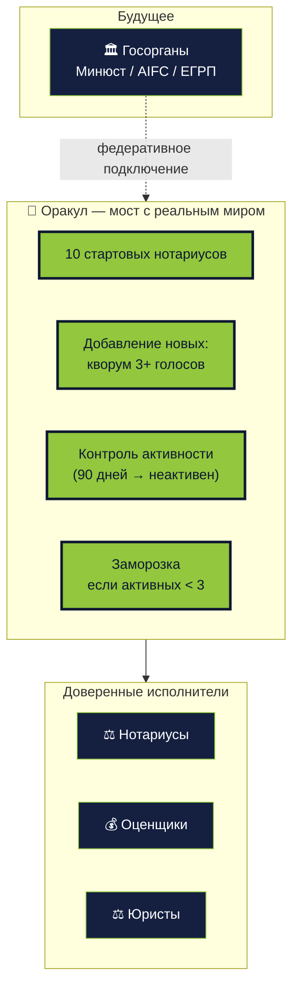

<div class="mt-3 text-xs opacity-70">
<strong>Смарт-контракт не может сам проверить что в реальном мире.</strong> Законы разные в каждой стране — невозможно зашить единые правила. Оракул — это мост между блокчейном и государством: он переводит внешние события (смерть, арест, развод) в действия в блокчейне.
</div>

<!--
- Главная проблема блокчейна: он ничего не знает о реальном мире. Он как робот в коробке.
- Аналогия: представьте робота в запертой комнате. Он не знает, идёт ли дождь снаружи. Пока ему не скажут.
- Тот, кто "говорит" блокчейну о реальном мире — это оракул. Мост между компьютером и жизнью.
- Пример: суд арестовал квартиру. Блокчейн об этом не знает сам. Оракул должен прийти и сообщить.
- Почему нельзя "один смарт-контракт для всех стран": законы разные. В КЗ — ТОО, в Дубае — LLC, в РФ — ООО.
- Невозможно зашить в код все законы мира. Поэтому оракул — настраиваемый мост для каждой страны отдельно.
- Сейчас оракул = кворум нотариусов. Долгосрочно — подключение государственных реестров напрямую.
- Переход: конкретные жизненные ситуации, где оракул нужен.
-->

---

# Проблема смерти владельца

<div class="mt-6 text-sm grid grid-cols-2 gap-8">
<div>

**Ситуация:** Айша умерла. У неё 80% фракций в кошельке. Наследник не знает секретной фразы.

**Что ломается:**
- Фракции навсегда заперты на кошельке
- Квартира юридически живёт (SPV не распущено)
- Держатели не могут сделать выкуп, нет контактного лица
- Нельзя переоформить SPV на наследника

</div>
<div>

**Решение через оракул:**
1. Наследник приходит с свидетельством о смерти + нотариальным завещанием
2. Юрист подаёт заявку в программу `compliance`
3. Нотариальный кворум (взвешенное голосование) проверяет документы
4. Принудительный перевод на кошелёк наследника через перехватчик при передаче
5. `Asset.original_owner` обновляется

</div>
</div>

<div class="mt-6 text-xs opacity-70">
Принудительный перевод реализуется через перехватчики при передаче Token-2022 + административные права программы `compliance`. Важно: это не произвольный захват — только по решению кворума на базе документов вне блокчейна.
</div>

<!--
- Самый частый вопрос от скептиков: "а если владелец умер, что с токенами?"
- Представьте: Айша умерла, у неё в кошельке 80% квартиры. Наследник не знает секретной фразы.
- Без механизма — фракции навсегда мёртвые. Квартира "зависла". Никто не может делать выкуп.
- Решение: наследник приходит с свидетельством о смерти и завещанием в суд → получает решение суда.
- Суд передаёт решение оракулу (нотариусам) → кворум подтверждает → токены переходят на новый кошелёк.
- Это НЕ произвольный захват. Админ не может сам нажать кнопку. Только через кворум + документ.
- Аналогия: как банк передаёт счёт наследнику — тоже требует документов, а не просто так.
- Переход: ещё один реальный кейс — арест имущества.
-->

---

# Проблема ареста имущества

<div class="mt-6 text-sm grid grid-cols-2 gap-8">
<div>

**Ситуация:** Суд постановил арестовать квартиру (налоговая задолженность, уголовное дело).

**Что нужно:**
- Заморозить торговлю фракциями
- Запретить выкуп
- Оставить возможность распределения средств от принудительной продажи
- Уведомить всех держателей

</div>
<div>

**Процедура (через оракул):**
1. Госорган подаёт официальный документ
2. Юрист или нотариус оформляет `FreezeOrder` в блокчейне
3. Перехватчик при передаче блокирует все переводы фракций
4. Хранилище переходит в статус `Frozen`
5. После реализации актива — распределение пропорционально долям

</div>
</div>

<div class="mt-6 text-xs opacity-70">
Это неприятная, но необходимая функция: без неё платформа несовместима с законодательством любой юрисдикции.
</div>

<!--
- Сценарий: налоговая или суд арестовывают квартиру (долги, уголовное дело).
- Крипто-пуристы скажут: "блокчейн не должен замораживать!" Но тогда мы не сможем работать ни в одной стране.
- Аналогия банковского счёта: если суд арестовал — банк замораживает, невозможно снять деньги. Норма.
- Без этого механизма мы — пират, а не платформа для институциональных денег.
- Заморозка делается только по решению суда, документ проверяется юристами/нотариусами, потом кворум.
- После реализации актива (принудительная продажа) — деньги распределяются всем держателям токенов.
- Переход: ещё кейсы — развод, банкротство, споры.
-->

---

# Другие крайние случаи

<div class="mt-4 text-sm grid grid-cols-2 gap-4">
<div class="role-card">

**Развод совладельцев SPV**
Если собственник — это двое супругов. Суд делит 80% владельческих фракций пополам. Принудительный перевод по решению.

</div>
<div class="role-card">

**Банкротство инвестора**
Фракции инвестора становятся частью конкурсной массы. Арбитр может запросить принудительный перевод на кошелёк доверенного.

</div>
<div class="role-card">

**Спор о документах SPV**
После `NotaryPostCheck` выяснилась ошибка в уставе. Актив возвращается в `LegalProcessing`, залог юриста удерживается.

</div>
<div class="role-card">

**Держатель блокирует выкуп**
Один держатель купил 34% и больше, чтобы блокировать любой выкуп (кворум 66%). Решается через предложение о размытии через DAO.

</div>
</div>

<div class="mt-6 text-xs opacity-70">
Все крайние случаи требуют кворум + документ вне блокчейна + действие в блокчейне. Нет ни одной ветки, где один человек может принять решение единолично.
</div>

<!--
- Это не полный список, но покрывает 80% реальных сценариев.
- Ключевой принцип: ни одно изменение владельца без кворума и документа.
- Предложение DAO — это отдельная программа управления, в планах развития.
- Цель показать: система не наивна. Мы подумали про смерть, развод, банкротство, атаки.
- Переход: возвращаемся к экономике и рынку.
-->

---
layout: cover
class: section-sub
---

# D · Рынок и экономика

Где мы играем и откуда деньги

---

# Экономика транзакции

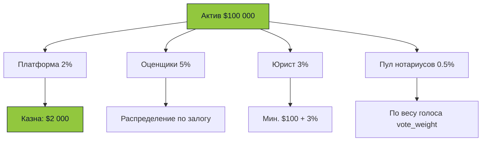

<div class="mt-4 text-sm opacity-70">
  Платформа берёт 2% с каждой токенизации. На $100M оборот — $2M годовой выручки. Плюс вторичный рынок (0.3% от каждой сделки).
</div>

<!--
- Платформа берёт 2% с каждой токенизации + 0.3% с каждой вторичной сделки.
- Один актив генерирует 100-300 транзакций за 3 года: сбор средств, вторичные сделки, выкуп.
- На $100M токенизированного оборота платформа делает $2M годовой выручки на первичном рынке плюс вторичный.
- Оценщикам достаётся 5%, юристу 3%, нотариусам общий пул (обычно 0.5-1%).
- Штрафы за крайние значения идут в казну — самофинансируемый защитный механизм.
- Переход: что уже построено и работает.
-->

---
layout: center
---

# Что уже сделано

<div class="mt-6 text-sm">

- ✅ **11 Anchor-программ** на Solana devnet
- ✅ **Полный интерфейс** на Next.js (EN/RU/KK)
- ✅ **Процесс KYC** (заглушка + готовность к Sumsub/Binance/Civic)
- ✅ **129 хранилищ**, **160+ активов**, **активный рынок**
- ✅ **Голосования нотариусов** + **раунды нотариусов**
- ✅ **Координатор вне блокчейна** на Bun + Elysia + Drizzle
- ✅ **Irys/Arweave** для документов

</div>

<div class="mt-8 text-xs opacity-60">
  Работает на Solana devnet.
</div>

<!--
- Это не PowerPoint-продукт: 160 активов в БД, 129 активных хранилищ, реальная торговля.
- 11 Anchor программ прошли подготовку к аудиту и развёрнуты на devnet.
- Интерфейс полностью на трёх языках, процесс KYC готов (заглушка плюс готовность к 3 провайдерам).
- Голосования нотариусов и раунды нотариусов — реализованы.
- Координатор вне блокчейна плюс интеграция Irys — рабочие.
- Переход: часть 1 закончена. Часть 2 — как это работает под капотом.
-->

---
layout: cover
class: section-tech
---

# Под капотом

## <span class="accent">Как это работает на уровне блокчейна</span>

<div class="opacity-60 mt-6">Архитектура → Контракты → Жизненный цикл → Решения → Вне блокчейна</div>

<!--
- Честное предупреждение: дальше технические детали.
- Если вы пришли только за инвест-частью — перерыв хорошая идея.
- Для технарей: это код Anchor, модели PDA, Token-2022, «конверт и вскрытие».
- Держать в голове из части 1: 6 ролей, SPV, N фракций, 7 стадий процесса.
- Переход: начнём с архитектуры.
-->

---

# Словарь терминов — что будем использовать

<div class="mt-4 text-xs grid grid-cols-2 gap-x-6 gap-y-2">
<div><span class="accent font-semibold">В блокчейне</span> — состояние хранится в контрактах Solana.</div>
<div><span class="accent font-semibold">Вне блокчейна</span> — бэкенд, базы данных, документы.</div>
<div><span class="accent font-semibold">PDA</span> — программно-производный адрес. Детерминированный адрес от seeds. Клиент сам вычисляет.</div>
<div><span class="accent font-semibold">Паттерн «маршрутизатор + модули»</span> — архитектура с одним входом и множеством модулей.</div>
<div><span class="accent font-semibold">Модуль</span> — программа, подключённая к маршрутизатору. У нас 11 модулей.</div>
<div><span class="accent font-semibold">Раунд</span> — раунд голосования нотариусов/оценщиков с дедлайном и кворумом.</div>
<div><span class="accent font-semibold">PreCheck / PostCheck</span> — наши термины: проверка документов ДО оценки и ПОСЛЕ юриста.</div>
<div><span class="accent font-semibold">Конверт и вскрытие</span> — двухфазное голосование: сначала хеш, потом открытие.</div>
<div><span class="accent font-semibold">Залог</span> — залог в SOL, замороженный на время голосования.</div>
<div><span class="accent font-semibold">Штрафное удержание</span> — штраф: часть залога уходит в казну за нарушение.</div>
<div><span class="accent font-semibold">Кворум</span> — минимальный порог голосов для принятия решения (обычно 66.66%).</div>
<div><span class="accent font-semibold">Перехватчик при передаче</span> — расширение Token-2022: проверка перед каждым переводом фракций.</div>
</div>

<!--
- Это справочник. Технари могут пропускать, новичкам — внимательно.
- «В блокчейне» — это как публичная доска объявлений: все видят, никто не может стереть.
- «Вне блокчейна» — это наш личный блокнот: быстро, но верят только на слово.
- PDA — детерминированный адрес. Аналогия: номер квартиры в доме. Зная дом+подъезд+этаж — вычислим квартиру, не нужно искать по списку.
- Паттерн «маршрутизатор + модули» — главный вход и множество магазинов. В торговом центре ты входишь через одну дверь, внутри выбираешь магазин.
- Модуль — один магазин в этом торговом центре. У нас 11 магазинов: identity, assets, validation и т.д.
- Раунд — раунд голосования с дедлайном и минимальным порогом согласия.
- «Конверт и вскрытие» — сначала запечатанный конверт, потом вскрытие, чтобы никто не подстроился.
- Перехватчик при передаче — охранник на проходной, который проверяет каждого при передаче фракции.
- Переход: архитектура — где что живёт, из каких слоёв состоит Slice.
-->

---
layout: cover
class: section-sub
---

# F · Архитектура

Три слоя и как они склеены

---

# Полная архитектура — шаг 1 · Клиент

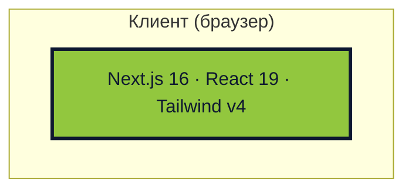

<div class="mt-4 text-sm opacity-70">
Фронт — Next.js 16 на App Router. Адаптер кошелька на клиенте для подписания транзакций.
</div>

<!--
- Всё начинается с браузера: пользователь сам подписывает всё, что касается его кошелька.
- React 19 + server components для быстрой отрисовки списков активов.
- Фронтенд НЕ держит приватных ключей — только подписи через расширение (Phantom, Solflare).
- Переход: но клиенту нужен бэкенд, который агрегирует данные и валидирует.
-->

---

# Полная архитектура — шаг 2 · + бэкенд

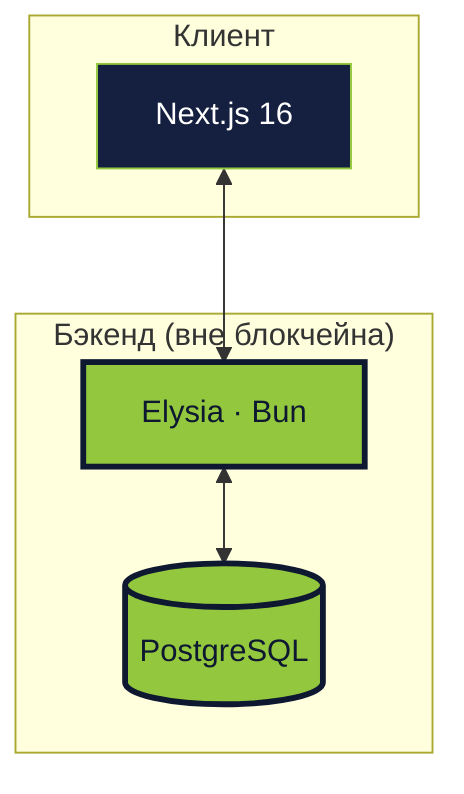

<div class="mt-4 text-sm opacity-70">
Бэкенд — координатор, не источник истины. Postgres кеширует данные из блокчейна для поиска, фильтрации и стакана ордеров вне блокчейна.
</div>

<!--
- Bun + Elysia даёт ~3× прирост пропускной способности относительно Node + Express.
- Drizzle ORM — типобезопасные запросы, без магии во время выполнения.
- Postgres держит то, что читать из цепочки дорого: индексы, списки, истории.
- Важно: если Postgres упадёт, система не сломается — данные всегда можно перестроить из цепочки.
- Переход: но реальное состояние живёт не здесь.
-->

---

# Полная архитектура — шаг 3 · + Solana

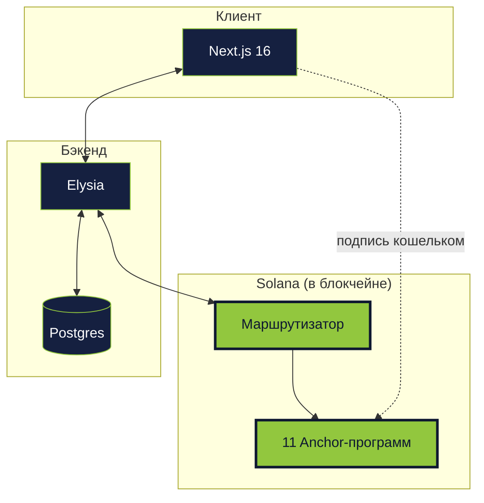

<div class="mt-4 text-sm opacity-70">
Клиент подписывает → бэкенд или сам клиент отправляет транзакцию → маршрутизатор валидирует → программа-модуль исполняет.
</div>

<!--
- Маршрутизатор — единая точка входа. Фильтр KYC, маршрутизация по адресам модулей.
- Две траектории транзакций: через бэкенд (простой UX) и прямо с клиента (полное самостоятельное хранение ключей).
- Бэкенд читает цепочку через RPC, но никогда не может инициировать транзакцию от имени пользователя.
- 11 программ разобьём через 2 слайда.
- Переход: осталось показать внешние интеграции.
-->

---

# Полная архитектура — шаг 4 · + Ory Kratos

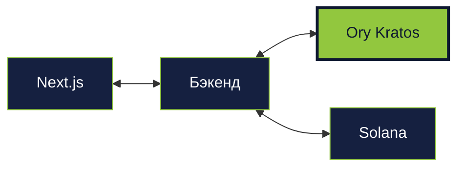

<div class="mt-4 text-sm opacity-70">
<strong>Ory Kratos</strong> — готовая система управления пользователями (email, TOTP, OAuth, привязка кошелька). Бэкенд делегирует ей всё, что связано с входом.
</div>

<!--
- Kratos — это готовый «движок регистрации». Компания Ory написала его, мы подключаем.
- Решает: вход по email, пароли, TOTP-коды, социальные сети, привязку кошельков.
- Аналогия: мы не пишем свою систему аутентификации — берём готовую, как двигатель для машины.
- Привязка кошелька через EIP-191: пользователь подписывает сообщение своим Phantom/Solflare, мы проверяем подпись.
- Переход: второй внешний сервис — постоянное хранилище документов.
-->

---

# Полная архитектура — шаг 5 · + Irys и KYC

```mermaid {scale: 0.65}
flowchart LR
  API[Бэкенд] <--> Ir[Irys / Arweave]
  API <--> KYC[Провайдеры KYC<br/>(не реализовано)]
  API <--> Chain[Solana]
  classDef old fill:#152040,stroke:#92c73e,color:#ffffff
  classDef new fill:#92c73e,stroke:#0e1830,color:#0e1830,stroke-width:3px
  class API,Chain old
  class Ir,KYC new
```

<div class="mt-4 text-sm opacity-70">
<strong>Irys</strong> — постоянное хранение документов поверх Arweave. Хеш в блокчейне, файл у Irys. <strong>KYC</strong> — пока заглушка, в планах Sumsub / Binance / Civic.
</div>

<!--
- Irys — это цифровая капсула времени. Положил документ — лежит навсегда в Arweave.
- Мы не храним файлы в Solana (дорого), только их хеши. Файлы в Irys.
- Если документ подменят — хеш не сойдётся, подделка будет видна.
- KYC — архитектура готова, реальных провайдеров не подключили в рамках хакатона.
- Подтверждения KYC приходят в виде webhook → записываются в PDA программы `identity`.
- Переход: почему выбрали именно Solana для слоя в блокчейне.
-->


---

# Почему Solana

<div class="mt-4 text-sm">

| Критерий | Ethereum | Polygon | **Solana** |
|---|---|---|---|
| Финальность | 12-60 сек | 2-3 сек | **400 мс** |
| Комиссия | $0.50-20 | $0.01-0.10 | **$0.00025** |
| TPS | 15-30 | 65 | **65 000** |
| Встроенные фракции | ❌ | ❌ | **Token-2022** |
| Инструменты разработчика | Hardhat | Hardhat | **Anchor** |

</div>

<div class="mt-6 opacity-70 text-sm">
  Сделки с недвижимостью частые и мелкие. $0.50 комиссии × 100 инвесторов = $50 только на блокчейне. На Solana — $0.025.
</div>

<!--
- 400мс финальность критична: мы не можем держать инвестора в подвешенном состоянии.
- $0.00025 за транзакцию: один инвестор может сделать 100 действий и не заметить комиссий.
- Расширения Token-2022 — встроенные перехватчики при передаче, конфиденциальные переводы, метаданные.
- Перехватчики при передаче нужны для соблюдения требований: проверка KYC перед каждой вторичной торговлей.
- Anchor даёт нам типобезопасную раскладку аккаунтов и автоматические дискриминаторы.
- Переход: посмотрим на весь технический стек.
-->

---
layout: center
---

# Технический стек

<div class="mt-6 grid grid-cols-3 gap-6 text-sm">

<div class="role-card">
<h3 class="accent">В блокчейне</h3>

- Rust
- Фреймворк Anchor
- 11 программ
- Token-2022
- Подписи Ed25519

</div>

<div class="role-card">
<h3 class="accent">Бэкенд</h3>

- Среда Bun
- Веб-фреймворк Elysia
- TypeScript
- Drizzle ORM
- PostgreSQL 16

</div>

<div class="role-card">
<h3 class="accent">Фронтенд</h3>

- Next.js 16 (App Router)
- React 19
- Tailwind CSS v4
- shadcn/ui
- @solana/wallet-adapter

</div>

</div>

---
layout: cover
class: section-sub
---

# G · Архитектура в блокчейне

11 Anchor-программ и их танец

---

# Как читать архитектуру программ

<div class="mt-4 text-sm grid grid-cols-2 gap-6">
<div>

**Паттерн «маршрутизатор + модули» (EIP-2535 на Solana):**
- Единая точка входа — маршрутизатор
- Программы-модули регистрируются в маршрутизаторе
- Обновление — замена адреса в маршрутизаторе без миграции данных
- Аккаунты PDA остаются на своих местах

</div>
<div>

**Модель PDA:**
- Каждое состояние — программно-производный адрес
- Детерминированные seeds: `[program, entity, id]`
- Клиент сам вычисляет адрес, не нужно читать индексы
- Никаких глобальных списков в цепочке

</div>
</div>

<!--
- 30 секунд рамки, чтобы технари не терялись в следующих 6 слайдах.
- Паттерн «маршрутизатор + модули» даёт нам путь обновления без форков и миграций.
- PDA — фундамент Solana-программирования. Если не знаком — это как детерминированный хеш от входных данных.
- Мы не используем глобальные реестры: клиент всегда знает, где искать.
- Переход: начнём с голого маршрутизатора и нарастим все 11 программ по одной группе.
-->

---

# 11 программ — шаг 1 · только маршрутизатор

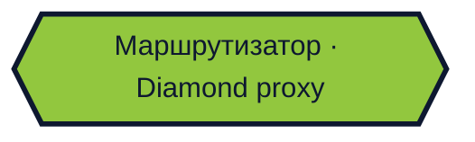

<div class="mt-4 text-sm opacity-70">
Единственная программа, которую знают клиенты. Все межпрограммные вызовы CPI проходят через неё.
</div>

<!--
- Маршрутизатор — это не смарт-контракт уровня фасада, это полноценный предварительный валидатор.
- Держит отображение: `target_pubkey → facet_address`.
- На каждый вызов проверяет: действителен ли KYC? зарегистрирован ли модуль? есть ли инструкция в белом списке?
- Обновить любую из 11 программ — одна транзакция в маршрутизаторе.
- Переход: добавим ядро — identity, assets, validation.
-->

---

# 11 программ — шаг 2 · + ядро

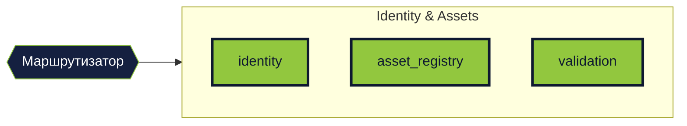

<div class="mt-4 text-sm opacity-70">
<strong>identity</strong> — роли, репутация, KYC · <strong>asset_registry</strong> — жизненный цикл актива · <strong>validation</strong> — верификации Ed25519
</div>

<!--
- Это минимальный скелет: пользователи, активы, и подтверждения того, что актив настоящий.
- identity: 6 ролей, репутация на каждую роль, `PublicKeyRecord` для подписей вне блокчейна.
- asset_registry: 12 статусов актива, `set_asset_status` авторизуется только уполномоченной программой.
- validation: верификаторы подписывают Ed25519 вне блокчейна, проверка через Instructions sysvar.
- Переход: активы есть, теперь добавим сделки.
-->

---

# 11 программ — шаг 3 · + сделки

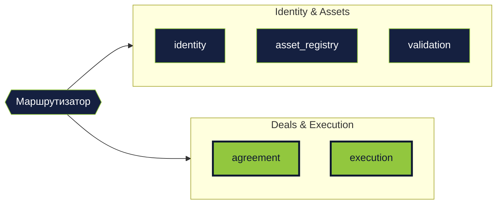

<div class="mt-4 text-sm opacity-70">
<strong>agreement</strong> — структура сделки, стороны, условия · <strong>execution</strong> — атомарный расчёт с условным депонированием
</div>

<!--
- agreement и execution — это для прямых сделок между кошельками (вне фракционной модели).
- agreement фиксирует условия: цена, стороны, срок, условия.
- execution делает атомарный обмен: актив ↔ SOL через условное депонирование.
- Это запасной вариант для нефракционной торговли или выкупа отдельных активов.
- Переход: теперь оценка и токенизация.
-->

---

# 11 программ — шаг 4 · + токенизация

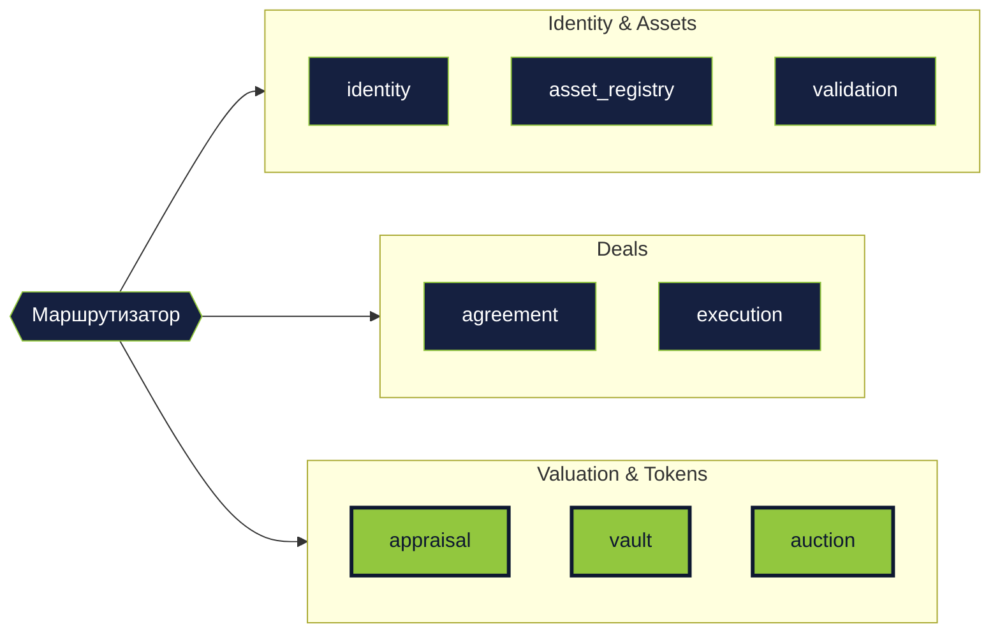

<div class="mt-4 text-sm opacity-70">
<strong>appraisal</strong> — оценки «конверт и вскрытие» · <strong>vault</strong> — фракции Token-2022 · <strong>auction</strong> — сбор средств и выкупы
</div>

<!--
- Это сердце фракционной модели. Три программы, которые делают из квартиры 10 тысяч токенов.
- appraisal: запечатать → открыть → медиана → штраф крайних значений. Разберём через 3 слайда подробно.
- vault: создаёт эмитента Token-2022, держит запас токенов, распределяет после сбора средств.
- auction: кампании сбора средств (вход) и аукционы выкупа (выход с голосованием держателей).
- Переход: последняя группа — управление и торговля.
-->

---

# 11 программ — одним взглядом

<div class="mt-4 text-xs">

| Группа | Программы | Что делает |
|---|---|---|
| **Identity & Assets** | identity, asset_registry, validation | Кто ты, чем владеешь, кто проверил |
| **Deals** | agreement, execution | P2P-сделки между кошельками |
| **Tokens** | appraisal, vault, auction | Оценка, фракции, сбор средств, выкуп |
| **Governance** | compliance, market | Нотариусы, юристы, вторичный рынок |

</div>

<div class="mt-6 text-sm opacity-70">
11 программ + маршрутизатор = 12 развёртываний на Solana. Каждая программа отвечает за одну задачу.
</div>

<!--
- Компактное резюме всех 11 программ по группам.
- Identity & Assets — ядро: пользователи и их активы.
- Deals — прямые сделки между кошельками, без дробления.
- Tokens — фракционная модель: оценка, хранилище, аукционы сбора и выкупа.
- Governance — самая сложная группа: нотариусы, юридические задачи, комиссии, вторичный рынок.
- Принцип единой ответственности: одна программа — одна задача.
- Переход: посмотрим на маршрутизатор детально.
-->


---

# Маршрутизатор — паттерн «маршрутизатор + модули»

```rust {all|1|3-5|7-10}
// Router pre-validates every call
pub fn pre_validate(ctx: Context<PreValidate>) -> Result<()> {
    require!(
        is_kyc_valid(&ctx.accounts.user_kyc),
        Error::KycExpired
    );
    let facet = ctx.accounts.router.facets
        .get(ctx.accounts.target)
        .ok_or(Error::UnknownFacet)?;
    Ok(())
}
```

<div class="mt-4 text-sm opacity-70">
Все вызовы идут через маршрутизатор → фильтр KYC → нужная программа (модуль). Обновить программу — поменять адрес в маршрутизаторе без миграции данных.
</div>

<!--
- Представьте многоэтажный торговый центр. Чтобы войти — один главный вход с охраной.
- Главный вход — маршрутизатор. Охрана проверяет: показал документы? KYC пройден? Тогда заходи.
- Внутри — разные магазины: продукты (identity), одежда (assets), банк (vault), юристы (compliance).
- Каждый магазин — отдельная программа. Они не знают друг о друге, знают только охрану.
- Если магазин закрылся и открылся новый — достаточно переписать адрес в списке охраны. Внутри ничего не трогаем.
- Преимущества: обновлять программы без миграций, одна точка проверок KYC, всё упорядочено.
- Переход: пошли знакомиться с магазинами по одному. Первый — identity (кто ты такой).
-->

---

# identity — корень системы

<div class="mt-2 text-xs grid grid-cols-2 gap-4">
<div>

**PDA аккаунты:**
- `User [wallet]` — профиль
- `UserReputation [wallet, role]` — репутация
- `KycAttestation [wallet, provider]` — KYC
- `PublicKeyRecord [owner, key]` — ключи

</div>
<div>

**6 ролей:**

```rust
enum UserRole {
  Regular, Verifier,
  Appraiser, Lawyer,
  Notary, Admin,
}
```

</div>
</div>

<!--
- User — базовый PDA, один на кошелёк. Все остальные identity-аккаунты ссылаются на него.
- `UserReputation` для каждой роли — хороший нотариус может быть плохим оценщиком.
- `KycAttestation` для каждого провайдера: можно иметь несколько (Sumsub + Civic), срок действия проверяется.
- `PublicKeyRecord` — для подписей Ed25519 вне блокчейна, чтобы не тратить SOL на каждую подпись.
- 6 ролей, кошелёк может иметь любое подмножество. Admin — для конфигурации платформы.
- Переход: теперь сам актив.
-->

---

# asset_registry — жизнь актива

<div class="mt-4 text-sm">

**Asset PDA** содержит:
- `asset_id`, `description`, `current_owner`, `original_owner`
- `status` — enum из 12 состояний
- `verification_count` / `verification_threshold`
- `minimum_price` — медианная оценка (lamports)
- `vault`, `fraction_mint`, `total_supply`
- `lawyer`, `legal_deadline`, `spv_document_hash`

**AssetAttribute [asset_id, key_hash]** — произвольные пары key/value для атрибутов (город, площадь, год и т.д.)

</div>

<!--
- Asset PDA — единственный писатель для `asset.status`, через `set_asset_status()`.
- 12 статусов, каждый переход авторизуется ровно одной уполномоченной программой.
- `minimum_price` — результат оценки, используется как нижняя граница кампании сбора средств.
- `legal_deadline` записывается когда юрист берёт задачу в работу, пропуск — штрафное удержание залога.
- `AssetAttribute` — произвольные ключ/значение (площадь, этаж, год), хеш от ключа для индексации.
- Переход: как верификаторы подписывают факты об активе.
-->

---

# validation — Ed25519 подписи

<div class="mt-2 text-xs">

Верификатор подписывает вне блокчейна, программа проверяет подпись через sysvar:

```rust
pub fn verify_asset(ctx: Context<VerifyAsset>,
    asset_id: [u8;32],
    pubkey: [u8;32],      // ключ верификатора
    signature: [u8;64],   // Ed25519
    verifier_name_hash: [u8;32],
) -> Result<()> {
    // 1. msg.sender has role=Verifier
    // 2. pubkey зарегистрирован в PublicKeyRecord
    // 3. Ed25519 через Instructions sysvar
    // 4. counter++, если >= threshold → status=NotaryPreCheck
}
```

</div>

<!--
- Instructions sysvar — механизм Solana для инспекции других инструкций в той же транзакции.
- Верификация программы Ed25519 добавляется как отдельная инструкция, мы её читаем.
- Верификатор платит SOL только раз — за регистрацию `PublicKeyRecord`.
- Потом может подписывать неограниченно вне блокчейна, не тратя комиссий.
- `verifier_name_hash` привязывает подпись к конкретному человеку для аудита.
- Переход: программа `appraisal` — механика «конверт и вскрытие».
-->

---

# appraisal — слепое двухфазное голосование

<div class="mt-4 text-sm">

**Проблема:** если оценщики видят чужие цены — они координируются.

**Решение:** схема «конверт и вскрытие» с залогом.

**Три фазы:**
1. **Запечатывание:** `keccak256(price || min_holders || salt)` + залог в SOL
2. **Вскрытие:** оценщик показывает `price + salt`, программа проверяет хеш
3. **Завершение:** медиана всех цен → `minimum_price` актива

**Защита:**
- Кто не раскрыл — теряет залог
- Крайние значения (далеко от медианы) — штрафуются

**Максимум оценщиков:** 11 на раунд.

</div>

<!--
- Три фазы — запечатывание (7 дней), вскрытие (7 дней), завершение (атомарно).
- `keccak256` выбран для совместимости с инструментами EVM (кошельки типа MetaMask видят хеш).
- `min_holders` — параметр оценщика: минимальное число держателей для сбора средств.
- Медиана защищает от экстремальных значений (в отличие от среднего).
- Штраф за крайние значения: параметр платформы, обычно 20% отклонение от медианы — штраф.
- Переход: цена есть, пора токенизировать.
-->

---

# vault — Token-2022 фракции

<div class="mt-4 text-sm">

После оценки актив может быть зафракционирован:

```rust
pub fn initialize_vault(ctx: Context<InitVault>,
    asset_id: [u8;32],
    total_supply: u64,  // параметр, например 10 000
) -> Result<()> {
    // 1. asset.status == Evaluated
    // 2. Create Token-2022 Mint[asset_id]
    // 3. Mint total_supply в vault_token_account
    // 4. token_price = minimum_price / total_supply
    // 5. asset.status → Funding
}
```

**Расширения Token-2022** позволяют: перехватчики при передаче (проверка соблюдения требований), метаданные в блокчейне, конфиденциальные суммы.

</div>

<!--
- `initialize_vault` требует `asset.status == Evaluated` — нельзя токенизировать без цены.
- Эмитент Token-2022 с `mint_authority = vault`. Хранилище — единственный, кто может выпускать и сжигать.
- `total_supply` — параметр при создании хранилища. Формула цены: `token_price = minimum_price / total_supply` (см. vault/src/domain/validation.rs:11-15).
- `token_price = minimum_price / total_supply` — справочная цена для сбора средств.
- После успешного сбора хранилище распределяет фракции инвесторам пропорционально депозитам.
- Переход: разберём подробно, как NFT становится делимым активом.
-->

---

# NFT vs фракционные токены

<div class="mt-4 text-sm grid grid-cols-2 gap-6">
<div class="role-card">

**Классический NFT (SPL NFT / Metaplex)**
- `supply = 1`, `decimals = 0`
- Уникальный, не делится
- Метаданные: JSON вне блокчейна или Arweave
- Используется для искусства, идентификации

Пример: сертификат владения квартирой.

</div>
<div class="role-card">

**Фракция (Token-2022, взаимозаменяемый)**
- `supply = N` (параметр), `decimals = 0`
- Взаимозаменяемы
- Метаданные в блокчейне через расширение Metadata
- Используется для долевого владения

Пример: 1 фракция = 0.01% квартиры.

</div>
</div>

<div class="mt-6 text-sm opacity-70">
В Slice мы используем оба: сначала регистрация через NFT (`asset_registry`), потом фракционирование через эмитента Token-2022.
</div>

<!--
- NFT — уникальный токен. Аналогия: свидетельство о рождении. Только одно, подделать нельзя.
- Используется для коллекционных картинок, сертификатов, идентификации объектов.
- Фракция — наоборот, как денежная купюра. Все одинаковые, взаимозаменяемые.
- Представьте 100-рублёвые купюры: неважно какая у вас в кошельке, они эквивалентны.
- Для нашей задачи нужны ОБЕ вещи: NFT чтобы сказать "эта квартира", фракции чтобы её "разрезать" на доли.
- Аналогия: NFT — это сертификат собственности на большой торт. Фракции — это нарезанные кусочки для продажи.
- Переход: покажем как эти кусочки торта существуют и передаются.
-->

---

# Фракционное владение — внутри блокчейна

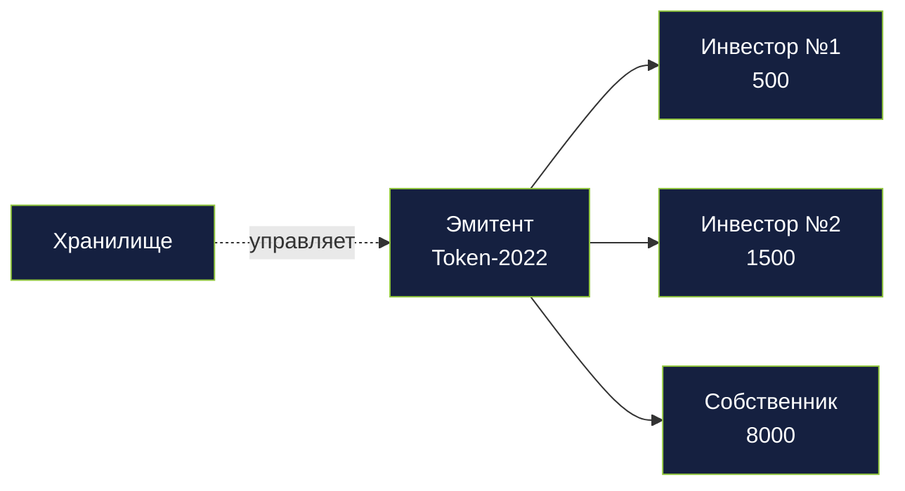

<div class="mt-4 text-xs opacity-70">
Эмитент — «станок», который печатает фракции для одной квартиры. Хранилище держит запас до окончания сбора средств, потом распределяет по токен-аккаунтам.
</div>

<!--
- Слева направо: эмитент → хранилище → токен-аккаунты инвесторов.
- Эмитент выпускает N фракций — N задаётся при создании хранилища.
- Хранилище — сейф. Держит весь запас до завершения сбора средств.
- После успешного сбора — распределение по токен-аккаунтам пропорционально депозитам.
- Токен-аккаунт — как банковский счёт, но для фракций. У каждого инвестора свой.
- Переход: а где здесь реальная квартира?
-->

---

# Связь блокчейна с реальным миром

```mermaid {scale: 0.55}
flowchart LR
  Asset[Asset PDA<br/>блокчейн]
  SPV[SPV · ТОО]
  Flat[🏠 Квартира]
  Asset -.хеш.-> SPV
  SPV --- Flat
  classDef new fill:#92c73e,stroke:#0e1830,color:#0e1830
  classDef dim fill:#152040,stroke:#92c73e,color:#ffffff
  class Asset dim
  class SPV,Flat new
```

<div class="mt-4 text-xs opacity-70">
SPV (ТОО) юридически владеет квартирой. Asset PDA в блокчейне хранит хеш документов SPV. Если документы изменятся — хеш не сойдётся, это будет видно всем.
</div>

<!--
- Это самый важный слайд для понимания: токен связан с реальным миром через SPV.
- Asset PDA — запись в блокчейне о том, что «где-то есть квартира с такими-то документами».
- SPV (в КЗ — ТОО) юридически владеет квартирой по бумагам.
- Связка: хеш документов SPV записан в Asset. Если документы подменят — хеш не совпадёт.
- Владеешь фракциями → владеешь долей в SPV → имеешь право на долю в реальной квартире.
- Переход: как защищены передачи фракций — кто проверяет каждую сделку.
-->

---

# Перехватчики при передаче — соблюдение требований на уровне токена

```rust {all|1-3|5-8|10-13}
// Каждый трансфер фракций проходит через hook
pub fn transfer_hook(ctx: Context<TransferHook>,
    amount: u64) -> Result<()> {

    // 1. KYC check обоих сторон
    require!(is_kyc_valid(&ctx.accounts.from_kyc), KycExpired);
    require!(is_kyc_valid(&ctx.accounts.to_kyc), KycExpired);

    // 2. Asset не заморожен (arrest/dispute)
    require!(!ctx.accounts.asset.frozen, AssetFrozen);

    // 3. Лимит по holder (anti-whale)
    require!(new_balance <= max_per_holder_bps * total_supply / 10000,
             HolderLimitExceeded);
    Ok(())
}
```

<div class="mt-4 text-sm opacity-70">
Любой перевод (первичный, вторичный, выкуп) проходит через эту проверку. Без KYC — транзакция отклоняется. Актив заморожен — отклоняется. Кит пытается скупить &gt;34% — отклоняется.
</div>

<!--
- Перехватчик при передаче — это охранник на проходной. Перед каждой передачей фракций он проверяет людей.
- Аналогия: в VIP-клуб не пускают без фейс-контроля. Вот этот фейс-контроль — и есть перехватчик.
- Что проверяет: (1) прошёл ли отправитель KYC, (2) прошёл ли получатель, (3) не заморожен ли актив, (4) не скупает ли один человек больше разрешённого.
- Если хоть одна проверка не прошла — транзакция отклоняется, никакой передачи не происходит.
- Главное преимущество: охранник встроен в саму фракцию, его нельзя обойти никаким кошельком.
- Переход: программа аукциона — сбор средств и выкуп.
-->


---

# auction — сбор средств и выкупы

<div class="mt-4 grid grid-cols-2 gap-6 text-sm">
<div>

**Кампания сбора средств**
- `invest()` — инвестор → campaign PDA
- `Deposit[asset_id, investor]` отслеживает
- После `end_time` → `close_funding()`
- Успех: распределить фракции, `asset.status = InLegalPool`
- Провал: возврат средств всем

</div>
<div>

**Аукцион выкупа**
- Покупатель блокирует `offer_per_token × total_supply`
- Держатели фракций голосуют (вес = `token_balance`)
- `quorum_bps` (напр. 6666 = 66.66%)
- Если одобрено — распределить средства, закрыть хранилище

</div>
</div>

<!--
- Сбор средств — первичный рынок. Выкуп — механизм выхода. Между ними — вторичный рынок.
- `Deposit` PDA = `[asset_id, investor]`, накопительно: один инвестор может инвестировать несколько раз.
- `close_funding` может вызвать кто угодно после `end_time` — финализация открыта для всех.
- Успех — `InLegalPool`, провал — все получают возврат средств, статус возвращается в `Evaluated`.
- Выкуп: `quorum_bps`, например 6666 — 66.66% с весом по балансу токенов.
- Переход: последняя программа — `compliance`, самая сложная.
-->

---

# compliance — нотариусы, юристы, комиссии

<div class="mt-4 text-sm">

**Раунды нотариусов (PreCheck + PostCheck):**
- Pre: проверка документов до оценки
- Post: проверка SPV перед фракционированием
- `vote_weight = max(1000, 10000 + rating_score × 10)`

**Юридические задачи:**
- Юрист берёт задачу в работу → 30 дней
- Загрузка хеша SPV → `LegallyBound`
- Пропустил дедлайн → штрафное удержание залога и передача следующему

**FeeConfig** (одиночка):
- `min_appraiser_fee`, `min_lawyer_fee`
- `appraiser_pct_bps`, `lawyer_pct_bps`, `platform_pct_bps`
- `platform_treasury` — куда идут 2%

</div>

<!--
- `compliance` держит 3 большие подсистемы: раунды нотариусов, юридические задачи, конфигурация комиссий.
- Формула `vote_weight`: `max(1000, 10000 + rating_score × 10)` — даже плохой нотариус имеет нижний предел.
- Очередь юридических задач открыта для всех: любой юрист может взять свободную задачу.
- `FeeConfig` — одиночка, меняется только администратором, влияет на все будущие сделки.
- `platform_treasury` получает 2% и все удержанные залоги.
- Переход: жизненный цикл актива, все 12 состояний.
-->

---
layout: cover
class: section-sub
---

# H · Жизненный цикл

12 состояний. 180 дней. Один поток.

---

# Автомат состояний — фаза 1 · Верификация

```mermaid {scale: 0.55}
stateDiagram-v2
  [*] --> PendingVerification
  PendingVerification --> NotaryPreCheck: порог достигнут
  NotaryPreCheck --> Verified: нотариусы одобрили
  Verified --> [*]: ... (далее)
```

<div class="mt-4 text-sm opacity-70">
Актив зарегистрирован → N верификаторов подписали → нотариусы одобрили → <code>Verified</code>.
</div>

<!--
- Самая длинная фаза: 3-5 дней в среднем, зависит от скорости верификаторов.
- Узкое место — человеческое: верификатор должен физически или через агента подтвердить документы.
- Порог задаётся владельцем при регистрации (обычно 3 из 5).
- `NotaryPreCheck` — первый взвешенный кворум. Проваливается — `asset.status = Rejected`.
- Переход: документы приняты, актив существует. Теперь ему нужна цена.
-->

---

# Автомат состояний — фаза 2 · Оценка

```mermaid {scale: 0.55}
stateDiagram-v2
  Verified --> PendingEvaluation
  PendingEvaluation --> Evaluated: оценка завершена
  Evaluated --> [*]: ... (далее)
```

<div class="mt-4 text-sm opacity-70">
Запечатывание → вскрытие → медиана → <code>minimum_price</code> записан в <code>asset_registry</code>.
</div>

<!--
- Длительность: 2 недели (7 дней запечатывания + 7 дней вскрытия).
- Финализирует любой участник: программа сама считает медиану и штрафует крайние значения.
- `minimum_price` — это не продажная цена, а нижняя граница для сбора средств.
- Если оценщиков меньше 3 к дедлайну запечатывания — раунд перезапускается.
- Переход: цена есть, можно токенизировать.
-->

---

# Автомат состояний — фаза 3 · Сбор средств

```mermaid {scale: 0.55}
stateDiagram-v2
  Evaluated --> Funding: хранилище создано
  Funding --> InLegalPool: собрано
  Funding --> [*]: сбор провалился (возврат)
```

<div class="mt-4 text-sm opacity-70">
Хранилище создано → инвесторы заходят → при достижении цели → <code>InLegalPool</code>. При провале — возврат средств.
</div>

<!--
- Сбор средств длится обычно 30 дней, владелец задаёт `end_time`.
- Если не набрали — автоматический возврат средств всем инвесторам, актив возвращается в `Evaluated`.
- Успех — `InLegalPool`, актив ждёт юриста.
- Момент перехода критичен: после успешного сбора собственник уже получил деньги, отступать некуда.
- Переход: дальше — юридическое оформление.
-->

---

# Автомат состояний — фаза 4 · Юридическое оформление

```mermaid {scale: 0.55}
stateDiagram-v2
  InLegalPool --> LegalProcessing: юрист взял в работу
  LegalProcessing --> LegallyBound: документы SPV загружены
  LegallyBound --> NotaryPostCheck
  NotaryPostCheck --> Fractionalized: нотариусы одобрили
  LegalProcessing --> InLegalPool: дедлайн пропущен (вернули в очередь)
```

<div class="mt-4 text-sm opacity-70">
Юрист берёт задачу → 30 дней на SPV → загрузка хеша → проверка SPV нотариусами → <code>Fractionalized</code>.
</div>

<!--
- Юрист берёт задачу в работу из `InLegalPool`, общий пул для всех свободных юристов.
- Пропустил дедлайн — залог удерживается, задача возвращается в общий пул.
- `NotaryPostCheck` — второй взвешенный кворум, проверяет SPV-документы.
- Если проверка провалилась — возврат в `LegalProcessing` с комментариями нотариусов.
- Переход: актив фракционирован, токены у инвесторов. Теперь — жизнь на рынке.
-->

---

# Автомат состояний — фаза 5 · Рынок и выход

```mermaid {scale: 0.55}
stateDiagram-v2
  Fractionalized --> Dissolved: выкуп принят
  Dissolved --> [*]
```

<div class="mt-4 text-sm opacity-70">
Вторичная торговля фракциями → покупатель делает предложение выкупа → голосование держателей → при достижении кворума → <code>Dissolved</code>.
</div>

<!--
- `Fractionalized` — «активная» жизнь актива, может длиться годами.
- Аукцион выкупа: предложение × запас блокируется, держатели голосуют (вес — баланс).
- `quorum_bps` например 6666 — 66.66% «за» → выкуп проходит.
- `Dissolved` — хранилище закрыто, SPV перерегистрирован на покупателя, фракции сожжены.
- Переход: финальная картина всех переходов вместе.
-->

---

# Автомат состояний — полная схема

```mermaid {scale: 0.55}
stateDiagram-v2
  [*] --> PendingVerification
  PendingVerification --> NotaryPreCheck: порог достигнут
  NotaryPreCheck --> Verified: нотариусы одобрили
  Verified --> PendingEvaluation
  PendingEvaluation --> Evaluated: оценка завершена
  Evaluated --> Funding: хранилище создано
  Funding --> InLegalPool: собрано
  InLegalPool --> LegalProcessing: юрист взял в работу
  LegalProcessing --> LegallyBound: документы SPV загружены
  LegallyBound --> NotaryPostCheck
  NotaryPostCheck --> Fractionalized: нотариусы одобрили
  Fractionalized --> Dissolved: выкуп принят
  Dissolved --> [*]
```

<div class="text-xs opacity-60 mt-2">
12 состояний. Любое (до сбора средств) может перейти в `Cancelled`. В среднем — 180 дней от регистрации до первой торговли.
</div>

<!--
- Теперь все фазы склеены. Именно эту диаграмму технари будут смотреть при долгом изучении.
- Отмена возможна только до сбора средств — после успешного сбора контракт обязывающий.
- Каждый переход авторизуется ровно одной программой — единственный писатель для `asset.status`.
- Переход: временная шкала в днях — сколько это занимает в реальности.
-->

---

# Типичная временная шкала — 180 дней

```mermaid {scale: 0.55}
gantt
  title Жизненный цикл актива
  dateFormat YYYY-MM-DD
  section Верификация
  Регистрация+верификация :done, 2025-01-01, 5d
  Notary PreCheck         :done, 2025-01-06, 3d
  section Оценка
  Фаза запечатывания      :active, 2025-01-09, 7d
  Фаза вскрытия           :2025-01-16, 7d
  section Токенизация
  Хранилище+эмитент       :2025-01-24, 1d
  Кампания сбора средств  :2025-01-25, 30d
  section Юридическое оформление
  Работа юриста+SPV       :2025-02-24, 30d
  Notary PostCheck        :2025-03-26, 5d
  section Рынок
  Вторичная торговля      :2025-03-31, 90d
```

<!--
- Диаграмма — оценочная временная шкала реального актива от регистрации до вторичного рынка.
- ~85 дней на все предрыночные этапы: верификация, оценка, сбор средств, юридическое оформление.
- После `Fractionalized` — активная жизнь 90+ дней на вторичном рынке.
- Узкие места: оценка (в темпе человека) и юридическое оформление (дедлайн 30 дней).
- Переход: глубже в ключевые решения.
-->

---
layout: cover
class: section-sub
---

# I · Ключевые решения

Глубоко в 4 механизма

---

# Слепое двухфазное голосование — фаза 1 · Запечатывание

```mermaid {scale: 0.6}
sequenceDiagram
  participant A as Оценщик
  participant P as Программа
  A->>A: Сгенерировать цену и соль
  A->>P: commit(keccak256(price‖salt)) + залог
  P->>P: Сохранить хеш обязательства
  Note over A,P: Цена скрыта за хешем
```

<div class="text-sm opacity-70 mt-2">
7 дней: каждый оценщик отправляет хеш и блокирует залог. Никто не видит чужие цифры.
</div>

<!--
- Каждый оценщик пишет свою цену на листочке, добавляет случайное число (соль), складывает в конверт.
- Запечатывает конверт и отправляет контракту его ОТПЕЧАТОК (хеш) — не саму цену.
- Плюс кладёт депозит в SOL — "честное слово" с деньгами.
- Зачем соль: без неё мошенник мог бы перебрать цены (1, 2, 3... $1M) и по хешу угадать. Соль делает это невозможным.
- 7 дней на то, чтобы все конверты собрали. Цен ещё никто не видит.
- Аналогия: запечатанное голосование в жюри. Все высказались — никто не знает чужого мнения.
- Переход: дедлайн прошёл. Время вскрывать конверты.
-->

---

# Слепое двухфазное голосование — фаза 2 · Вскрытие

```mermaid {scale: 0.6}
sequenceDiagram
  participant A as Оценщик
  participant P as Программа
  participant M as Другие оценщики
  Note over A,M: Дедлайн запечатывания прошёл
  A->>P: reveal(price, salt)
  P->>P: Проверить keccak256(price‖salt) == commitment
  M->>P: reveal(...)
  Note over A,M: Все цены открыты
```

<div class="text-sm opacity-70 mt-2">
7 дней: каждый открывает свою цифру, программа сверяет с запечатыванием. Не открыл — залог сгорает.
</div>

<!--
- Вскрытие конвертов. Каждый оценщик показывает цену + соль.
- Контракт проверяет: правда ли хеш от этой цены+соли совпадает с тем, что было отправлено раньше?
- Если не совпадает — значит, пытался изменить цену после вскрытия других. Штраф, весь депозит теряется.
- Если вообще не открыл конверт — тоже штраф. Система не любит трусов.
- Теперь цены видны всем. Но поздно координироваться — конверты уже были запечатаны.
- Психология: страх потерять $500 депозита сильнее желания соврать. Поэтому все говорят правду.
- Переход: у нас все цены. Осталось посчитать финальную.
-->

---

# Слепое двухфазное голосование — фаза 3 · Завершение

```mermaid {scale: 0.6}
sequenceDiagram
  participant P as Программа
  participant A as Оценщик
  P->>P: Вычислить медиану
  P->>P: Штрафовать крайние значения (> N% от медианы)
  P->>P: Записать minimum_price в Asset
  P-->>A: Вернуть залог + долю комиссии
```

<div class="text-sm opacity-70 mt-2">
Медиана → <code>minimum_price</code>. Крайние значения теряют часть залога. Честные оценщики получают залог + долю в комиссии.
</div>

<!--
- Берём все цены, выстраиваем по порядку, находим середину — это медиана.
- Аналогия: если 5 человек назвали 100, 140, 150, 160, 200 — медиана = 150.
- Почему не среднее: если кто-то назвал $1M по ошибке или со злым умыслом — среднее сломается, медиана нет.
- Оценки сильно далёкие от медианы (>20%) теряют часть депозита. Стимул быть ближе к правде.
- Честный оценщик получает: свой депозит обратно + долю комиссии пропорционально тому, сколько заложил.
- В итоге в контракте записана "минимальная цена актива" — дальше от неё строится аукцион.
- Переход: это экономическая защита. Теперь посмотрим, как устроено голосование нотариусов.
-->

---

# Модель данных PDA — шаг 1 · Identity

```mermaid {scale: 0.6}
erDiagram
  User ||--o{ KycAttestation : has
  User ||--o{ UserReputation : has
  User ||--o{ PublicKeyRecord : has
```

<div class="text-sm opacity-70 mt-2">
Корень: `User` PDA на каждый кошелёк. `KycAttestation` на каждого провайдера, `UserReputation` на каждую роль, `PublicKeyRecord` — ключи для подписей вне блокчейна.
</div>

<!--
- PDA — это "адрес квартиры": зная дом, подъезд, этаж — можно точно указать квартиру.
- У нас: зная кошелёк → получаем User. Зная кошелёк+провайдер → получаем KYC-запись. Зная кошелёк+роль → получаем репутацию.
- Один кошелёк может совмещать все 6 ролей: быть нотариусом, оценщиком, и инвестором одновременно.
- Плохой нотариус может быть хорошим инвестором — репутации считаются отдельно для каждой роли.
- Аналогия: в школе оценки по разным предметам не суммируются. Плохо по физике — не делает плохим по литературе.
- `PublicKeyRecord` — хранилище ключей для быстрых подписей вне блокчейна, экономит комиссии.
- Переход: вокруг User появляются активы — следующий кластер.
-->

---

# Модель данных PDA — шаг 2 · + жизненный цикл актива

```mermaid {scale: 0.65}
erDiagram
  User ||--o{ KycAttestation : has
  User ||--o{ UserReputation : has
  User ||--o{ Asset : owns
  Asset ||--o{ AssetVerification : receives
  Asset ||--|| AppraisalRound : "appraised-by"
  AppraisalRound ||--o{ AppraisalCommit : contains
  Asset ||--o{ NotaryRound : "validated-by"
  NotaryRound ||--o{ NotaryVote : contains
```

<div class="text-sm opacity-70 mt-2">
Asset — центральная сущность. Вокруг него вертятся верификации, оценочные раунды, нотариальные голосования.
</div>

<!--
- `Asset = [asset_id]`, `AssetVerification = [asset_id, verifier]`.
- Один актив может пройти несколько раундов оценки (если первый провалился).
- `NotaryRound` создаётся дважды на актив: `PreCheck` и `PostCheck`.
- `NotaryVote = [round, notary]` — один голос на нотариуса на раунд.
- Переход: верифицированный и оценённый актив токенизируется.
-->

---

# Модель данных PDA — шаг 3 · + токенизация

```mermaid {scale: 0.55}
erDiagram
  User ||--o{ Asset : owns
  Asset ||--o{ AssetVerification : receives
  Asset ||--|| AppraisalRound : "appraised-by"
  AppraisalRound ||--o{ AppraisalCommit : contains
  Asset ||--|| Vault : "locked-in"
  Vault ||--|| FractionMint : mints
  Vault ||--o{ Deposit : "funded-by"
  Asset ||--o{ NotaryRound : "validated-by"
  NotaryRound ||--o{ NotaryVote : contains
  Asset ||--o{ BuyoutAuction : "can-be-bought"
  BuyoutAuction ||--o{ BuyoutVote : contains
```

<div class="text-sm opacity-70 mt-2">
Полная модель: хранилище владеет `FractionMint` (Token-2022), `Deposit` связывает инвесторов с фракциями, `BuyoutAuction → BuyoutVote`.
</div>

<!--
- Всё детерминированно выводится из seeds. Клиент пересчитывает любой PDA локально.
- `Vault = [asset_id]`, `FractionMint = [asset_id, "mint"]`, `Deposit = [asset_id, investor]`.
- `BuyoutAuction` и `BuyoutVote` создаются только при активном предложении на выкуп.
- Нет глобальных списков: клиент спрашивает конкретный PDA, а не «дай все депозиты».
- Переход: теперь смотрим, как нотариусы голосуют с весами.
-->

---

# Голосование нотариусов с весом репутации

```mermaid {scale: 0.65}
flowchart LR
  N[Нотариус голосует] --> C{rating_score}
  C -->|положительный| W1["weight = 10000 + score×10"]
  C -->|отрицательный| W2["weight = max 1000"]
  W1 --> S[Сумма взвешенных голосов]
  W2 --> S
  S --> Q{одобрение &gt; quorum_bps?}
  Q -->|да| F[Asset.status = следующий]
  Q -->|нет| R[Отклонить]
  classDef ok fill:#92c73e,stroke:#0e1830,color:#0e1830
  classDef bad fill:#fca5a5,stroke:#991b1b
  class F ok
  class R bad
```

<div class="text-sm opacity-70 mt-2">
Хороший нотариус: rating=+500 → вес 15 000. Плохой: rating=-200 → вес 1000 (минимум). Репутация реально влияет.
</div>

<!--
- Взвешенное голосование — защита от атак Сивиллы: заводить новых нотариусов невыгодно, у них минимальный вес.
- Нижний предел 1000 гарантирует, что даже плохой нотариус имеет голос (не в чёрном списке окончательно).
- Положительный рейтинг растёт линейно: +50 к рейтингу — +500 к весу.
- Переход: голосования устроены по-разному на разных этапах — покажем каждое.
-->

---
layout: cover
class: section-sub
---

# I' · Механика голосований

7 точек голосования, от нотариусов до держателей

<!--
- В Slice 7 разных моментов, где нужно голосование.
- Каждое — со своей механикой: пороговое, взвешенное, «конверт и вскрытие», кворум по балансу.
- Покажу их как отдельные диаграммы, потому что механики разные.
- Переход: первое — голосование нотариусов на `PreCheck`.
-->

---

# 1 · Notary PreCheck — пороговое голосование

```mermaid {scale: 0.5}
flowchart TB
  Submit[Собственник подаёт документы] --> Round[Создан NotaryRound]
  Round --> Vote1[Голос нотариуса #1]
  Round --> Vote2[Голос нотариуса #2]
  Round --> Vote3[Голос нотариуса #3]
  Round --> VoteN[...нотариус #N]
  Vote1 --> Sum[сумма взвешенных одобрений / общий вес]
  Vote2 --> Sum
  Vote3 --> Sum
  VoteN --> Sum
  Sum --> Check{≥ quorum_bps?}
  Check -->|да| Verified[asset.status = Verified]
  Check -->|нет, таймаут| Rejected[asset.status = Rejected]
  Check -->|идёт голосование| Round
  classDef ok fill:#92c73e,stroke:#0e1830,color:#0e1830
  classDef bad fill:#fca5a5,stroke:#991b1b
  class Verified ok
  class Rejected bad
```

<div class="mt-2 text-xs opacity-70">
Все участники общего пула могут голосовать. Кворум считается не по числу голосов, а по <strong>сумме весов</strong>. Дедлайн: обычно 72 часа.
</div>

<!--
- Это стандартное взвешенное пороговое голосование.
- Не ждём всех — как только суммарный вес одобрений перешёл `quorum_bps` (обычно 6666 — 66.66%), раунд финализируется.
- Если вес отклонений перевесил — отклонение.
- Если таймаут и ни одна сторона не набрала — актив возвращается в `PendingVerification`.
- Переход: такое же голосование на `PostCheck`, но проверяется уже SPV, а не документы собственника.
-->

---

# 2 · Notary PostCheck — то же, но про SPV

```mermaid {scale: 0.65}
flowchart LR
  Lawyer[Юрист загружает хеш SPV] --> Post[NotaryRound #2]
  Post --> Votes[Взвешенные голоса<br/>по SPV-документам]
  Votes --> Check{≥ quorum_bps?}
  Check -->|да| Frac[asset.status = Fractionalized]
  Check -->|нет| Requeue[status = InLegalPool,<br/>штраф юриста]
  classDef ok fill:#92c73e,stroke:#0e1830,color:#0e1830
  classDef bad fill:#fca5a5,stroke:#991b1b
  class Frac ok
  class Requeue bad
```

<div class="mt-2 text-xs opacity-70">
Нотариусы проверяют: ТОО зарегистрировано, устав соответствует, квартира оформлена на ТОО, хеш совпадает. Если нет — штраф юристу, задача возвращается в общий пул.
</div>

<!--
- Разница с `PreCheck`: проверяется не исходный пакет документов, а конечный артефакт юриста.
- Это двойная защита: сначала документы собственника, потом юридическая обёртка.
- Если нотариусы нашли ошибку — юрист теряет залог, актив идёт другому юристу.
- Переход: оценщики — другая механика, «конверт и вскрытие».
-->

---

# 3 · Оценка — медиана через «конверт и вскрытие»

```mermaid {scale: 0.6}
flowchart LR
  C[Запечатывание<br/>7 дней] --> R[Вскрытие<br/>7 дней]
  R --> M[Медиана цен]
  M --> OK{Цена близка<br/>к медиане?}
  OK -->|да| W[Вернуть залог<br/>+ комиссия]
  OK -->|нет| S[Штраф 20%<br/>залога]
  classDef ok fill:#92c73e,stroke:#0e1830,color:#0e1830
  classDef bad fill:#fca5a5,stroke:#991b1b
  class W ok
  class S bad
```

<div class="mt-4 text-sm opacity-70">
Оценщики равны (вес = 1). Но штрафное удержание делает ложные оценки дорогими. Медиана защищает от крайних значений.
</div>

<!--
- Здесь НЕ взвешенно — все оценщики равны. Ценность защиты — в штрафном удержании плюс «конверт и вскрытие».
- Медиана, а не среднее: устойчиво к одному крайнему значению в обе стороны.
- Штраф 20% — параметр платформы, можно менять через администратора.
- Награда — возвращённый залог + `(appraiser_fee_pool × my_stake / total_good_stake)`.
- Переход: работа юристов — но это не голосование, а гонка за задачей.
-->

---

# 4 · Юридическая задача — кто первый, тот и забрал

```mermaid {scale: 0.55}
flowchart TB
  Pool[Очередь InLegalPool] --> L1[Юрист #1 берёт]
  Pool --> L2[Юрист #2 берёт]
  Pool --> L3[Юрист #3 берёт]
  L1 --> Work{30 дней работы}
  L2 --> Skipped1[опоздал]
  L3 --> Skipped2[опоздал]
  Work -->|в срок| Upload[загрузка хеша SPV]
  Work -->|пропуск дедлайна| Slash[штраф + возврат в очередь]
  Upload --> Post[→ NotaryPostCheck]
  classDef ok fill:#92c73e,stroke:#0e1830,color:#0e1830
  classDef bad fill:#fca5a5,stroke:#991b1b
  classDef dim fill:#1c2a4a,stroke:#5a6378,color:#8b95ab
  class Upload,Post ok
  class Slash bad
  class Skipped1,Skipped2 dim
```

<div class="mt-2 text-xs opacity-70">
Первый забравший получает задачу. Нет голосования — есть соревнование за скорость и репутацию.
</div>

<!--
- Это не голосование, а безопасный к гонкам захват задачи.
- Атомарный захват через PDA: либо ты первый, либо нет. Никто не может отобрать после захвата.
- 30 дней — фиксированный параметр, начинается с момента захвата.
- Штраф если пропустил: задача возвращается в общий пул, другой юрист может забрать.
- Репутация юриста растёт за сдачу в срок, падает за штрафы.
- Переход: валидация работы юриста — это возвращает нас к `PostCheck` нотариусов (#2).
-->

---

# 5 · Сбор средств — пассивное голосование «кошельком»

```mermaid {scale: 0.6}
flowchart LR
  Open[Сбор средств открыт<br/>2000 долей, цель $30k] --> I1[Инвестор #1<br/>вкладывает $500]
  Open --> I2[Инвестор #2<br/>вкладывает $1000]
  Open --> IN[...]
  I1 --> Sum[сумма депозитов]
  I2 --> Sum
  IN --> Sum
  Sum --> Check{≥ цели к end_time?}
  Check -->|да| Funded[распределить доли<br/>собственник получает $30k]
  Check -->|нет| Refund[возврат всем инвесторам]
  classDef ok fill:#92c73e,stroke:#0e1830,color:#0e1830
  classDef bad fill:#fca5a5,stroke:#991b1b
  class Funded ok
  class Refund bad
```

<div class="mt-2 text-xs opacity-70">
Нет формального голосования. Деньги — это голос: активное инвестирование — «да этому проекту». Недобор — рынок сказал «нет».
</div>

<!--
- Рыночные сигналы, а не явное голосование.
- `close_funding` может вызвать любой кошелёк после `end_time` — финализация открыта для всех.
- Распределение фракций пропорционально депозитам.
- Если недобор: возврат всем инвесторам, актив → `Evaluated` (может попробовать снова).
- Переход: покупка на вторичном рынке — это не голосование, но важный поток.
-->

---

# 6 · Вторичный рынок — сведение вне блокчейна, расчёт в блокчейне

```mermaid {scale: 0.55}
flowchart LR
  Seller[Продавец: продать 50 долей @ $20] -->|POST /market/orders| OB[Стакан ордеров вне блокчейна]
  Buyer[Покупатель: купить 50 долей ≤ $22] -->|POST /market/orders| OB
  OB -->|сведение| Deal[Сведённая сделка]
  Deal --> Batch[Пакет расчётов]
  Batch -->|Token-2022 transfer + SOL transfer| Chain[Атомарный обмен в блокчейне]
  Chain --> Done[Готово: фракции переведены]
  classDef ok fill:#92c73e,stroke:#0e1830,color:#0e1830
  class Done,Chain ok
```

<div class="mt-2 text-xs opacity-70">
Гибрид: сведение с низкой задержкой вне блокчейна, атомарный расчёт в блокчейне. 0.3% комиссия платформе.
</div>

<!--
- Это не голосование — это обычная биржа, но с расчётом в блокчейне.
- Бэкенд держит стакан ордеров, сводит ордера, формирует пакет.
- Каждая сделка — отдельная атомарная транзакция: перевод Token-2022 от продавца + перевод SOL от покупателя.
- Перехватчик при передаче проверяет KYC обеих сторон.
- 0.3% комиссия идёт в казну платформы.
- Переход: выкуп — финальное голосование.
-->

---

# 7 · Выкуп — голосование держателей по балансу

```mermaid {scale: 0.55}
flowchart TB
  Offer[Покупатель: $1.2 × 10000 долей<br/>блокирует $12000] --> Auction[Открыт BuyoutAuction]
  Auction --> V1[Голос держателя #1<br/>вес = баланс]
  Auction --> V2[Голос держателя #2]
  Auction --> VN[...]
  V1 --> Sum[сумма одобрений / общий запас]
  V2 --> Sum
  VN --> Sum
  Sum --> Check{≥ quorum_bps?}
  Check -->|да| Accepted[распределить $12k пропорционально<br/>сжечь фракции<br/>закрыть хранилище]
  Check -->|нет| Rejected[возврат покупателю]
  classDef ok fill:#92c73e,stroke:#0e1830,color:#0e1830
  classDef bad fill:#fca5a5,stroke:#991b1b
  class Accepted ok
  class Rejected bad
```

<div class="mt-2 text-xs opacity-70">
Вес голоса — <code>balance</code>: 1 фракция — 1 голос. Обычно кворум 66.66%. Покупатель блокирует сумму до завершения.
</div>

<!--
- Это классическое голосование держателей токенов: вес пропорционален владению.
- Покупатель должен заблокировать `offer_per_token × total_supply` в условном депонировании — реальная вовлечённость.
- Если принято: все держатели получают свою долю от $12k, фракции сжигаются, хранилище закрывается.
- Если отклонено: покупатель получает возврат, фракции остаются у держателей.
- Рискованно для держателей: один кит с 34% может блокировать (> 33%).
- Переход: у нас 7 точек голосования с 4 разными механиками.
-->

---

# Сравнение 7 механик голосования

<div class="mt-2 text-xs">

| # | Момент | Участники | Вес | Результат |
|---|---|---|---|---|
| 1 | Notary PreCheck | общий пул нотариусов | по репутации | verify / reject |
| 2 | Notary PostCheck | общий пул нотариусов | по репутации | fractionalize / requeue |
| 3 | Оценка | 11 оценщиков | равный (штраф за крайнее) | медианная цена |
| 4 | Юридическая задача | общий пул юристов | кто первый, тот и забрал | задача назначена |
| 5 | Сбор средств | все KYC-инвесторы | по сумме депозита | funded / refund |
| 6 | Вторичная сделка | покупатель + продавец | двусторонний матч | атомарный обмен |
| 7 | Выкуп | держатели | по балансу фракций | dissolve / refund |

</div>

<div class="mt-4 text-xs opacity-70">
Четыре механики: взвешенное пороговое (нотариусы), медиана через «конверт и вскрытие» (оценка), гонка за задачей (юристы), голосование держателей по балансу (выкуп).
</div>

<!--
- Эта таблица — шпаргалка для технических вопросов из зала.
- Ключевое: разные этапы требуют разных механик, нет универсальной.
- Нотариусы — доверие через репутацию. Оценка — честность через штрафное удержание. Голосование держателей — владение через баланс.
- Все 7 механик встроены в программы `compliance` и `auction`, используют общие PDA.
- Переход: экономическая модель, которая финансирует всё это.
-->

---

# Экономическая модель

<div class="mt-4 text-sm">

**Пример: актив 1 000 000 lamports (1 SOL)**

| Получатель | Формула | Сумма |
|---|---|---|
| Оценщики | 5% (пропорц. залогу) | 50 000 |
| Юрист | max(min_lawyer_fee, 3%) | 30 000 + min |
| Платформа | 2% | 20 000 |
| Нотариусы | общий пул, взвешенно | 900 000 − выше |
| **Штраф за крайние** | залог × 10% | → платформе |

**Стимулы:**
- Залог возвращается если раскрыл и не выброс
- Штраф пополняет казну платформы
- Репутация + роль — больше комиссий

</div>

<!--
- Пример на круглой сумме: 1 SOL = 1_000_000 lamports.
- Оценщики 5% распределяются пропорционально залогу, не поровну.
- Юрист получает максимум из `min_lawyer_fee` и 3% — защита от токенизации слишком дешёвых активов.
- Нотариусам достаётся самая большая доля, но через взвешенный общий пул — активные получают больше.
- Штрафы за крайние значения идут в казну, не пропадают в эфире.
- Переход: слой вне блокчейна — координатор на бэкенде.
-->

---
layout: cover
class: section-sub
---

# J · Слой вне блокчейна

Бэкенд как координатор

---

# Процесс через координатор на бэкенде

```mermaid {scale: 0.55}
sequenceDiagram
  participant U as Пользователь (браузер)
  participant FE as Next.js
  participant BE as Бэкенд Elysia
  participant PG as Postgres
  participant SOL as Solana
  U->>FE: Нажимает «Создать актив»
  FE->>BE: POST /api/v1/assets/create
  BE->>PG: Валидация, вставка записи
  BE->>SOL: CPI asset_registry.create_asset
  SOL-->>BE: подпись транзакции
  BE->>PG: Обновить с tx_sig
  BE-->>FE: {asset, tx}
  FE-->>U: Успех + ссылка на explorer
```

<div class="text-sm opacity-70 mt-2">
Бэкенд — не источник истины. Источник — цепочка. Бэкенд кеширует, оркестрирует, проверяет фильтры.
</div>

<!--
- Бэкенд не может двигать состояние сам — ему нужна подпись пользователя.
- Путь записи: пользователь подписывает → бэкенд добавляет метаданные → отправляет транзакцию → обновляет кеш.
- Если бэкенд откажет — пользователь может слать транзакцию напрямую со своего адаптера кошелька.
- Устойчивость к цензуре: бэкенд не имеет монополии.
- Переход: как бэкенд вообще знает, что произошло в блокчейне?
-->

---

# Процесс кеширования — откуда бэкенд знает состояние

```mermaid {scale: 0.55}
flowchart LR
  SOL[Solana RPC] -->|подписка на логи| Idx[Индексатор]
  Idx -->|разобранные события| DB[(Postgres)]
  DB --> API[Elysia API]
  API --> FE[Next.js UI]
  SOL -.запасное прямое чтение.-> API
  classDef ok fill:#92c73e,stroke:#0e1830,color:#0e1830
  class SOL,Idx,DB,API,FE ok
```

<div class="text-sm opacity-70 mt-2">
Индексатор слушает логи программ → парсит события → пишет в Postgres. API читает из кеша, при промахе — напрямую из цепочки.
</div>

<!--
- Источник истины — всегда цепочка. Postgres — материализованное представление.
- При старте индексатор догоняет историю с `last_processed_slot`.
- Каждая программа испускает события Anchor (макрос `msg!`) с типизированной структурой.
- Если индексатор упал на час — при перезапуске прогоняет пропущенные слоты.
- Переход: что ещё подключено к бэкенду?
-->

---

# Интеграции

<div class="mt-4 grid grid-cols-2 gap-6 text-xs">
<div>

**Ory Kratos** — open-source система управления идентичностью
- Вход: email + TOTP, OAuth, привязка кошелька
- Сессии в браузере (без JWT в клиенте)
- Готовое решение, не пишем свой auth

**Irys / Arweave** — постоянное хранилище
- Arweave — блокчейн для вечного хранения файлов
- Irys — upload-layer над Arweave
- < 100 KiB бесплатно на devnet
- Хеш файла в блокчейне, сам файл в Irys

</div>
<div>

**Провайдеры KYC** (не реализовано в хакатоне)
- Планируется: Sumsub, Binance, Civic
- Сейчас: mock-реализация
- Webhook → PDA `KycAttestation`
- Проверки на уровне маршрутизатора

**PostgreSQL** — локальный кеш
- Кеш данных из блокчейна для поиска
- Off-chain стакан ордеров
- Сессии, черновики голосований

</div>
</div>

<!--
- Kratos — готовый "движок регистрации". Компания Ory написала его, мы просто подключаем.
- Аналогия: не строим свой автомобиль — покупаем готовый двигатель и крепим на раму.
- Kratos умеет: вход по email, пароли, TOTP-коды, социальные сети, привязку кошельков.
- Irys — хранилище файлов навсегда. Загрузил документ раз — лежит в сети Arweave вечно.
- Аналогия: цифровая капсула времени. Положил документ — никто не может удалить никогда.
- Мы не храним файлы в Solana (дорого — каждый байт стоит денег). Только хеш, а файл — в Irys.
- KYC — плашка "не реализовано в хакатоне": архитектура готова, реальных провайдеров не подключили.
- PostgreSQL — наш быстрый кеш. Блокчейн читать медленно, база — мгновенно.
- Переход: отдельная программа для управления самими нотариусами.
-->

---

# Децентрализованные нотариусы

<div class="mt-4 text-sm">

Отдельная программа для назначения нотариусов в блокчейне:

- **GlobalState:** 10 стартовых нотариусов при запуске системы
- **Добавление нового:** 3 голоса активных → создаётся новый
- **Контроль активности:**
  - 90 дней без сигнала активности → статус `inactive`
  - 180 дней → возможно восстановление
- **Аварийный режим:** если активных < 3 → заморозка системы
- Методы: `propose_notary` / `confirm_notary` / `ping_heartbeat`

</div>

<div class="mt-6 text-sm opacity-70">
Защита от централизации. Нотариусы не назначаются платформой — только кворумом существующих.
</div>

<!--
- Это отдельный уровень управления над общим пулом нотариусов.
- Нотариусов нельзя назначить из платформы — только кворум существующих добавляет новых.
- Активность: 90 дней без сигнала активности → неактивен, 180 → восстановление.
- Аварийный режим: если активных <3 → заморозка DAO и ручное восстановление.
- Защищает от централизации: платформа не может стать единым держателем прав.
- Переход: интерфейс — 30 страниц, 3 языка.
-->

---
layout: cover
class: section-sub
---

# K · Фронтенд

30 страниц · 3 языка

---
layout: image-right
image: /shots/admin-users.png
---

# Управление пользователями

Фильтр по 6 ролям.

Назначение роли — администратор может выдавать роли по адресу кошелька.

Оценка репутации по каждой роли.

<!--
- Страница только для администраторов, обычные пользователи видят упрощённую версию `/participants`.
- Назначение роли по адресу кошелька — роли можно выдавать и отзывать.
- Фильтрация по всем 6 ролям, поиск по кошельку/email.
- Оценки репутации по каждой роли сразу видны в таблице.
- Переход: локализация — как это всё выглядит на трёх языках.
-->

---
layout: two-cols
---

# Локализация — 3 языка

<div class="mt-4 text-sm">

Фронт полностью локализован:
- 🇬🇧 English (по умолчанию)
- 🇷🇺 Русский
- 🇰🇿 Қазақша

next-intl + JSON-файлы сообщений.

Маршрутизация: `/{locale}/...`

**Вся терминология** (запечатывание, вскрытие, кворум, SPV, фракция) переведена под каждый рынок.

</div>

::right::

<div class="grid grid-cols-1 gap-2 mt-4">


</div>

---
layout: cover
class: section-sub
---

# L · Завершение

Хакатонные допущения, дорожная карта, контакты

---

# Это хакатон — честно про допущения

<div class="mt-4 text-xs grid grid-cols-2 gap-6">
<div>

**Что реализовано:**
- ✅ 11 Anchor-контрактов на devnet Solana
- ✅ Полный интерфейс (30 страниц, 3 языка)
- ✅ Индексатор + кеш в PostgreSQL
- ✅ Координатор на бэкенде (Bun + Elysia)
- ✅ Стакан ордеров вне блокчейна (в памяти)

</div>
<div>

**Что не реализовано / упрощено:**
- ⚠️ **Интеграция KYC**: только заглушка, без реальных провайдеров
- ⚠️ Вход: TOTP + email через Ory Kratos (не продакшен SSO)
- ⚠️ Нет мультиподписи на документах SPV
- ⚠️ Принудительные переводы — только через администратора, без федеративного оракула
- ⚠️ Кастодиальный кошелёк — не упрощение, а архитектурное решение (логика биржи)

</div>
</div>

<div class="mt-4 text-xs opacity-70">
Цель хакатона: показать полный сквозной процесс от регистрации до выкупа. Основная сеть потребует аудит, реальных KYC-провайдеров и регуляторный пилот (например через AIFC).
</div>

<!--
- Важно быть честными перед жюри: это не продакшен.
- MVP охватывает полный процесс — от регистрации до выкупа, это главное.
- Интеграция KYC — специально выделяем: архитектура готова, но подключение реальных провайдеров не сделано.
- Кастодиальный кошелёк — НЕ упрощение, а сознательная архитектура для массового внедрения.
- Абстракции позволяют подменить заглушку на реального провайдера без переписывания.
- Переход: про кастодиальные кошельки подробнее — это архитектурное решение.
-->

---

# Архитектура биржи — маршрут обычного пользователя

<div class="mt-4 text-sm">

Бэкенд прячет блокчейн — пользователь взаимодействует с обычным веб-сервисом.

</div>

<div class="mt-6 text-sm space-y-3 max-w-2xl">

**Маршрут «как обычный сайт»:**

1. Регистрация email + TOTP
2. Бэкенд выдаёт кастодиальный кошелёк
3. Все действия — как на обычном сайте
4. Ключи хранятся на бэкенде (зашифрованы)
5. Пользователь может не знать, что это блокчейн

</div>

<div class="mt-6 text-xs opacity-70">
Аналог — Binance, Coinbase, Revolut Crypto. Массовый пользователь взаимодействует с интерфейсом биржи, не с блокчейном напрямую.
</div>

<!--
- Массовый пользователь не должен знать про seed-фразы, газ, адреса.
- Он регистрируется email + пароль + TOTP. Как везде.
- Бэкенд создаёт ему кошелёк, ключи хранит у себя (зашифрованы).
- Все действия инвестора (покупка, продажа фракций) выглядят как обычные кнопки.
- Транзакции в блокчейн бэкенд подписывает от имени пользователя.
- Аналогия: когда вы покупаете акции в приложении банка, вы не видите, как они записываются в реестре.
- Переход: но продвинутый пользователь может взять контроль в свои руки.
-->

---

# Архитектура биржи — маршрут продвинутого

<div class="mt-4 text-sm">

Продвинутый подключает свой кошелёк — получает полный контроль.

</div>

<div class="mt-6 text-sm space-y-3 max-w-2xl">

**Маршрут «самостоятельное хранение ключей»:**

1. Подключение Phantom / Solflare
2. Подписи — в клиентском кошельке
3. Полный контроль над ключами
4. Прямое взаимодействие с контрактами

</div>

<div class="mt-6 text-sm space-y-2 max-w-2xl">

**Переход между маршрутами:**

- Из веб2: можно экспортировать ключ и перейти на самостоятельное хранение
- Из веб3: можно привязать email для восстановления доступа

</div>

<!--
- Продвинутый пользователь знает, что такое кошелёк, и хочет контроль.
- Он подключает Phantom или Solflare и подписывает сам каждую транзакцию.
- Его ключи никогда не попадают на бэкенд.
- Один сервис, два типа пользователей — и между ними можно переходить в любую сторону.
- Это НЕ допущение хакатона, это продуктовая архитектура для массового внедрения.
- Переход: но есть и реальные нерешённые проблемы.
-->

<!--
- Это не упрощение — это сознательная архитектура биржи для массового внедрения.
- Пользователь не должен знать про секретную фразу, комиссии, кошельки, чтобы купить фракцию квартиры.
- Для 90% пользователей достаточно веб2-опыта: email + пароль + TOTP.
- Для продвинутых — полное самостоятельное хранение ключей через адаптер кошелька.
- Это НЕ допущение о доверии, которое должно уйти — это базовая архитектура сервиса.
- Аналоги: Binance, Coinbase, Revolut Crypto — все используют кастодиальную модель для масс.
- Переход: но есть и реальные нерешённые проблемы.
-->

---
layout: cover
class: section-sub
---

# Риски и как мы их закрываем

Четыре главные угрозы платформе

<!--
- Следующие два слайда — для скептиков из зала.
- Инвесторы и жюри всегда спрашивают: а если бизнес закроется? А если регулятор придёт?
- У нас есть ответ на каждую угрозу, не отмахиваемся.
- Переход: первый риск — дефолт самого бизнеса.
-->

---

# Риски — бизнес и регуляция

<div class="mt-4 text-sm grid grid-cols-2 gap-6">

<div class="role-card">
<div class="font-semibold accent">📉 Риск дефолта бизнеса</div>

<div class="text-xs mt-2 opacity-80">
**Проблема:** малый бизнес может закрыться или показать нулевую выручку.

**Решение — диверсификация:** платформа позволяет собрать портфель из 10+ бизнесов. Убыток одного компенсируется доходом остальных.
</div>
</div>

<div class="role-card">
<div class="font-semibold accent">⚖️ Регуляторный риск (ценные бумаги)</div>

<div class="text-xs mt-2 opacity-80">
**Проблема:** токены доходности могут быть признаны ценными бумагами финансовыми регуляторами.

**Решение — соблюдение требований с первого дня:**
- Исключение юрисдикции США
- KYC / AML на входе
- Модель Revenue Purchase Agreement (продажа доли в будущей выручке, а не доли в компании)
</div>
</div>

</div>

<!--
- Дефолт бизнеса — главный страх инвестора. Мы не обещаем, что каждый бизнес выживет.
- Решение — математика портфеля: если разложил $1000 по 10 бизнесам, банкротство одного это -$100, не -$1000.
- Аналогия: паевой фонд покупает 100 акций разных компаний. Если одна обанкротится — потеря 1%, а не 100%.
- Регуляторный риск: токен доходности = фактически ценная бумага. США жёстко преследуют незарегистрированные ценные бумаги.
- Мы изначально исключаем США из юрисдикций. Работаем через KZ (AIFC), ОАЭ (VARA), ЕС (MiCA).
- Revenue Purchase Agreement — юридическая форма «покупаю долю от твоей будущей выручки», не «покупаю акции». Это важное различие для регулятора.
- Переход: технические риски — безопасность контрактов и честность данных.
-->

---

# Риски — технические и прозрачность

<div class="mt-4 text-sm grid grid-cols-2 gap-6">

<div class="role-card">
<div class="font-semibold accent">💻 Технический риск (уязвимости)</div>

<div class="text-xs mt-2 opacity-80">
**Проблема:** уязвимости в смарт-контрактах — потеря средств пользователей.

**Решение — открытый код и аудиты:**
- Проверенные библиотеки Solana (Anchor)
- Внешние технические аудиты до публичного запуска
- Открытый исходный код — кто угодно может проверить
</div>
</div>

<div class="role-card">
<div class="font-semibold accent">📊 Прозрачность выручки</div>

<div class="text-xs mt-2 opacity-80">
**Проблема:** бизнес может занижать реальные доходы, чтобы платить меньше держателям токенов.

**Решение — оракулы данных:**
- Интеграция с платёжными шлюзами (Stripe, кассовые системы)
- Автоматическое подтверждение транзакций в блокчейне
- Данные поступают напрямую от источника, минуя собственника
</div>
</div>

</div>

<!--
- Технический риск реален: в DeFi за 2021-2024 взломано контрактов на $5+ миллиардов.
- Anchor — фреймворк Solana, который устраняет большинство типовых ошибок на этапе компиляции.
- Внешний аудит до публичного запуска — обязательное условие, не опция. Планируем подключить Trail of Bits или OtterSec.
- Открытый код = любой может проверить. Это не слабость, это сила: ошибки находят быстрее.
- Прозрачность выручки — более коварная проблема. Если бизнес получает кассу наличными, ему легко недоплатить инвесторам.
- Решение: подключаем его кассовую систему или Stripe напрямую. Деньги поступили → оракул записал в блокчейн → распределение пошло автоматически.
- Аналогия: это как если бы налоговая видела каждую операцию в реальном времени. Обмануть невозможно.
- Переход: теперь о том, что мы пока не доделали.
-->

---
layout: cover
class: section-sub
---

# Нерешённые задачи

Что ещё не продумано

<!--
- Честный блок: что НЕ решено даже на уровне архитектуры.
- Это не баги, а открытые вопросы, требующие продуктовых решений.
- Переход: первая задача — управление эмиссией фракций.
-->

---

# Задача 1 — эмиссия новых токенов (сплит)

<div class="mt-4 text-sm max-w-3xl">

**Проблема:** цена одной фракции со временем вырастает. Вход для новых инвесторов становится дороже. Нужен аналог сплита акций.

**Что есть на фондовом рынке:** компания делает сплит 10:1 — одна акция становится 10. Цена падает в 10 раз, ликвидность растёт.

**Что не продумано у нас:**
- Кто инициирует сплит? Владелец? Кворум держателей?
- Как сохранить пропорции владения?
- Как обновить все существующие ордера на вторичном рынке?
- Token-2022 не поддерживает встроенный сплит — нужна миграция в нового эмитента

</div>

<div class="mt-4 text-sm opacity-70">
Вариант решения: создание нового эмитента, перевыпуск с коэффициентом, одновременное закрытие старого через снимок балансов.
</div>

<!--
- Это фундаментальная проблема для долгоживущих активов.
- Без сплита цена фракции со временем становится недоступной для новых инвесторов.
- На Ethereum это делается через миграции контрактов, но мы привязаны к конкретному эмитенту.
- Возможное решение: новый эмитент + мост «сжечь и выпустить» по снимку балансов.
- Переход: ещё более важная задача — дивиденды.
-->

---

# Задача 2 — учёт и распределение доходов актива

<div class="mt-4 text-sm max-w-3xl">

**Проблема:** квартира сдаётся в аренду. Арендная плата приходит собственнику SPV. **Как эти деньги попадают к держателям фракций?**

**Что не продумано:**
- Как зафиксировать факт получения дохода в блокчейне (оракул стоимости аренды?)
- Как распределить между всеми держателями пропорционально балансу
- Что делать с долями собственника (он сам получает часть)
- Налоговые последствия для инвесторов в разных юрисдикциях
- Частота выплат: помесячно? поквартально? по запросу?

</div>

<div class="mt-4 text-sm opacity-70">
Варианты решения: программа дивидендов со снимком балансов держателей и механизмом получения выплаты. Интеграция с банковскими платежами через оракул.
</div>

<!--
- Это главная недоработка MVP — без дивидендов актив живёт только на выкупе.
- Проблема распределения: нужно сделать снимок балансов на определённую дату.
- Проблема источника: деньги приходят в реальном мире (банк SPV), их нужно отразить в цепочке.
- Налоги: в КЗ дивиденды облагаются 5%, в РФ 13-15%, в ОАЭ 0% — разные правила.
- Возможное решение: оракул подтверждает приход денег → программа распределяет стейблкоин по держателям.
- Переход: кто принимает решения о стратегии актива.
-->

---

# Задача 3 — совет держателей актива

<div class="mt-4 text-sm max-w-3xl">

**Проблема:** у актива много держателей. Нужен орган для принятия стратегических решений — аналог совета директоров.

**Вопросы для голосования:**
- Сдавать в долгосрочную аренду или посуточно
- Делать капитальный ремонт или продавать
- Распределять доход или реинвестировать в улучшения
- Принимать предложение о выкупе или ждать

**Что не продумано:**
- Порог голосования для разных типов решений
- Как инициировать голосование (любой держатель? только >5%?)
- Что если большинство проигнорировало голосование
- Обязательность исполнения решений собственником SPV

</div>

<div class="mt-4 text-sm opacity-70">
Варианты решения: отдельная программа управления с типами предложений, разными кворумами и отсрочками исполнения.
</div>

<!--
- Это не просто функция, это необходимое условие для институциональных RWA.
- Без управления фракционный актив вырождается в обычный купи-продай инструмент.
- Совет держателей — это аналог DAO, но привязанный к конкретному активу.
- Разные типы решений требуют разных порогов: ремонт 51%, продажа 75%, смена управляющего 66%.
- Возможное решение: модуль управления с настраиваемыми правилами на каждый актив.
- Переход: итоговая дорожная карта — как мы планируем всё это закрыть.
-->

---

# Ссылки и QR-коды

<div class="mt-8 grid grid-cols-2 gap-12 text-sm max-w-3xl mx-auto">
<div class="text-center">

<div class="mt-3 font-semibold">GitHub</div>
<div class="opacity-70 text-xs">github.com/In-Da-Hack-Decentrathon/Slice</div>
</div>

<div class="text-center">

<div class="mt-3 font-semibold">Solana Explorer (devnet)</div>
<div class="opacity-70 text-xs">explorer.solana.com/?cluster=devnet</div>
</div>
</div>

<div class="mt-6 text-xs opacity-70 text-center">
QR-код на GitHub ведёт в репозиторий с исходниками всех 11 контрактов, бэкенда и фронтенда. Solana Explorer позволяет посмотреть живые транзакции на devnet.
</div>

<!--
- Две главные ссылки: код и блокчейн-обозреватель.
- GitHub: весь код открыт, аудиторы могут посмотреть контракты.
- Solana Explorer devnet: живые транзакции, созданные во время демо.
- Переход: спасибо, вопросы?
-->

---

# Команда — In Da Hack

<div class="mt-4 px-6 py-3 border-l-4 border-primary bg-muted text-sm italic text-center" style="border-color: #92c73e;">
Наша миссия — <span class="accent font-semibold">сделать инвестиции в бизнес такими же простыми, как покупка товара онлайн</span>.
</div>

<div class="mt-4 grid grid-cols-2 gap-3 text-sm">

<div class="role-card">
<div class="font-semibold accent">Булыгин Н.С.</div>
<div class="text-xs opacity-70 mt-1">@Bulygin_Nik</div>
<div class="text-xs mt-1 opacity-60">t.me/Bulygin_Nik</div>
</div>

<div class="role-card">
<div class="font-semibold accent">Almat Kismet</div>
<div class="text-xs opacity-70 mt-1">@almatkismet</div>
<div class="text-xs mt-1 opacity-60">t.me/almatkismet</div>
</div>

<div class="role-card">
<div class="font-semibold accent">Muslim Shady</div>
<div class="text-xs opacity-70 mt-1">@musl1m_shady</div>
<div class="text-xs mt-1 opacity-60">t.me/musl1m_shady</div>
</div>

<div class="role-card">
<div class="font-semibold accent">Fekiss</div>
<div class="text-xs opacity-70 mt-1">@fek1ss</div>
<div class="text-xs mt-1 opacity-60">t.me/fek1ss</div>
</div>

</div>

<div class="mt-3 text-center text-xs opacity-60">
Проект сделан за хакатон Decentrathon
</div>

<!--
- Закончите слайд озвучиванием миссии вслух: «Сделать инвестиции в бизнес такими же простыми, как покупка товара онлайн».
- Это наша цель на 5 лет: открыть инвестиции для тех, у кого $100 в месяц, и дать финансирование тем, кого не замечают банки.
- Четыре человека, каждый со своим фокусом: контракты Solana, координатор на бэкенде, фронтенд, интеграции.
- Все мы из Казахстана, знаем локальный рынок и юридический контекст.
- Telegram — основной канал связи, пишите по любому вопросу.
- Проект открытый: пул-реквесты и задачи на GitHub приветствуются.
- Переход: финальный слайд, вопросы.
-->

---
layout: cover
class: text-center
---


# Вопросы?

<div class="mt-4 opacity-70">
  <span class="accent">Slice</span> · Real Estate on Solana
</div>

<div class="mt-12 opacity-50 text-xs">
  github.com/In-Da-Hack-Decentrathon/Slice · Decentrathon
</div>
